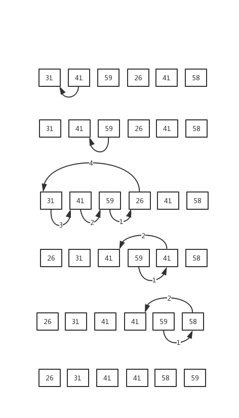

## 读书笔记

> 原址排序： 在排序过程中，只有常数个数据存储在数组外；

> 插入排序工作过程：

```java
for j = 2 to A.length
    key = A[j]
    // insert A[j] into the sorted sequence A[1, j-1]
    i = j - 1
    while i > 0 and A[i] > key
        A[i + 1] = A[i]
        i = i -1
    A[i + 1] = key
```

首先从宏观的层面，将数组分割为左右两个部分；左边是排好序的数组，右边是等待排序的数组；

**循环不变式**可以帮助我们理解算法的正确性：

> 初始化： 循环的第一次迭代之前，它为真。
>
> 保持： 如果循环的某次迭代之前它为真，那么下次迭代之前它仍为真。
>
> 终止： 在循环终止时，不变式为我们提供了一个有用的性质，该性质有助于证明算法的正确性。

1. 一开始，我们应该把分割线定在哪呢？因为还没有排序，所以我们只能从数组的头一个或者尾一个进行分割；这里选头一个元素作为排好序的数组，由于只有一个元素，无从排序；此时，循环不变式中的**初始化**成立。
2. 然后在第二步，我们要在循环过程中保证每次迭代后左边的数组处于有序状态。第二步中的一次迭代中做了三件事： 从右边取出第一个元素；将这个元素在左边的数组中从右向左进行比较，如果被比较的元素比这个元素大，则被比较的元素向右移；直到找到一个合适的位置，插入该元素；至此，**一次迭代完成**，左边数组仍然是有序状态，循环不变式中的**保持**成立。
3. 最后一步，我们的算法何时终止呢？根据伪代码`j>A.length`，所以当`j`大于数组大小时，算法终止；那么在算法终止前的最后一次迭代，`j`必定为`A.length`，因此在完成最后一次迭代时，整个数组完成排序；因此当算法终止时，循环不变式中的**终止**成立；

## 课后习题
### 2.1-1
> 以图2-2为模型，说明INSERTION-SORT在数组A=<31, 41, 59, 26, 41, 58>上的执行过程。


### 2.1-2
> 重写过程INSERTION-SORT，使之按照降序排列。

```java
for j = 2 to A.length
    key = A[j]
    // insert A[j] into the sorted sequence A[1, j-1]
    i = j - 1
    while i > 0 and A[i] < key
        A[i + 1] = A[i]
        i = i -1
    A[i + 1] = key
```
### 2.1-3
> 考虑一下查找问题：
>
> 输入： n个数的一个序列A=<a1, a2, a3, ......, an>和一个值`v`
>
> 输出： 下标`i`使得`v`=A[i]或者当`v`不在A中出现时，`v`为特殊值NIL
>
> 写出线性查找的伪代码，它扫描整个序列来查找`v`。使用一个循环不变式来证明的你的算法的正确性。确保你的循环不变式满足三条必要的性质。

```java
for i = 1 to A.length
    if ( v == A[i] ){
        result = i
        break;
    }
    if ( i == A.length && v != A[i]){
        result = NIL
        break;
    }
return result;
```

### 2.1-4
> 考虑把两个n位二进制整数加起来的问题，这两个整数分别存储在两个n元数组A和B中。这两个整数的和应按二进制形式存储在一个(n+1)元数组C中。请给出该问题的形式化描述，并写出伪代码。

二进制的加法实际上是两种基本的位运算，结果位为`异或`，进位为`按位与`

```java
bit carry = 0
for i = A.length to 1 {
    result = A[i] XOR B[i] XOR carry
    C[i] = result
    carry = A[i] AND B[i] AND carry
}
C[0] = carry
```

