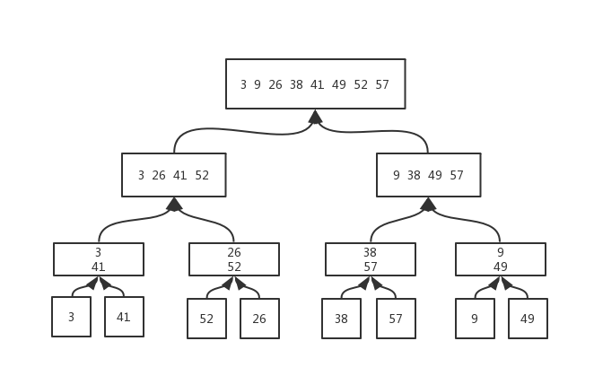

## 读书笔记

> 首先是**递归和分治**的思想；
> 
> **递归**：在函数内部再次调用函数本身，但是这个**再次调用**所处理的问题要小于**上一次调用**，函数参数也并不相同；
> 
> **分治**：将原问题分解为**几个规模较小但是类似原问题**的子问题，然后递归地求解这些问题，最后在合并这些子问题的解来建立原问题的解；

> 详细讲一下**分治**：
> 
> **分解**原问题为若干子问题，这些子问题是**规模较小**的原问题，这些子问题又会被分解为**更小的子问题**，直至不可分解；
> 
> **解决**这些子问题，递归地求解各子问题。从上向下，递归到**不可分解的子问题**，便可直接求解；
> 
> **合并**这些子问题的解成原问题的解；从最底层的**不可分解的子问题**开始求解，然后求出倒数第二层的解，依次上升求解，最终形成原问题的解；

> 按照**分治法**的思想，描述**归并排序**：
> 
> **分解**：分解待排序的$n$个元素的序列成各具$\frac{n}{2}$个元素的两个子序列。
> 
> **解决**：使用归并排序递归地排序两个子序列。
> 
> **合并**：合并两个已排序的子序列以产生已排序的答案。


第一和第二步，从上到下，递归到最底层的不可分解的最小子问题，然后合并上升求解，这也是递归的一部分，最终形成原问题的解；

> **归并排序**的时间复杂度
> $$
> T(n) = \begin{cases}
> c,                    & n = 1\\
> 2T(\frac{n}{2}) + cn, & n \geq 1
> \end{cases}
> $$
> 
> 通过书中图解，我们可以轻易知道时间复杂度为$n\lg{n}$。

## 课后习题

> 使用图2-4作为模型，说明归并排序在数组A=<3, 41, 52, 26, 38, 57, 9, 49>上的操作。



> 重写过程 MERGE，使之不使用哨兵，而是一旦数组L或R的所有元素均被复制到A就立刻停止，然后吧另一个数组的剩余部分复制到数组A。

**原来的MERGE过程**：

> MERGE(A, p, q, r)
> 
> $n_1$ = q - p +1
> 
> $n_2$ = r - q
> 
> // 新建两个小数组
> 
> for i = 1 to $n_1$
> 
> >  L[i] = A[p + i -1]
> 
> for j = 1 to $n_2$
> 
> > R[j] = A[q + j]
> 
> // 设置哨兵
> 
> L[$n_1$+1] = $\infty$
> 
> R[$n_2$+1] = $\infty$
> 
> i = 1
> 
> j = 1
> 
> for k = p to r
> 
> > > if L[i] $\leq$ R[j]
> > > 
> > > > A[k] = L[i]
> > > > 
> > > > i++
> > 
> > > else 
> > > 
> > > > A[k] = R[j]
> > > > 
> > > > j++            

**修改后**：

> MERGE(A, p, q, r)
> 
> $n_1$ = q - p +1
> 
> $n_2$ = r - q
> 
> // 新建两个小数组
> 
> for i = 1 to $n_1$
> 
> > L[i] = A[p + i -1]
> 
> for j = 1 to $n_2$
> 
> > R[j] = A[q + j]
> 
> i = 1
> 
> j = 1
> 
> for k = p to r
> 
> > if L[i] $\leq$ R[j]
> > 
> > A[k] = L[i]
> > 
> > > ​    if i == $n_1$
> > > 
> > > // 将R数组的剩余元素放入A数组
> > 
> > > ​        else 
> > > 
> > > ​            i++
> 
> >  else 
> > 
> > ​        A[k] = R[j]
> > 
> > > ​        if j == $n_2$
> > > 
> > > ​            //将L数组中的剩余元素放入A数组
> > 
> > > ​        else
> > > 
> > > ​            j++

> 使用数学归纳法证明， 当$n$正好是2的幂时，以下递归式的解是$T(n)=n\lg{n}$。
>
> 
> $$
> T(n) = \begin{cases}
> 2,         & n = 2\\
> 2T(\frac{n}{2})+n, & n = 2^k, k>1
> \end{cases}
> $$

当$n=2$时，$T(2) = 2\lg{2} = 2$，等式成立；

假设当$n=2^k$时，等式成立，即$T(2^k)=2^k\lg{2^k}$；

当$n = 2^{k+1}$时，


$$
\begin{aligned}
T(n)&=  2T(2^k)+2^{k+1} \\[2ex]
& = 2^{k+1}\lg{2^k}+2^{k+1}\\[2ex]
& = 2^{k+1}\lg{2^{k+1}}
\end{aligned}
$$


等式成立，证毕；

> 我们可以吧插入排序表示为如下的一个递归过程，为了排序A[1..n]，我们递归地排序A[1..n-1]，然后把A[n]插入已排序的数组A[1..n-1]。为插入排序的这个递归版本的最坏情况运行时间写一个递归式。

```c++
//插入排序的递归算法
void insert(vector<int>& a, int x=1)                
{                                                   
    if(x >= (int)a.size())                
        return;                    
    int temp = a[x],j;                
    for(j = x; j > 0 && a[j-1] > temp; j--)        
        a[j] = a[j-1];                  
    a[j] = temp;                          
    insert(a, x+1);                    
}
```

$$
T(n) = 
\begin{cases}
\theta(1),     & n = 1 \\[2ex]
T(n-1) + \theta(n), & n > 1
\end{cases}
$$

时间复杂度为$\theta(n^2)$

> 回顾查找问题，注意到，如果序列A已排序，就可以将该序列的中点与$\nu$进行比较。根据比较结果，原序列中有一半就可以不用再做进一步的考虑了。**二分查找**算法重复这个过程，每次都将序列剩余部分的规模减半。为二分查找写出迭代或递归的伪代码，证明二分查找的最坏运行时间为$\theta(\lg{n})$。

```java
binarySearch(int[] A, int first, int second, int target){
    t = (first + second) \ 2;
    if (A[t] > target){
        binarySearch(A, first, t, target)
    }else if ( A[t] < target){
        binarySearch(A, t, second, target)
    }else {
        println(t)
        return;
    }
}
```

查看图2-5，对应到此处的二分查找，树高$\lg{n}$，每一层的代价为$\theta(1)$，所以最坏情况下时间复杂度为$\theta(\lg{n})$。

> 注意到2.1节中的过程INSERTION-SORT的5～7行的while循环采用一种线性查找来（反向）扫描已排好序的子数组A[1..j-1]。我们可以使用二分查找来把插入排序的最坏情况总运行时间改进到$\theta(n\lg{n})$吗？

在最坏情况下，二分查找的时间复杂度是$n\lg{n}$，但是插入时数组移动的时间复杂度仍然是$n^2$，所以总体时间不能改善为$\theta(n\lg{n})$；但是如果排序中采用的是链表，则可改善。

> 描述一个运行时间为$\theta(n\lg{n})$的算法，给定$n$个整数的集合$S$和另一个整数$x$，该算法能确定$S$中是否存在两个其和刚好为$x$的元素。

分为三步：

1. 使用归并排序对$S$进行排序，此处时间复杂度为$\theta(n\lg{n})$;
2. 对于$S$数组中的每个元素执行第三步，此处时间复杂度为$\theta(n)$;
3. 二分查找相应的元素，此处时间复杂度为$\theta(\lg{n})$;

两倍的$\theta(n\lg{n})$，仍然是$\theta(n\lg{n})$。
