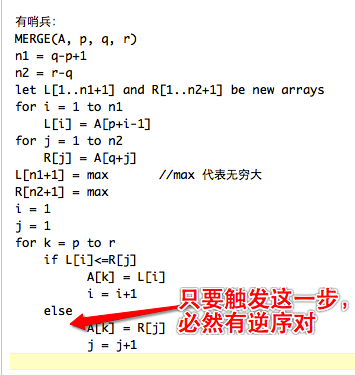

<!-- more -->

> (在归并排序中对小数组采用插入排序)虽然归并排序的最坏情况运行时间为$\theta(n\lg{n})$，而插入排序的最坏情况的运行时间为$\theta(n^2)$，但插入排序中的常量因子可能是的它在$n$较小时，在大多数机器上运行得较快；因此，在归并排序中，当子问题的规模足够小时，采用插入排序的方法来使得递归的叶**变粗**是有意义的。考虑对归并排序的一种修改，其中使用插入排序来排序长度为$k$的$\frac{n}{k}$个子表，然后使用标准的合并机制来合并这些子表，这里$k$是一个待定的值。
>
> a. 证明：插入排序的最坏情况可以在$\theta(nk)$时间内排序每个长度为$k$的$\frac{n}{k}$个子表
>
> b. 表明在最坏情况下如何在$\theta(n\lg{\frac{n}{k}})$时间内合并这些子表
>
> c. 假定修改后的算法最坏运行时间为$\theta(nk+n\lg{\frac{n}{k}})$，要使修改后的算法与标准的归并排序有相同的运行时间，作为$n$的一个函数，借助$\theta$记号，$k$的最大值是什么？
>
> d. 在实践中，我们应该如何选择$k$的值？

**a.** 在插入排序中，长度为$k$的子表的时间复杂度为$\theta(k^2)$，一共有$\frac{n}{k}$张子表，所以总的复杂度为     $\theta(nk)$；

**b.** 原本归并排序的时间复杂度为$\theta(n\lg{n})$，其中$n$是二叉树每一层的代价，$\lg{n}$是二叉树的高度；现在每一层的代价没有变，但是二叉树的高度变了，也就是$\lg{n}-\lg{k}$，化简后就是$\lg{\frac{n}{k}}$，所以时间复杂度为$\theta(n\lg{\frac{n}{k}})$；

**c.** 也就是要使得以下等式成立：

$$
\begin{aligned}
\theta(nk + n\lg{\frac{n}{k}}) = \theta(n\lg{n}) \\
\theta(k + \lg{\frac{n}{k}}) = \theta(\lg{n})
\end{aligned}
$$


当$k= 1$时，等式成立；

当$k=\lg{n}$时，$\theta(\lg{n}+\lg{\frac{n}{\lg{n}}})$中后一项的增长级数不及前一项，所以它的时间复杂度仍然为$\theta(\lg{n})$；

**d.** 所选取的$k$值应当小于$\theta(\lg{n})$；

> (冒泡排序的正确性)冒泡排序是一种流行但低效的排序算法，它的工作过程是反复交换相邻的未按次序排列的元素。

```java
BUBBLESORT(A)
for i = 1 to A.length -1
	for j = A.length downto i + 1
		if A[j] < A[j-1]
			exchange A[j] with A[j-1]
```

> **a.** 假设A'表示`BUBBLESORT(A)`的输出。为了证明`BUBBLESORT(A)`的正确性，我们必须证明它会终止并且有：


$$
A'[1]\leq{A'[2]}\leq{A'[3]}...\leq{A'[n]}
$$


> 其中$n=A.length$，为了证明`BUBBLESORT(A)`确实完成了排序，我们还需要证明什么？

```
还需要证明A’中的元素全部来自于A中变换后的元素。
```

> **b.** 为第2~4行的`for`循环精确地说明一个循环不变式，并且证明该循环不变式成立。

```
每次迭代之前，A[j]=min{A[k] | j<=k<=n}，并且子数组A[j..n]中的元素还是最初在A[j..n]中的元素。

初始化：第一次迭代之前j=n，子数组A[j..n]只包含一个元素A[n]，循环不变式显然成立。

保持：迭代一个给定值的j。首先假设此次迭代前循环不变式成立，那么根据循环不变式，A[j]是A[j..n]中最小的元素。第3~4行代码表示如果A[j]<A[j-1]就交换A[j]和A[j-1]，显然这使得A[j-1]成为A[j-1..n]中最小的元素。由于唯一改变子数组A[j-1..n]的操作仅仅是那次可能发生的交换操作，且在迭代开始时，A[j..n]中的元素最初都是在A[j..n]中，所以在迭代开始时A[j-1..n]中的元素最初都是在A[j-1..n]中。然后j自减，准备开始进入下一轮迭代。

终止：循环终止时j=i。根据循环不变式，A[j]=A[i]=min{A[k] | i<=k<=n}，并且A[i..n]中的元素最初都在A[i..n]中。

所以在2~4行的for循环执行结束过后，A[i]将是A[i..n]中最小的元素。
```

> **c.** 使用(b)部分证明的循环不变式的终止条件，为第1~4行的`for`循环说明一个循环不变式。

```
每次迭代之前，子数组A[1..i-1]包含了A[1..n]中前i-1小的所有元素，并且它们是已排好序的。A[i..n]中包含了A[1..n]中余暇的元素。

初始化：第一次迭代之前i=1。子数组A[1..i-1]为空，循环不变式显然成立。

保持：迭代一个给定值的i。首先假设此次迭代前循环不变式成立，那么根据循环不变式，A[1..i-1]包含了A[1..n]中前i-1小的所有元素，并且它们是已排好序的。第一部分已经证明：在执行2~4行的for循环后A[i]是A[i..n]中最小的元素。所以在执行了2~4行的for循环后A[1..i]中就包含了A[1..n]中前i小的所有元素，并且它们已经排好序。子数组A[i+1..n]就包含了n-i个A[1..n]中余下的元素。

终止：循环终止时i=n+1 => i-1=n。所以根据循环不变式，A[1..i-1]óA[1..n]中包含了A[1..n]中前i-1小的元素（即A[1..n]的全部元素），并且它们是排好序的。

所以在1~4行的for循环执行结束过后，A[1..n]将是有序的。
```

> **d.** 冒泡排序的最坏运行时间是多少？与插入排序的运行时间相比，其性能如何？

最坏运行时间为$O(n^2)$；最坏情况下和插入排序差不多，最好情况下，比插入排序要差；

> (Horner规则的正确性) 给定系数$a_0,a_1,...,a_n$和$x$的值，代码片段

```java
y = 0 
for i = n downto 0
	y = a + x*y
```

> 实现了用于求值多项式


$$
P(x) = \sum_{k=0}^{n}a_kx^k=a_0+x(a_1+x(a_2+...x(a_{n-1}+xa_n)))
$$


> 的霍纳规则。

> **a.** 借助$\theta$记号，实现霍纳规则的以上代码的运行时间是多少？

运算时间为$\theta(n)$

> **b.** 编写伪代码来实现朴素的多项式求值算法，该算法从头开始计算多项式的每个项。该算法的运行时间是多少？与霍纳规则相比，其性能如何？

```java
for i = 0 to n
	x = 1
	for j =1 to i
		x =*x
	y = y + A[i]*x
return y
```

朴素算法的运行时间为$\theta(n^2)$，无论在何种情况下，霍顿规则都要优于朴素算法。

> **c.** 考虑以下循环不变式：
>
> 在第2~3行`for`循环每次迭代的开始有


$$
y = \sum_{k=0}^{n-(i+1)}a_{k+i+1}x_k
$$


> 把没有项的和式解释为等于0。遵照本章中给出的循环不变式证明的结构，使用该循环不变式来证明终止时有$y=\sum_{k=0}^na_kx^k$.

初始化： 有 y = 0， i = n , 这样 计算 下面公式的右边 为 0 ， 所以初始化满足循环不变式。


$$
 y = \sum_{k=0}^{n-(i+1)}a_{k+i+1}x_k
$$


保持：假设当第i=j满足时，考察i=j-1；

终止： 当循环结束时候，有 i= -1。

> **d.** 最后证明上面给出的代码片段将正确地求出由系数$a_0, a_1, ... ,a_n$刻画的多项式的值

由于0从0到n-(i+1)，因此有：


$$
\begin{aligned}
y = & \sum_{k=0}^{n}a_kx^k \\
=& a_0 + a_1x+...+a_nx^n
\end{aligned}
$$


霍纳规则代码段循环不变式证明如下：
初始：
    i=n，y[n] = 0，迭代开始时，循环后有y[n] = a[n]。
保持：
    对于任意 0 ≤ i ≤ n，循环后有：


$$
\begin{aligned}
y[i] =& a[i] + y[i+1]*x\\
= & a[i] +(a[i+1]*x+a[i+2]*x+...+a[n]*x^{n-i}) \\

\end{aligned}
$$


终止：
    i小于0时终止，此时有 $ y[0] = a[0]+a[1]*x+...+a[n]x^n $
    证毕。

> (逆序对) 假设A[1..n]是一个有$n$个不同数的数组。若存在$i<j且A[i]>A[j]$，则$(i,j)$称为A的一个逆序对。

> **a.** 列出数组$(2,3,8,6,1)$的5个逆序对

```
(0,4) (1,4) (2,4) (3,4) (2,3)
```

> **b.** 由集合$(1,2,3,...,n)$组成的什么样的数组具有最多的逆序对，数量是多少？

降序排序的数组拥有最多的逆序对。数量是$\frac{n(n-1)}{2}$。

> 插入排序的运行时间与输入数组中的逆序对数量之间是什么关系？证明你的回答。

逆序对增加时，插入排序时间增加。
没有逆序对时，插入排序时间最少，为Θ(n)。
逆序对最多时，插入排序时间最多，为Θ(n^2)。

> 给出一个 确定在$n$个元素中的任何排列中逆序对数量的算法，最坏情况需要$\theta(n\lg{n})$时间。（提示：修改归并排序）

 归并算法， 每次移动牌，次数加1， 合计的次数就是逆序对的个数。



 

 

 

 

 

 

 

 

 

 

 

 

 