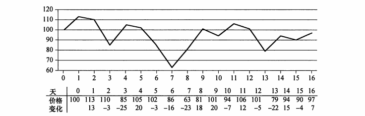

 
## 学习笔记

本章给出一张未来17天的股价涨跌折线图，要求获得最大收益；



将相邻的价格相减，把问题转化为求解最大子数组问题，其输入是一个数值数组，算法需要确定具有最大和的连续子数组；

### 分解

将数组分为左右两块

### 解决

最大子数组的产生一共有三种基本情况：

* 左子数组（向下递归）
* 右子数组（向下递归）
* 包含左右数组分界点的中间数组

### 合并

从上述三种情况中选出子情况的最大的子数组，然后递归地得到最大子数组；

## 课后习题
### 4.1-1
> 当$A$的所有元素均为负数时，FIND-MAXIMUM_SUBARRAY返回什么？

返回$A$中最大的元素
### 4.1-2
> 对最大子数组问题，编写暴力求解方法的伪代码，其运行时间应该为$\theta(n^2)$

```kotlin
val array = 
arrayListOf<Int>(13, -3, -25, 20, -3, -16, -23, 18, 20, -7, 12, -5, -22, 15, -4, 7)

fun findMax() {
    val result = ArrayList<Int>()
    for (index in 0 until array.size) {
        var tmp = 0
        for (i in index until array.size) {
            tmp += array[i]
            result.add(tmp)
        }
    }
    println("array size is ${array.size}")
    println("result size is ${result.size}")
    println("max is ${result.max()}")
}
```

双重循环，时间复杂度为$ \theta (n^2) $
### 4.1-3
> 在你的计算机上实现最大子数组问题的暴力算法和递归算法。请指出多大的问题规模$n_0$之后，递归算法打败暴力算法？然后，修改递归算法的基本情况：当问题规模小于$n_0$时采用暴力算法。修改后$n_0$的值会改变吗？

```kotlin
val array = arrayListOf<Int>(13, -3, -25, 20, -3, -16, -23, 18, 20, -7, 12, -5, -22, 15, -4, 7)

data class Result(val low: Int, val high: Int, val result: Int)

//暴力算法
fun findMax() {
    val results = ArrayList<Result>()
    for (index in 0 until array.size) {
        var tmp = 0
        for (i in index until array.size) {
            tmp += array[i]
            results.add(Result(index, i, tmp))
        }
    }
    println("array size is ${array.size}")
    println("result size is ${results.size}")
    println("max is ${results.maxBy { it.result }}")
}

//递归算法
fun findMax(low: Int, high: Int): Result {
    return if (low == high) {
        Result(low, high, array[low])
    } else {
        val mid = (low + high) / 2;
        val leftResult = findMax(low, mid)
        val rightResult = findMax(mid + 1, high)
        val crossResult = findCrossMax(low, mid, high)

        arrayListOf(leftResult, rightResult, crossResult).maxBy { it.result }!!
    }
}

fun findCrossMax(low: Int, mid: Int, high: Int): Result {
    var leftSum = Int.MIN_VALUE
    var rightSum = Int.MIN_VALUE
    var sum = 0
    var leftIndex = Int.MIN_VALUE
    var rightIndex = Int.MIN_VALUE
    for (index in mid downTo low) {
        sum += array[index]
        if (sum > leftSum) {
            leftSum = sum
            leftIndex = index
        }
    }
    sum = 0
    for (index in (mid + 1)..high) {
        sum += array[index]
        if (sum > rightSum) {
            rightSum = sum
            rightIndex = index
        }
    }
    return Result(leftIndex, rightIndex, leftSum + rightSum)
}

fun main() {
    findMax()
    println()
    val result = findMax(0, array.size - 1)
    println(result)
}

```

在我的电脑上此处的$n_0$是16，修改递归算法的基本情况，$n_0$也不会改变
### 4.1-4
> 假定修改最大子数组问题的综艺，允许结果为空子数组，其和为0。你应该如何修改现有算法，使得它们能允许空子数组为最终结果？

事实上并不需要修改算法过程，只需要在最后返回结果时，检查结果是否小于0，如果小于0，则直接返回0和空数组；如果不是，则按原来的返回；
### 4.1-5
> 使用如下思想为最大子数组问题设计一个非递归的、线性时间的及算法。从数组的左边界开始，由左至右处理，记录到目前为止已经处理过的最大子数组。若已知$A[1..j]$的最大子数组，基于如下性质将解拓展为$A[1..j+1]$的最大子数组：$A[1..j+1]$的最大子数组要么是$A[1..j]$的最大子数组，要么是某个子数组$ A [i..j+1] (1\le{i\le{j+1}}) $。在已知$A[1..j]$的最大子数组的情况下，可以在线性时间内找出形同$A[i..j+1]$的最大子数组。

关于这个问题，推荐阅读下面这两篇文章：

[最大子数组的和问题--线性算法](https://blog.csdn.net/zj0395/article/details/76284342)

[动态规划法（八）最大子数组问题（maximum subarray problem）](https://www.cnblogs.com/jclian91/p/9151120.html)              

下面是代码：

```kotlin
val array = arrayListOf(6, -3, -2)

fun findIt() {
    var max = array[0]
    var result = array[0]
    for (i in 1 until array.size) {
        max = max(max + array[i], array[i])
        result = max(result, max)
    }
    println(result)
}

fun max(first: Int, second: Int): Int {
    return if (first > second) first else second
}

fun main() {
   findIt()
}
```

