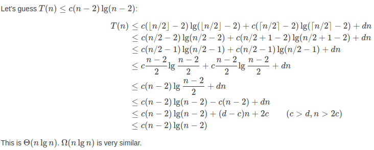

## 读书笔记

代入法求解递归式分为两步：

1. 猜测解的形式。
2. 用数学归纳法求出解中的常数，并证明解是正确的。

但是并不存在通用的方法来猜测递归式的正确解，但是也是有一些技巧的：

1. 使用**递归树**辅助猜测
2. 先猜测一个较为宽松的上界和下界，然后缩小范围

## 课后习题

> 证明：$T(n) = T(n-1)+n$的解为$O(n^2)$

猜测：$T(n) \le {cn^2}$

证明: 

$$
\begin{aligned}
T(n) &= T(n-1) + n \\
&\le {c(n-1)^2}+n \\
& = cn^2 -2cn +c +n \le {cn^2}
\end{aligned}
$$

此处只要$-2cn+c+n\le 0$，上述不等式成立；

所以
$$
c \ge {\frac{n}{2n-1}}
$$
因此可令$c = 1$，证毕。

> 证明： $T(n)=T(\lceil n/2\rceil)+1$的解为$O(\lg{n})$

证明：

$$
\begin{aligned}
T(n) &= T(\lceil n/2 \rceil) + 1 \\
&= c\lg{\frac{n}{2}}+1 \\
&= c\lg{n} - c + 1 \le {c\lg{n}}
\end{aligned}
$$

令$c=1$，上式成立，证毕；

> 我们看到$T(n)=2T(\lfloor n/2 \rfloor)+n$的解为$O(n\lg{n})$。证明$\Omega(n\lg{n})$也是这个递归式的解。从而得出结论: 解为$\theta(n\lg{n})$。

证明： 

$$
\begin{aligned}
T(n) &= 2T(\lfloor n/2 \rfloor)+n \\
&=cn\lg{\frac{n}{2}}+n \\
&=cn\lg{n} - cn + n \ge {cn\lg{n}}
\end{aligned}
$$

令$c=1$，上式成立，证毕；

> 证明：通过做出不同的归纳假设，我们不必调整归纳证明中的边界条件，即可克服递归式(4.19)中边界条件$T(1)=1$带来的困难。

将假设换位$T(n)\le{cn\lg{n}+d}$，其中$d\ge0$即可；

> 证明：归并排序的严格递归式(4.3)的解为$\theta(n\lg{n})$。

严格递归式4.3：

$$
T(n) = 
\begin{cases}
\theta(1) & if\; n=1 \\[2ex]
T(\lceil n/2 \rceil) + T(\lfloor n/2 \rfloor) + \theta(n)  & if \; n > 1
\end{cases}
$$

> 证明： $T(n)=2T(\lfloor n/2 \rfloor+17)+n$的解为$O(n\lg{n})$。

证明：

$$
\begin{aligned}
T(n) &= 2T(\lfloor n/2 \rfloor + 17)+n \\
&
\end{aligned}
$$

//todo

> 使用4.5节中的主方法，可以证明$T(n)=4T(n/3)+n$的解为$T(n)=\theta(n^{\log_3^4})$。说明基于假设$T(n)\le{cn^{\log_3^4}}$的代入法不能证明这一结论。然后说明如何通过减去一个低阶项完成代入法证明。

//todo

> 使用4.5节中的主方法，可以证明$T(n)=4T(n/2)+n$的解为$T(n)=\theta(n^2)$。说明基于假设$T(n)=\le{cn^2}$的代入法不能证明这一结论。然后说明如何通过减去一个低阶项完成代入法证明。

//todo

> 利用改变变量的方法求解递归式$T(n)=3T(\sqrt{n})+\log{n}$。你的解应该是渐近紧确的。不必担心数值是否为整数。

//todo