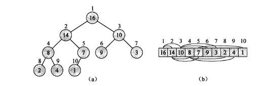
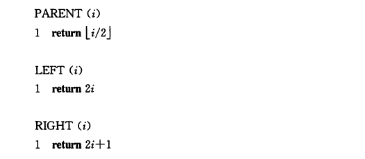
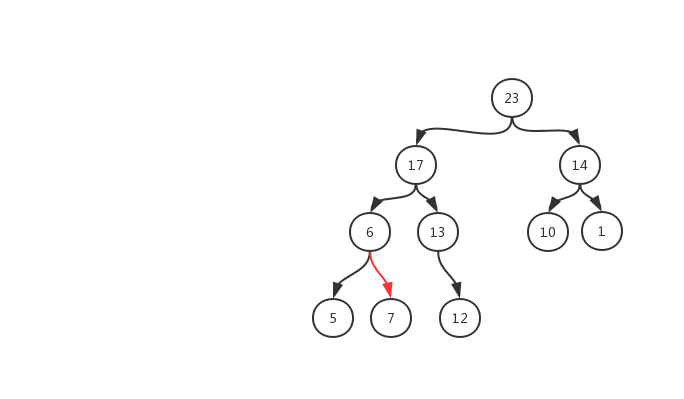

## 读书笔记

本小节首先介绍了__堆__的概念，然后又介绍了__二叉堆__的两种形式：最大堆和最小堆；

其中图$(a)$是二叉堆逻辑上的结构，图$(b)$是物理上的结构。如何从物理上的结构映射到逻辑的结构，通过下方的简单的函数进行映射。

### 最大堆

所有的父节点都__大于等于子__节点。

### 最小堆

所有的父节点都__小于等于__子节点。

## 课后习题

### 6.1-1

> 在高度为$h$的堆中，元素个数最多和最少分别是多少？

最多的情况，满子节点，个数为$2^{h+1} -1$;

最少的情况，只有一个子节点，个数为$2^h $

### 6.1-2

> 证明：含$n$个元素的堆的高度为$\lfloor \lg{n}\rfloor$

令$n$个元素的堆的高度为$h$，有第一题可得
$$
2^h \le n \le 2^{h+1} -1 \\
h \le \lg{n} \le h+1
$$
证毕。

### 6.1-3

> 证明：在最大堆的任意子树中，该子树所包含的最大元素在该子树的根节点上。

根据最大堆的定义可知，上述结论是显而易见的。

### 6.1-4

> 假设一个最大堆的所有元素都不相同，那么该堆的最小元素应该位于哪里？

在最大堆的叶子节点上，但是在哪一个不确定。

### 6.1-5

> 一个已排好序的数组是一个最小堆吗？

是最小堆的一种特殊情况，左节点小于右节点的情况；

### 6.1-6

> 值为$(23, 17, 14, 6, 13, 10, 1, 5, 7, 12)$的数组是一个最大堆吗？

标记为红色的连线不符合最大堆的定义，所以该数组不是一个最大堆。

### 6.1-7

> 证明：当用数组表示存储$n$个元素的堆时，叶节点下标分别是$\lfloor n/2\rfloor +1, \lfloor n/2\rfloor +2, ..., n$。

根据二叉堆的性质：某节点下标为i（非根节点），其父节点的下标为floor(i/2)，因此最后一个叶节点的父节点的下标为floor(n/2)，所以从下标floor(n/2)+1开始到n都是叶节点。