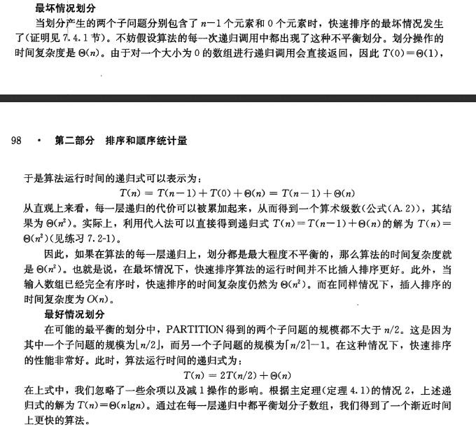
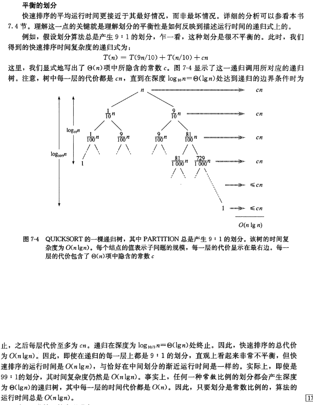

## 读书笔记

本小节对快速排序在三种情况下的性能进行了分析，我自觉没有书上说得好，所以直接上图片。

### 最好和最坏情况

### 平均情况

## 课后习题

### 7.2-1

> 利用代入法证明：正如7.2节开头提到的那样，递归式$T(n) = T(n-1) + \theta(n)$的解为$T(n)=\theta(n^2)$。

易证，**略**

### 7.2-2

> 当数组$A$的所有元素都具有相同值时，$QUICKSORT$的时间复杂度是什么？

属于最坏的情况，时间复杂度为$\theta(n^2)$；

### 7.2-3

> 证明：当数组$A$包含的元素不同时，并且是按降序排列的时候，$QUICKSORT$的时间复杂度为$\theta(n^2)$。

显而易见，当数组$A$按降序排列时，在划分左右子数组时，是$n-1$和$0$的情况，属于最坏情况，所以时间复杂度为$\theta(n^2)$；

### 7.2-4

> 银行一般会按照交易时间来记录某一账户的交易情况。但是，很多人却喜欢收到银行对账单是按照支票号码的顺序来排列的。这是因为，人们通常都是按照支票号码的顺序来开出支票的，而商人而通常都是根据支票编号的循序兑付支票。这一问题是将按交易时间排序的序列转换成按支票号排序的序列，它实质上是对一个几乎有序的输入序列进行排序的问题。请证明：在这个问题上，$INSERTION-SORT$的性能往往要优于$QUICKSORT$?

由于数组$A$是接近排好序的数组，所以在进行插入排序时，有许多元素根本不会移动，减少了许多的比较和移动；

### 7.2-5

> 假设快速排序的每一层所做的划分的比例都是$1-\alpha:\alpha$，其中$0<\alpha\le \frac{1}{2}$且是一个常数。试证明：在相应的递归树中，叶节点的最小深度大约是$-\frac{\lg{n}}{\lg{\alpha}}$，最大深度大约是$-\frac{\lg{n}}{\lg{(1-\alpha)}}$(无需考虑整数舍入问题)。

由于$\alpha$是一个常数，所以令$\alpha = \frac{1}{2}$，左右两个子数组长度相等，这是最好的情况，最小深度和最大深度都是$\lg{n}$；