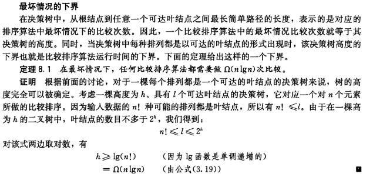

## 读书笔记
本小节通过**决策树**模型，说明了一个比较排序算法的下界为$\Omega(n\lg{n})$；

## 课后习题

### 8.1-1

> 在一棵比较排序算法的决策树中，一个叶节点可能的最小深度是多少？

最好情况就是当前数组是已经排好序的，需要比较$n-1$次；深度为$n$

### 8.1-2

> 不用斯特林公式，给出$\lg{(n!)}$的渐近确界。利用$A.2$节中介绍的技术来求累加和$\sum^n_{k=1}\lg{k}$ 。

上界：
$$
\begin{aligned}
\lg{n!} &= \sum_{k=1}^n \lg{k} \\[2ex]
        &= \sum_{k=1}^{\frac{n}{2}}\lg{k} + \sum_{k=\frac{n}{2}+1}^{n} \lg{k}\\[2ex]
        &\le \sum_{k=1}^{\frac{n}{2}} \lg{\frac{n}{2}} + \sum_{k=\frac{n}{2}+1}^{n}\lg{n}\\[2ex]
        &= \frac{n}{2}\lg{\frac{n}{2}} + n\lg{n}\\[2ex]
        &= O(n\lg{n})
\end{aligned}
$$
下界：
$$
\begin{aligned}
\lg{n!} &= \sum_{k=1}^n \lg{k} \\[2ex]
        &= \sum_{k=1}^{\frac{n}{2}}\lg{k} + \sum_{k=\frac{n}{2}+1}^{n} \lg{k}\\[2ex]
        &\ge \frac{n}{2}\lg{2} + \frac{n}{2}\lg{\frac{n}{2}}\\[2ex]
        &= \Omega(n\lg{n})
\end{aligned}
$$
**证毕**。

### 8.1-3

> 证明：对$n!$种长度为$n$的输入中的至少一半，不存在能达到线性运行时间的比较排序算法。如果只要求对$\frac{1}{n}$的输入达到线性时间呢？$\frac{1}{2^n}$呢？

比较算法的时间复杂度无论如何都不是线性相关的；

### 8.1-4

> 假设现有一个包含$n$个元素的待排序序列。该序列由$\frac{n}{k}$个子序列组成，每个子序列包含$k$个元素。一个给定子序列中的每个元素都小于其后继子序列中的所有元素，且大于其前驱子序列中的每个元素。因此，对于这个长度为$n$的序列的排序转化为$\frac{n}{k}$个子序列中的$k$个元素的排序。试证明：这个排序问题中所需比较次数的下界是$n\lg{k}$。（提示：简单地将每个子序列的下界进行合并是不严谨的。）

一共有$\frac{n}{k}$个子序列，单个子序列的比较次数为$\Omega(k\lg{k})$，所以总的比较次数为$\Omega(n\lg{k})$。