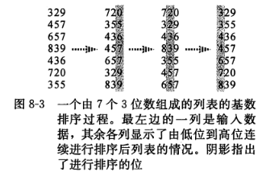

## 读书笔记

本小节讲的是**基数排序**，与比较排序不同，基数排序并不是直接比较元素间的大小获得次序，而是从低位到高位依次排序，最终获得次序；

具体过程如下：



伪代码如下：

```python
RADIX-SORT(A, d)
for i = 1 to d
	use a stable sort to sort array A on digit i
```

在循环内部，使用的是**计数排序**，总时间复杂度为$\theta(d(n+k))$，$k$为元素可能取值的个数。

## 课后习题

### 8.3-1

> 参考图$8-3$的方法，说明$RADIX-SORT$在下列单次上的操作过程：$COW,DOG,SEA,RUG,MOB,BOX,TAB,BAR,EAR,TAR,DIG,BIG,TEA,NOW,FOX$。

**略**。

### 8.3-2

> 下面的排序算法中哪些是稳定的：插入排序、归并排序、堆排序和快速排序？给出一个能使任何排序算法都稳定的方法。你所给出的方法带来的额外时间和空间开销是多少？

插入排序，归并排序是稳定的。

在排序之前为每个元素以升序设置编号，在排好序之后，根据编号调整相等元素的位置。

时间复杂度为$O(n)$。

### 8.3-3

> 利用归纳法来证明基数排序是正确的。在你所给出的证明中，在哪里需要假设所用的底层排序算法是稳定的？

在证明排序第d位有两个相等元素并不改变d-1位已经排好元素的顺序的时候。

### 8.3-4

> 说明如何在$O(n)$时间内，对$0$到$n^3-1$区间内的$n$个整数进行排序。

把这n个数看成n进制的数，那么只需要3位即可对0到n3-1的数进行排序。很显然基数排序，时间复杂度是O(n)。

### 8.3-5

> 在本节给出的第一个卡片排序算法中，为排序$d$位十进制数，在最坏情况下需要多少轮排序？在最坏情况下，操作员需要记录到少堆卡片？

排序第$i$位十进制数需要$10^i-1$遍，所以等比数列求和可得最坏情况学$(10^d-1)/9$遍，在最坏情况下工序$10^d$个堆。