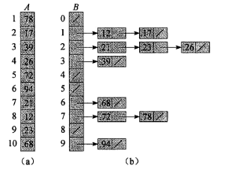

## 读书笔记

本小节介绍了**桶排序**，桶排序是将元素按照规则放在一个个递增区间内，区间之间是递增的，区间内部也是递增的，最后依次合并区间得到次序；

具体过程如下：



伪代码如下：

```python
BUCKET-SORT(A)
n = A.length
let B[0..n-1] be a new array
for i = 0 to n-1
	make B[i] an empty list
for i = 1 to n
	insert A[i] into list B[⌊nA[i]⌋]
for i = 0 to n-1
	sort list B[i] with insertion sort
concatenate tthe list B[0], B[1],...,B[n-1] together in order
```

事实上伪代码的第$6$行没有解释清楚，首先数组$B$空间大小只有$n$，可是$\lfloor nA[i] \rfloor$又明显大于$n$，这显然说不通。

然后我在网上搜索到了这一篇文章：[排序算法之桶排序的深入理解以及性能分析](https://dailc.github.io/2016/12/03/baseKnowlenge_algorithm_sort_bucketSort.html)


## 课后习题

### 8.4-1

> 参照图8-4的方法，说明$BUCKET-SORT$在数组$A=<0.79, 0.13, 0.16, 0.64, 0.>$

