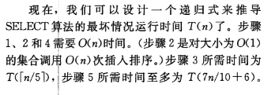

## 读书笔记

本小节介绍了一种上界为$O(n)$的选择算法，该算法过程如下：

1. 先对将输入数组以每组5个元素分组，可能会剩余一组不足5个元素的小组。
2. 对每个小组进行插入排序。
3. 对每个小组的中位数，进行递归操作，也就是重复第1,2步骤，直至找到整个数组的中位数$x$。
4. 使用在第三步找出的中位数$x$对数组进行分区，比$x$小的在左边，比$x$大的在右边。
5. 当前$x$的下标代表它是第几小的数字，如果输入的$i$小于$x$的下标，则递归调用左支；如果输入的$i$大于$x$的下标，则递归调用右支；

对其时间复杂度为什么是$O(n)$的解释如下：

更加详细的解释请查看第三版第123页。

## 课后习题

### 9.3-1

> 在算法$SELECT$中，输入元素被分为每组$5$个元素。如果它们被分为每组$7$个元素，该算法仍然会是线性时间吗？证明： 如果分成每组$3$个元素，$SELECT$的运行时间不是线性的。

顺着书上的过程推导，可知$7$个元素仍然是线性时间，但是$3$个元素不是线性时间。

详细的过程请看[这里](https://blog.csdn.net/z84616995z/article/details/18840823) 。

### 9.3-2

> 分析$SELECT$，并证明： 如果$n\ge 140$，则至少$\lceil n/4 \rceil$个元素大于中位数的中位数$x$，至少$\lceil n/4 \rceil$个元素小与$x$？

一半的一半

### 9.3-3

> 假设所有元素都是互异的，说明在最坏情况下，如何才能使快速排序的运行时间为$O(n\lg{n})$。

使主元为中位数。

下面的题目有些浪费时间，等有时间了在做，先跳过看下一章节。