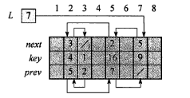
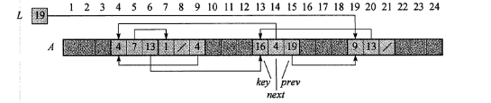

## 读书笔记

本小节介绍了利用数组实现指针的过程。

### 利用二维数组



其中一列代表一个节点，一列分为上中下三个部分，上代表后继节点的坐标，中代表当前节点的值，下代表前驱节点的坐标；

### 利用单数组



其中一个节点由连续的数组元素组成，图中`4`代表该节点的值，`7`代表后继节点的坐标，`13`代表前驱节点的坐标；

这种单数组的表示法比较灵活，因为它允许不同长度的对象存储于同一数组中。但是管理一组异构的对象比管理一组同构的对象更困难，所以大多数情况使用多数组实现指针。

### 对象的分配与释放

将已使用的和未使用的对象分为两组，已使用的对象用双向链表组织，未使用的对象用单向链表组织；

当需要新的对象时，就从单链表中弹出对象；

当释放对象时，就从单链表头部插入对象；

伪代码如下：

```python
ALLOCATE-OBJECT()
	if free == NIL
		error 'out of space'
	else
		x = free
		free = x.next
		return x

FREE-OBJECT(x)
	x.next = free
	free = x
```

## 课后习题

### 10.3-1

> 画图表示序列$<13,4,8,19,5,11>$，其存储形式为多数组表示的双向链表。同样画出单数组表示的形式。

**略**。

### 10.3-2

> 对一组同构对象用单数组表示实现，写出过程$ALLOCATE-OBJECT$和$FREE-OBJECT$。

**略**。

### 10.3-3

> 对$ALLOCATE-OBJECT$和$FREE-OBJECT$过程的实现中，为什么不需要设置或者重置对象的$pre$属性呢？

因为自由表是一个单链表。

### 10.3-4

> 我们往往希望双向链表的所有元素在存储其中保持紧凑，例如，在多数组表示中占用前$m$个下标位置。（在页式虚拟存储的计算环境下，即为这种情况。）假设除指向链表本身的指针外没有其他指针指向该链表的元素，试说明如何实现过程$ALLOCATE-OBJECT$和$FREE-OBJECT$，使得该表示保持紧凑。（提示：使用栈的数组实现。）

这相当于两个栈，这两个栈的栈底分别为数组的两端；

### 10.3-5

> 设$L$是一个长度为$n$的双向链表，存储于长度为$m$的数组$key$、$pre$和$next$中。假设这些数组由维护双链自由表$F$的两个过程$ALLOCATE-OBJECT$和$FREE-OBJECT$进行管理。又假设$m$个元素中，恰有$n$个元素在链表$L$上，$m-n$个自由表上。给定链表$L$和自由表$F$，试写出一个过程$COMPACTIFY-LIST(L,F)$，用来移动$L$中的元素时期占用数组中$1,2,...,n$的位置，调整自由表$F$以保持其正确性，并且占用数组中$n+1,n+2,...,m$的位置。要求所写的过程运行时间应为$\theta(n)$，且只使用固定量的额外存储空间。请证明所写的过程是正确的。

这和上一题有些重复了，**略**。