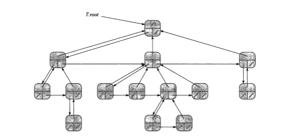
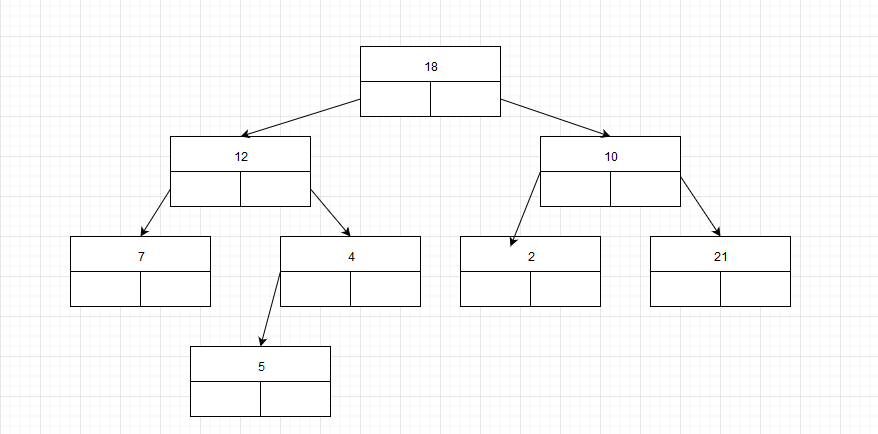

## 读书笔记
本小姐介绍了两种有根树的实现方法，**二叉树**和**分支无限制的有根树**;
### 二叉树
二叉树的单个节点有三个指针$p, left, right$，其中$p$指向父节点，如果一个节点为根节点，则其父节点指向空；$left, right$分别指向左子节点和右子节点；

### 分支无限制的有根树
上面的二叉树虽然好用，但是仍然有所不足；当一个节点有着未知数目的子节点时，二叉树无法正确处理这种关系；
二叉树无法处理这种关系的原因是子节点直接和父节点相关，但是父节点又对子节点的数目未知，导致父节点无法分配合理数目的指针给子节点；
分支无限制的有根树的解决方案是所有的子节点并不全部都和父节点相关，只有最左子节点直接和父节点相关，然后该节点再指向它的兄弟节点；
这样单个节点仍然有三个指针$p, left-child, right-sibling$，其中$p$指向父节点，$left-child$指向最左子节点，$right-sibling$指向兄弟节点；

注意观察图中中间位置，更能理解分支无限制的有根树。

## 课后习题
### 10.4-1
> 画出下列属性表所表示的二叉树，其根节点的下标为$6$。
> 



### 10.4-2
> 给定$n$节点的二叉树，写一个$O(n)$时间的递归过程，将每个节点关键字输出。

```python
printTree(root)
if root == NIL
	return
echo root.key
printTree(root.left)
printTree(root.right)
```
上述伪代码进行的是前序遍历；
### 10.4-3
> 给定一个$n$节点的二叉树，写出一个$O(n)$时间的非递归过程，将该树的每个节点的关键字输出。可以使用一个栈作为辅助数据结构。

参考文章：[【直观算法】树的基本操作](https://charlesliuyx.github.io/2018/10/22/%E3%80%90%E7%9B%B4%E8%A7%82%E7%AE%97%E6%B3%95%E3%80%91%E6%A0%91%E7%9A%84%E5%9F%BA%E6%9C%AC%E6%93%8D%E4%BD%9C/)

```python
class Solution:
    def preorderTraversal(self, root):
        """
        :type root: TreeNode
        :rtype: List[int]
        """
        if not root: return []
        
        result, stack = [], [root]
    
        while stack:
            cur_node = stack.pop() # 访问根节点，直接进行操作(输出到数组)
            result.append(cur_node.val)
            if cur_node.right: # 先入栈右节点
                stack.append(cur_node.right)
            if cur_node.left: # 后入栈左节点，这样下一轮循环先访问左节点，维护了访问顺序
                stack.append(cur_node.left)
                
        return result
```
### 10.4-4
> 对于一个含$n$个节点的任意有根树，写出一个$O(n)$时间的过程，输出其所有关键字，该树以左孩子右兄弟表示法存储。

代码和递归输出二叉树的代码一致。

