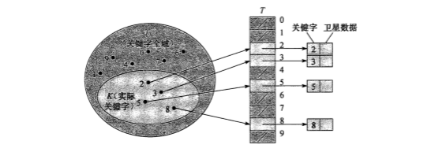

## 读书笔记
本小节介绍了**直接寻址表**，其实也就是数组；

为一个动态集合创建一个数组，这个数组长度大于等于这个动态集合的长度，将数组下标作为集合元素的关键字，进行直接寻址，这样的数组被称为直接寻址表。

## 课后习题

### 11.1-1

> 假设一动态集合$S$用一个长度为$m$的直接寻址表$T$来表示。请给出一个查找$S$中最大元素的过程。你所给出的过程在最坏情况下的运行时间是多少？

逐一遍历，最坏时间为$O(m)$。

### 11.1-2

> 位向量（bit vector）是一个仅包含$0$和$1$的数组。长度为$m$的位向量所占空间要比包含$m$个指针的数组少得多。请说明如何用一个位向量来表示一个包含不同元素（无卫星数据）的动态集合。字典操作的运行时间应为$O(1)$。

使用二进制表示关键字即可。

### 11.1-3

> 试说明如何实现一个直接寻址表，表中个元素的关键字不必都不相同，且各元素可以有卫星数据。所有三种字典操作（$INSERT$, $DELETE$, $SEARCH$）的运行时间应为$O(1)$。（不要忘记$DELETE$要处理的是被删除对象的指针变量，而不是关键字。）

题中条件元素的关键字可以相同，那么直接寻址表的关键字就不能是动态集合的关键字，应该将元素关键字和元素卫星数据作为关键字，以这两者生成一个新的关键字。