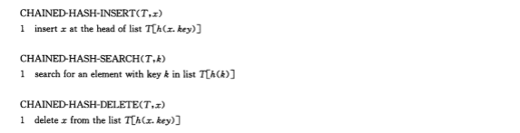

## 读书笔记

虽然直接寻址表的所有字典操作能在$O(1)$时间内完成，但是它的缺点也同样明显；

如果某一个元素的关键字特别大，但是动态集合的元素数量又相对少，这就会造成极大的内存浪费；此外，直接寻址表对拥有同样关键字的元素缺乏合理的处理；

**散列表**改善了直接寻址表的上述缺点：

1. 原本元素在直接寻址表的位置依赖于关键字的大小，在散列表中引入一个中间层，元素在表中的位置依赖于这个中间层，这个中间层的输入为元素关键字，输出为该元素在表中的位置；与直接依赖关键字相比，散列函数更加收敛，所使用的空间更小；

2. 虽然使用了散列函数，但是仍然会有不同元素产生同样的地址的冲突，散列表使用**链接法**来解决这一问题，对定位到同一位置的多个元素使用双向链表将它们组织起来；

插入操作的时间复杂度为$O(1)$;

搜索操作的时间复杂度为$O(n)$;

删除操作的时间复杂度为$O(1)$；（如果链表使用的是双向链表）

## 课后习题

### 11.2-1

> 假设用一个散列函数$h$将$n$个不同的关键字散列到一个长度为$m$的数组$T$中。假设采用的是简单均匀散列，那么期望的冲突数是多少？更准确地，集合${{k,l}: k \ne l, 且 h(k) = h(l)}$基的期望值是多少？

期望为$C_n^2 \frac{1}{m}$。

### 11.2-2

> 对于一个用链接法解决冲突的散列表，说明将关键字$5, 28, 19, 15, 20, 33, 12, 17, 10$插入到该表中的过程。设该表中有$9$个槽位，并设其散列函数为$k(k)=k mod 9$。

**略**。

### 11.2-3

> $Marley$教授做了这样一个假设，即如果将链模式改动一下，使得每个链表都能保持已排好序的顺序，散列的性能就可以有较大提高。$Marley$教授的改动对成功查找、不成功查找、插入和删除的操作的运行时间有何影响？

对于成功查找没什么影响；
对于失败查找提高了效率；
对于插入时间变为$O(\alpha)$，降低了效率;
对于删除没什么影响；

### 11.2-4

> 说明在散列表内部，如何通过将所有未占用的槽位链接成一个自由链表，来分配和释放元素所占的存储空间。假定一个槽位可以存储一个标志、一个元素加上一个或两个指针。所有的字典和自由链表的操作均应具有$O(1)$的期望运行时间。该自由链表需要是双向链表吗？或者，是不是单链表就足够了呢？

存储方法和第十章的自由链表存储方法相同，只不过散列表的自由链表的分配元素并不是按照顺序分配，而是按照散列函数分配，所以用双向链表更有利于自由链表的插入和删除操作。

### 11.2-5

> 假设将一个具有$n$个关键字的集合存储到一个大小为$m$的散列表中。说明如果这些关键字均源于全域$U$，且$|U| > nm$，则$U$中还有一个大小为$n$的子集，其由散列到同一槽位的所有关键字构成，使得链接法散列的查找时间为$\theta(n)$。

当一个槽位的元素有$n$个，查找时间理所应当为$\theta(n)$。

### 11.2-6

> 假设将$n$个关键字存储到一个大小为$m$且通过链接法解决冲突的散列表中，同时已知每条链的长度，包括其中最长链的长度$L$，请描述从散列表的所有关键字中均匀随机地选择某一元素并在$O(L * (1 + 1/\alpha))$的期望时间内返回该关键字的过程。

$\alpha = \frac{n} {m}$，$L$为最长链长度，即$L \ge \alpha$。所以$L * (1 + \frac{1}{\alpha}) \ge 1 + \alpha$。又因为成功查找期望时间为$O(1 + \alpha)$，即 $O( L(1 + \frac{1}{\alpha}) )$。

