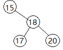

## 读书笔记

本小节介绍了二叉搜索树的查询操作，包括$SEARCH, MINIMUM,MAXIMUM, SUCCESSOR, PREDECESSOR$这$5$个操作，这五个操作均可以在$O(h)$，$h$是当前二叉树的高度。

### 搜索

递归实现：

```python
TREE-SEARCH(x, k)
if x == NIL or k == x.key
	return x
if k < x.key
	return TREE-SEARCH(x.left, k)
else 
	return TREE-SEARCH(x.right, k)
```

迭代实现：

```python
ITERATIVE-TREE-SEARCH(x, k)
while x != NIL and key != x.key
	if k < x.key
		x = x.left
	else 
		x = x.right
return x
```

### 最小和最大

获取最小值：

```python
TREE-MINIMUM(x)
while x.left != NIL
	x = x.left
return x
```

最左子节点就是最小值。

获取最大值：

```python
TREE-MAXIMUM(x)
while x.right != NIL
	x = x.right
return x
```

最右子节点就是最大值。

### 后继和前驱

后继节点：

```python
TREE-SUCCESSOR(x)
if x.right != NIL
	return TREE-MINIMUM(x.right)
y = x.p
while y != NIL and x == y.right
	x = y
	y. = y.p
return y
```

上述算法为中序遍历存在；

一个节点的后继节点有两种情况：

1. 当前节点$x$存在右子树，则后继节点就是右子树中的最小值。
2. 当前节点不存在右子树，则后继节点为某个祖先节点，此祖先节点的左子树包含当前节点。

前驱节点：

一个节点的前驱节点有两种情况：

1. 当前节点存在左子树，则前驱节点就是左子树中的最大值。
2. 当前节点不存在左子树，则前驱节点为某个祖先节点，此祖先节点的右子树包含当前节点。

## 课后习题

### 12.2-1

**略**。

### 12.2-2

> 写出$TREE-MINIMUM$和$TREE-MAXIMUM$的递归版本。

```python
TREE-MINIMUM(x)
 if x.left == NIL
 	return x
 TREE-MINIMUM(x.left)
```

```python
TREE-MAXIMUM(x)
if x.right == NIL
	return x
TREE-MAXIMUM(x.right)
```

### 12.2-3

> 写出过程$TREE-PREDECESSOR$的伪代码。

```python
TREE-PREDECESSSOR(x)
if x.left != NIL
	return TREE-MAXIMUM(x.left)
y = x.p
while y != NIL and x == y.left
	x = y
	y = y.p
return y
```

### 12.2-4

> $Bunyan$教授认为他发现了要给二叉搜索树的重要性质。假设在一颗二叉搜索树中查找一个关键字$k$，查找结束于一个树叶。考虑三个集合：$A$为查找路径左边的关键字集合；$B$为查找路径上的关键字集合；$C$为查找路径右边的关键字集合。$Bunyan$教授声称：任何$a\in A, b \in B, c\in C$，一定满足$a\le b\le c$。请给出该教授这个论断的一个最小可能的反例。



查找节点20，则集合A={17}, 集合B={15,18,29},集合C={φ}，并不满足集合A中的任意元素<=B中的。

### 12.2-5

> 证明：如果一颗二叉搜索树中的一个节点有两个孩子，那么它的后继没有左孩子，它的前驱没有右孩子。

如果当前节点的后继有左孩子，那就代表有一个节点比该后继节点小，但是实际上这个节点应该是当前节点，这就导致了二叉搜索树的错误。前驱节点没有右孩子也是一样。

### 12.2-6

> 考虑一颗二叉搜索树$T$，其关键字互不相同。证明：如果$T$中一个节点$x$的右子树为空，且$x$有一个后继$y$，那么$y$一定是$x$的最底层祖先，并且其左孩子也是$x$的祖先。（注意：每个节点都是它自己的祖先。）

前驱节点：

一个节点的前驱节点有两种情况：

1. 当前节点存在左子树，则前驱节点就是左子树中的最大值。
2. 当前节点不存在左子树，则前驱节点为某个祖先节点，此祖先节点的右子树包含当前节点。

### 12.2-7

> 对于一颗有$n$个节点的二叉搜索树，有另一种方法来实现中序遍历，先调用$TREE-MINIMUM$找到这棵树中的最小元素，然后再调用$n-1$次的$TREE-SUCCESSOR$。证明：该算法的运行时间为$\theta(n)$。

对$n$个元素进行遍历，无论整出什么幺蛾子，时间复杂度都在$\theta(n)$。

### 12.2-8

> 证明： 在一棵高度为$h$的二叉搜索树中，不论从哪个节点开始，$k$次连续的$TREE-SUCCESSOR$调用所需时间为$O(k+h)$。

复杂度里有一个$k$是因为调用了$k$次，有一个$h$是因为需要向上找到祖先节点；

### 12.2-9

> 设$T$是一颗二叉搜索树，其关键字互不相同；设$x$是一个叶节点，$y$为其父节点。证明：$y.key$或者是$T$树中大于$x.key$的最小关键字，或者是$T$树中小于$x.key$的最大关键字。

显然如此。