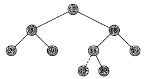
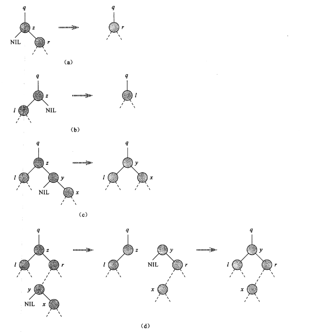
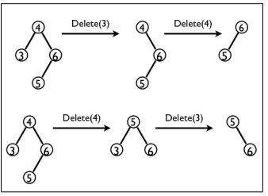

## 读书笔记

本小节介绍了二叉搜索树的插入和删除，至于修改只要先删除后插入就好；

### 插入

插入的过程和搜索的过程有些相似，先找到合适的位置然后将元素插入；

伪代码如下：

```python
TREE-INSERT(T, z)
y = NIL
x = T.root
while x != NIL
	y = x
	if z.key < x.key
		x = x.left
	else 
		x = x.right
z.p = y
if y == NIL
	T.root = z
else if z.key < y.key
	y.left = z
else 
	y.right = z
```



上图是插入`13`的过程，配合理解。

### 删除

从二叉搜索树的名字可以看出，这种数据结构对搜索友好，而对修改不友好，删除元素尤其难搞；

从二叉搜索树中删除一个元素$z$有三种基本情况：

1. 如果$z$没有孩子节点，那么只是简单将它删除；
2. 如果$z$只有一个孩子，那就删除$z$然后用它的孩子替代它的位置；
3. 如果$z$有两个孩子，那就在$z$的右子树中找到后继节点$y$，替换$z$的位置，然后$y$接管$z$的原来的左右子树。



配合上述图例进行理解，特别是最后一个例子。

伪代码如下：

```python
TRANSPLANT(T, u , v)
if u.p == NIL
	T.root = v
else if u == u.p.left
	u.p.left = v
else 
	u.p.right = v
if v != NIL
	v.p = u.p
```

```python
TREE-DELTE(T ,z )
if z.left == NIL
	TRANSPLANT(T, z, z.right)
else if z.right == NIL
	TRANSPLANR(T ,z, z.left)
else 
	y = TREE-MINIMUM(z.right)
	if y.p != z
		TRANSPLANT(T, y, y.right)
		y.right = z.right
		y.right.p = y
	TRANSPLANT(T, z, y)
	y.left = z.left
	y.left.p = y
```

其中$TRANSPLANT$过程用来变更子树的根。

## 课后习题

### 12.3-1

> 给出$TREE-INSERT$过程的一个递归版本。

```java
public void insert_recursive(TreeNode<Integer> newNode){
		if(tree.root == null){	//empty tree
			tree.root = newNode;
			return;
		}
		insert_recursive(newNode, tree.root);
	}
	
private void insert_recursive(TreeNode<Integer> newNode, TreeNode<Integer> currentNode){
		if(currentNode.left == null && currentNode.key >= newNode.key){	
			currentNode.left = newNode;
			newNode.parent = currentNode;
			return;
		}else if(currentNode.right == null && currentNode.key <= newNode.key){
			currentNode.right = newNode;
			newNode.parent = currentNode;
			return;
		}
		else{
			if(currentNode.key < newNode.key){
				insert_recursive(newNode, currentNode.right);
			}
			else{
				insert_recursive(newNode, currentNode.left);
			}
		}
	}
```

### 12.3-2

> 假设通过反复向一棵书中插入互不相同的关键字来构造一颗二叉树。证明：在这棵树中查找关键字所检查过的节点数目等于先前插入这个关键字所检查的节点数目加$1$。

因为要比较一次当前元素，所以加$1$。

### 12.3-3

> 对于给定的$n$个数的集合，可以通过先构造包含这些数据的一颗二叉搜索树(反复使用$TREE-INSERT$逐个插入这些数)，然后按中序遍历输出这些数的方法，来对它们排序。这个排序算法的最坏运行时间和最好运行时间各是多少？

运行时间要依据树高决定，树的的最小高度为$\lg{n}$，最大高度为$n$，所以最好运行时间为$\theta(n\lg{n})$，最坏运行时间为$n^2$。

### 12.3-4

> 删除操作可交换吗？可交换的含义是，先删除$x$再删除$y$留下的结果树与先删除$y$再删除$x$留下的结果数完全一样。如果是，说明为什么？否则，给出一个反例。

不可交换，如图：



### 12.3-5

> 假设为每个节点换一种设计，属性$x.p$指向$x$的双亲，属性$x.succ$指向$x$的后继。试给出使用这种表示法的二叉搜索树$T$上$SEARCH,INSERT,DELETE$操作的伪代码。这些伪代码应在$O(h)$时间内执行完，其中$h$为树$T$的高度。（提示：应该设计一个返回某个节点的双亲的子过程。）

这样还能算是二叉树吗？这不就是双向链表吗？

### 12.3-6

> 当$TREE-DELETE$中的节点$z$有两个孩子时，应该选择节点$y$作为它的前驱，而不是作为它的后继。如果这样做，对$TREE-DELETE$应该做些什么必要的修改？一些人提出一个公平策略，为前驱和后继赋予相等的优先级，这样得到了较好的实验性能。如何对$TREE-DELETE$进行修改来实现这样一种公平策略？

删除前驱和删除后继类似，也分为两种情况：如果左孩子是前驱，和左孩子不是前驱。和删除后继的策略是一样的，就是用前驱代替当前待删除的结点，然后删除前驱。
 公平策略，可以简单地随机选择用前驱或者后继替换。也可以从左右子树的高度考虑，如左子树高，则用前驱替换。