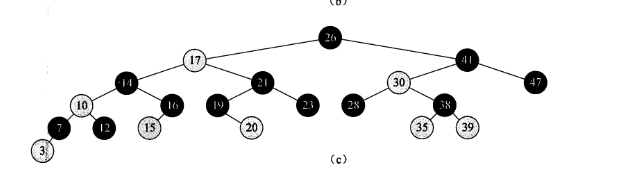

## 读书笔记

本小节介绍了**红黑树**的一些性质，具体的实现方法在之后的章节中讲述。

### 红黑树解决的问题

普通的二叉搜索树所有的操作都依赖于树的高度，但是树高又依赖于数据，极不稳定；

红黑树使得元素分布相对平衡，来使得树高为$O(\lg{n})$，减少操作时间。

### 红黑树的性质

1. 每个节点或是红色，或是黑色。
2. 根节点是黑色的。
3. 每个叶节点是黑色的。
4. 如果一个节点是红色的，则它的两个子节点都是黑色的。
5. 对每个节点，从该节点到其所有后代叶节点的简单路径上，均包含相同数目的黑色节点。

还通过数理证明：

> 一棵有$n$个内部节点的红黑树的高度至多为$2\lg{(n+1)}$。

## 课后习题

### 13.1-1

> 按照图$13-1(a)$的方式，画出关键字集合$<1,2,...,15>$上高度为$3$的完全二叉搜索树。以三种不同方式向图中加入$NIL$叶节点并对各节点着色，使所得的红黑树的黑高分别为$2,3,4$。

**略**。

### 13.1-2

> 对图$13-1$中的红黑树，画出对其调用$TREE-INSERT$操作插入关键字$36$后的结果。如果插入的节点被标为红色，所得的树是否还是一棵红黑树？如果该节点被标为黑色呢？

按照Tree-insert，插入36后应该是35的右孩子。无论是红色还是黑色，都不符合红黑数的定义：
 如果是红色，违背规则4：红结点的左右孩子都是黑的；
 如果是黑色，违背规则5： 不是每条简单路径上黑色结点数目都一样了。
 （所以，普通二叉搜索树的insert算法不能应用于红黑树。）

### 13.1-3

> 定义一棵松弛红黑树(relaxed red-black tree)为满足红黑树性质$1,3,4,5$的二叉搜索树。换句话说，根节点可以是红色或是黑色。考虑一棵根节点为红色的松弛红黑树$T$。如果将$T$的根节点标为黑色而其他都不变，那么所得到的是否还是一棵红黑树？

依然是红黑树；那为什么要规定根节点为黑色呢？

### 13.1-4

> 假设将一棵红黑树的每一个红节点吸收到它的黑色父节点中，使得红节点的子节点变成黑色父节点的子节点（忽略关键字的变化）。当一个黑节点的所有红色子节点都被吸收后，它可能的度为多少？所得的树的叶节点深度如何？

所有的叶节点深度和之前的黑高一样。

### 13.1-5

> 证明：在一棵红黑树中，从某节点$x$到其后代叶节点的所有简单路径中，最长的一条至多的最短一条的$2$倍。

最短路径：全是黑色节点；

最长路径：一个黑色一个红色交替；

### 13.1-6

> 在一棵黑高为$k$的红黑树中，内部节点最多可能有多少个？最少可能有多少个？

最少有$2^ｋ -1$个，最多有$2^{ｋ+1} -1$；

### 13.1-7

> 试描述一棵含有$n$个关键字的红黑树，使其红色内部节点个数与黑色内部节点个数的比值最大。这个比值是多少？该比值最小的树又是怎样呢？比值是多少？

比值最大是$1$，最小是$0$。

