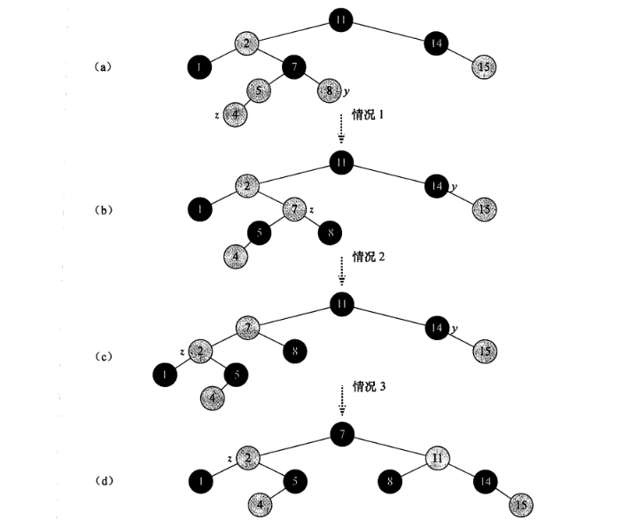

## 读书笔记

本小节介绍了向红黑树插入元素的过程：

1. 将新元素普通地插入二叉树；
2. 调整二叉树使其符合红黑树的性质；

### 插入元素到二叉树

```python
RB-INSERT(T, z)
y = T.nil
x = T.root
while x != T.nil
	y = x
	if z.key < x.key
		x = x.left
	else 
		x = x.right
z.p = y
if y == T.nil
	T.root = z
else if z.key < y.key
	y.left = z
else 
	y.right = z
z.left = T.nil
z.right = T.nil
z.color = RED
RB-INSERT-FIXUP(T, z)
```

这和二叉树的插入没有什么太大不同，区别主要在于：

1. $TREE-INSERT$内的所有$NIL$都被$T.nil$代替；
2. 将插入后的元素的左右子节点置为$T.nil$;
3. 将插入后的元素标记为红色；
4. 最后调用$RB-INSERT-FIXUP$调整二叉树使其符合红黑树的性质。

### 调整二叉树



如图$(a)$中所示，我们假设这是在调用$RB-INSERT-FIXUP$之前的情况，假设元素$z$被插入到了左支；

在对三种情况的调整时，其指导思想是先找到不符合红黑树性质的最小子树，然后通过不同措施使该子树符合红黑树性质，然后重复这一步骤，直至全部符合红黑树性质；

如图$(a)$，不符合红黑树性质的最小子树是以$7$为根的子树；

在图$(b)$，以$7$为根的子树符合了红黑树性质，但是以$2$为根的子树不符合红黑树性质；

在图$(c)$，以$2$为根的子树符合了红黑树性质，但是以$7$为根的子树不符合红黑树性质；

在图$(d)$，以$7$为根的子树符合红黑树性质，调整完毕；

伪代码如下：

```python
RB-INSERT-FIXUP(T, z)
while z.p.color == RED
	if z.p == z.p.p.left
		y = z.p.p.right
		if y.color == RED
			z.p.color = BLACK
			y.color = BLACK
			z.p.p.color = RED
			z = z.p.p
		else
			if z == z.p.right
				z = z.p
				LEFT-ROTATIE(T, z)
			z.p.color = BLACK
			z.p.p.color = RED
			RIGHT-ROTATE(T, z.p.p)
	else
		// 操作与上述操作相似，只是左右相反
T.root.color = BLACK
```

## 课后习题

### 13.3-1

> 在$RB-INSERT$的第$16$行，将新插入和节点着为红色。注意到，如果将$z$着为黑色，则红黑树的性质$4$就不会被破坏。那么为什么不选择将$z$着为黑色呢？

这样性质$5$就会被破坏，维护性质$4$的代价要小于维护性质$5$；

### 13.3-2

> 将关键字$41,38,31,12,19,8$连续地插入一棵初始为空的红黑树之后，试画出该结果树。

**略**。

### 13.3-3

> 假设图$13-5$和图$13-6$中子树$\alpha,\beta,\gamma,\delta$和$\epsilon$的黑高都是$k$。给每张图中的每个节点标上黑高，以验证图中所示的转换能保持性质$5$。

**略**。

### 13.3-4

> $TEACH$教授担心$RB-INSERT-FIXUP$可能将$T.nil.color$设为$RED$，这时，当$z$为根时，第$1$行的测试就不会让循环终止。通过讨论$RB-INSERT-FIXUP$永远不会将$T.nil.color$设置为$RED$，来说明这位教授的担心是没有必要的。

通过查看伪代码，对节点着为红色的只有$z$的祖父节点；

### 13.3-5

> 考虑一棵用$RB-INSERT$插入$n$个节点而成的红黑树。证明：如果$n>1$，则该树至少有一个红节点。

当$n=2$，当插入第$2$个元素时，这个元素必定被着为红色。

### 13.3-6

> 说明如果红黑树的表示不提供父指针，应当如何有效地实现$RB-INSERT$。

二叉树搜索父节点；

