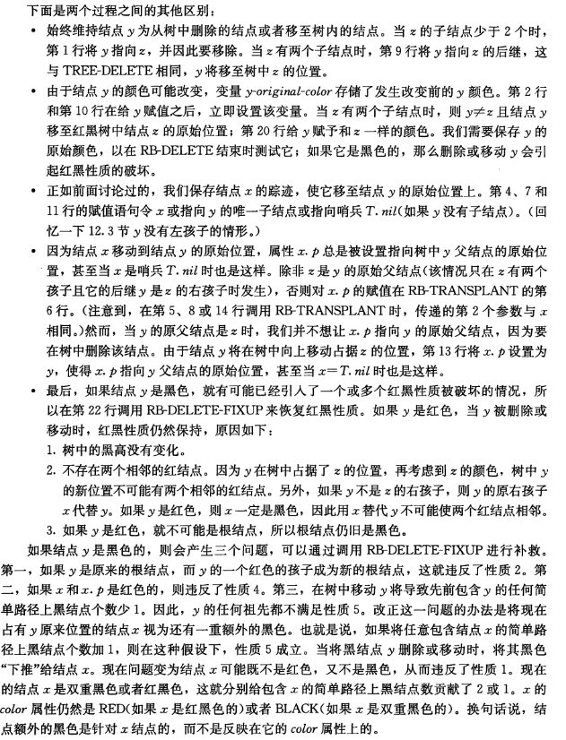
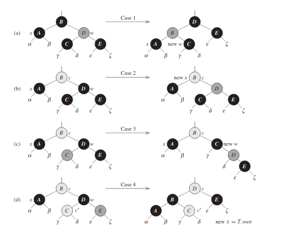
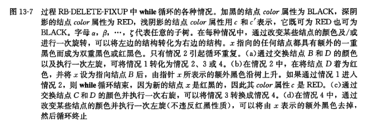
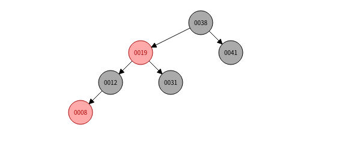
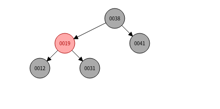
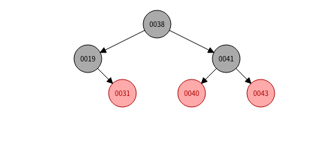
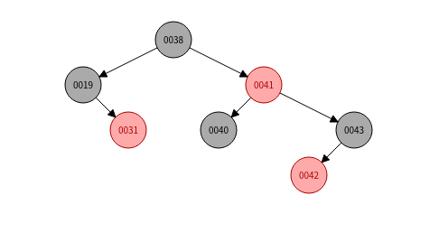
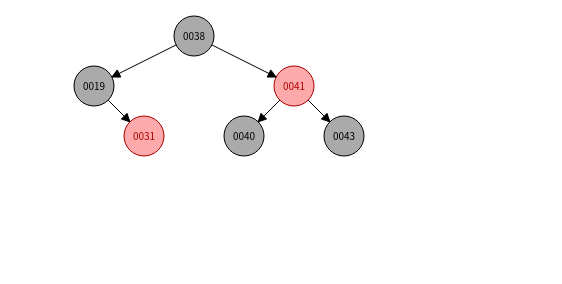

## 读书笔记

本小节介绍了红黑树的删除操作，这是红黑树的基础操作中比较复杂的一种；

和红黑树的插入的基本思想一致，红黑树的删除也是先将元素普通地删除，然后在调整二叉树使其符合红黑树的性质。

### 红黑树的元素普通删除

```python
RB-TRANSPLANT(T, u, v)
if u.p == T.nil
	T.root = v
else if u == u.p.left
	u.p.left = v
else 
	u.p.right = v
v.p = u.p
```

```python
RB-DELETE(T, z)
y = z
y-original-color = y.color
if z.left = T.nil
	x = z.right
	RB-TRANSPLANT(T, z, z.right)
else if z.right == T.nil
	x = z.left
	RB-TRANSPLANT(T, z, z.left)
else 
	y = TREE-MINIMUM(z.right)
	y-original-color = y.color
	x = y.right
	if y.p == z
		x.p = y
	else 
		RB-TRANSPLANT(T, y, y.right)
		y.right = z.right
		y.right.p = y
	RB-TRANSPLANT(T, z, y)
	y.left = z.left
	y.left.p = y
	y.color = z.color

if y-original-color == BLACK
	RB-DELETE-FIXUP(T, x)
```

红黑树的删除和二叉树的删除，基本操作也是一致的；

如果节点$z$只有一个子节点，则该子节点替代节点$z$的位置；

如果节点$z$有两个子节点，则找到后继结点代替节点$z$的位置；

由于删除了节点，所以当前二叉树可能无法保持红黑树的性质，所以必须对当前二叉树进行调整；

但是这两者又有一些区别，如书中所述：



### 红黑树删除元素后调整

```python
while x != T.root and x.color == BLACK
	if x == x.p.left
		w = x.p.right
		if w.color == RED
			w.color = BLACK
			x.p.color = RED
			LEFT-ROTATE(T, x.p)
			w = x.p.right
		else if w.left.color == BLACK and w.right.color == BLACK
			w.color = RED
			x = x.p
		else 
			if w.right.color == BLACK
				w.left.color = BLACK
				w.color = RED
				RIGHT-ROTATE(T, w)
				w = x.p.right
			w.color = x.p.color
			x.p.color = BLACK
			w.right.color = BLACK
			LEFT-ROTATE(T, x.p)
			x = T.root
     else 
    	// 和上述操作相似，只是左支变成了右支

x.color = BLACK
```





## 课后习题

### 13.4-1

> 在执行$RB-DELETE-FIXUP$之后，证明：树根一定是黑色的。

上述四种情况，能够终止循环的只有第$2,4$种情况；

第$2$情况：

指针最多上升$O(\lg{n})$次，也就是到达根节点，然后最后过程的最后一句话执行后，会将根节点置为黑色；

第$4$种情况：

这种情况在最后直接将$x$置为根节点，同样会置为黑色；

### 13.4-2

> 在$RB-DELETE$中，如果$x$和$x.p$都是红色，证明：可以通过调用$RB-DELETE-FIXUP(T, x)$来恢复性质$4$。

由于$x$为红色，所以不会执行循环，会直接将其置为黑色；

### 13.4-3

> 在练习$13.3-2$中，将关键字$41,38,31,12,19,8$连续插入一棵初始的空树中，从而获得一棵红黑树。请给出从该树中连续删除关键字$8,12,19,31,38,41$后的红黑树。





下面的图不贴了；

### 13.4-4

> 在$RB-DELETE-FIXUP$代码中的那些行中，可能会检查或修改哨兵$T.nil$？

获取叔节点的地方。

### 13.4-5

> 在图$13-7$的每种情况中，给出所示子树的根节点至每棵子树$\alpha,\beta,...,\zeta$之间的黑节点个数，并验证它们在转换之后保持不变。当一个节点的$color$属性为$c$或$c'$时，在计数中用记号$count(c)$或$count(c')$来表示。

**略**。

### 13.4-6

> $Skelton$和$Baron$教授担心在$RB-DELETE-FIXUP$的情况$1$开始时，节点$x.p$可能不是黑色的。如果这两位教授是对的，则第5~6行就是错的。证明：$x.p$在情况$1$开始时必是黑色的，从何说明这两位教授没有担心的必要。

在情况$1$中，叔节点是红色的，这代表着$x.p$必是黑色；

因为如果$x.p$是红色的，则叔节点应该是黑色；

### 13.4-7

> 假设用$RB-INSERT$将一个节点$x$插入一棵红黑树，紧接着又用$RB-DELETE$将它从树中删除。结果红黑树和初始的红黑树是否一样？证明你的答案？

不一样；

初始红黑树：



插入元素后：



删除元素后：



可以看到元素`41`及其子树着色有一些变化；