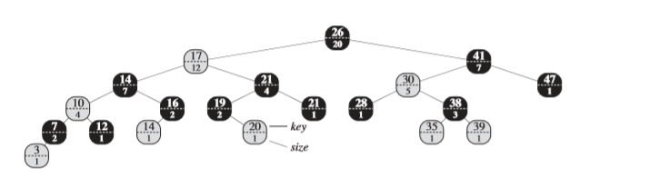
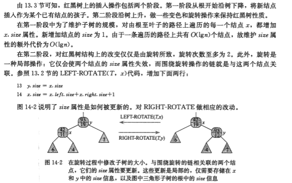
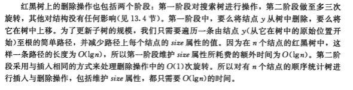
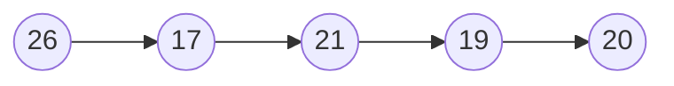

## 读书笔记

本小节介绍了红黑树的改进版本，为每个节点新增一个属性，用于记录当前子树的数量；



新增属性$x.size$是由左子树加右子树再加本身组成，即$x.size = x.left.size + x.right.size + 1$；

### 维护数量属性

对红黑树的基本操作过程中，需要持续维护$size$属性；

#### 插入



#### 删除



### 获取第$i$ 小的元素

```python
OS-SELECT(x, i)
r = x.left.size + 1
if i == r
	return x
else if i < r
	return OS-SELECT(x.left, i)
else 
	return OS-SELECT(x.right, i - r)
```

### 获取指定元素的次序

```python
OS-RANK(T, x)
r = x.left.size + 1
y = x
while y != T.root
	if y == y.p.right
		r = r + y.p.left.size + 1
	y = y.p
return r
```

## 课后习题

### 14.1-1

> 对于图$14-1$中的红黑树$T$，说明执行$OS-SELECT(T.root, 10 )$的过程。


过程依次是：



### 14.1-2

> 对于图$14-1$中的红黑树$T$和关键字$x.key$为$35$的节点$x$，说明执行$OS-RANK(T, x)$的过程。

可以在图中右下角的位置找到元素$35$，在进入循环之前，$r=1 \text{且y指向元素35}$，循环的终止条件是$\text{y指向根节点}$；

第一次循环结束，$y$指向元素$38$；

第二次循环结束，$r=3$，$y$指向元素$30$；

第三次循环结束，$r=3$，$y$指向元素$41$；

第四次循环结束，$r=16$，$y$指向元素$26$；

### 14.1-3

> 写出$OS-SELECT$的非递归版本。

//todo

### 14.1-4

> 写出一个递归过程$OS-KEY-RANK(T, k)$，以一棵顺序统计树$T$和一个关键字$k$作为输入，要求返回在由$T$表示的动态集合中的秩。假设$T$的所有关键字都不相同。

```python
OS-KEY-RANK(T, k)
r = k.left.size + 1
if y == y.p.right && y != T.root
	r += OS-KEY-RANK(T, k.p)
return r
```

### 14.1-5

> 给定$n$个元素的顺序统计树中的一个元素$x$和一个自然数$i$，如何在$O(\lg{n})$的时间内确定$x$在该树线性序中的第$i$个后继？

先确定元素$x$的秩，然后确定其相对后继节点的秩，最后根据相对后继节点的秩查找元素。

### 14.1-6

> 在$OS-SELECT$或$OS-RANK$中，注意到无论什么时候引用节点的$size$属性都是为了计算一个秩。相应地，假设每个节点都存储它在以自己为根的子树的秩。是说明在插入和删除时，如何维护这个信息。（注意，这两种操作都可能引起旋转。）

//todo

### 14.1-7

> 说明如何在$O(n\lg{n})$时间内，利用顺序统计树对大小为$n$的数组中的逆序对（见思考题2-4）进行计数。

//todo

