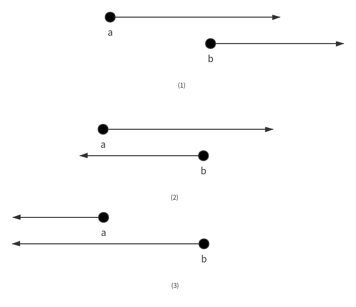
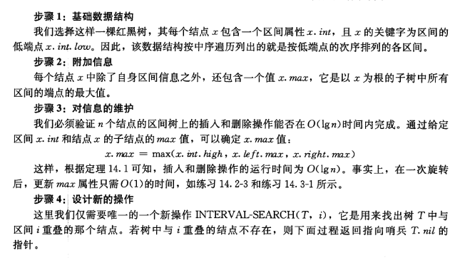

## 读书笔记

本小节介绍了一种红黑树的扩展：区间树；

为每个节点添加了一个新属性$int$，属性$int$又有两个属性$low,high$，分别表示区间的两端；

### 区间重叠

区间便于表示占用一连续时间的一些事件。为了查询给定时间内发生的事件，需要在区间树找到与给定时间重叠的部分；

假设在一条直线有左右两个点$a,b$，由这两个点向左或者向右划线段，两条线段在下面三种情况下会重叠：



所以若有两条线段$i,i'$，当$i.low \le i'.high \;\&\&\; i'.low \le i.high $，则两条线段重叠。

### 区间树的扩展过程



```python
INTERVAL-SEARCH(T, i)
x = T.root
while x != T.nil and i does not overlay x.int
	if x.left != T.nil and x.left.max >= i.low
		x = x.left
	else 
		x = x.right
return x
```

## 课后习题

### 14.3-1

> 写出作用于区间树的节点且在$O(1)$时间内更新$max$属性的过程$LEFT-ROTATE$的伪代码。

```python
LEFT-ROTATE(T, x)
    y = x.right
    y.max = x.max
    x.max = max(x.left.max, y.left.max, x.int.high)
```

### 14.3-2

> 改写$INTERVAL-SEARCH$的代码，使得当所有区间都是开区间时，它也能正确地工作。

将循环的判断条件去掉等于。

### 14.3-3

> 请给出一个有效的算法，对一个给定的区间$i$，返回一个与$i$重叠且具有最小低端点的区间；或者当这样的区间不存在时返回$T.nil$。

```python
MIN-SEARCH(T, i)
    x = T.root
    res = T.nil
    mark = INT_MAX
    while x != T.nil
        if i overlap x.int
            if x.int.low < mark
                mark = x.low
                res = x
        if x.left != T.nil and x.left.max ≥ i.low
            x = x.left
        else
            x = x.right
    return res
```

### 14.3-4

> 给定一棵区间树$T$和一个区间$i$，请描述如何在$O(min(n, k\lg{n}))$时间内列出$T$中所有与$i$重叠的区间，其中$k$为输出的区间数。（提示：一种简单的方法是做若干次查询，并且在这些查询操作中修改树，另一种略微复杂点的方法是不对树进行修改。）

```python
SEARCH-ALL(T.root, i)
    x = T.root
    if i overlap x.int
        print x
    if x.left != T.nil and x.left.max ≥ i.max
        SEARCH-ALL(x.left, i)
    if x.right != T.nil and x.right.int.low ≤ i.high and x.right.max ≥ i.low
        SEARCH-ALL(x.right, i)
```

### 14.3-5

> 对区间树$T$和一个区间$i$，请修改有关区间树的过程来支持新的操作$INTERVAL-SEARCH-EXACTLY(T, i)$，它返回一个指向$T$中节点$x$的指针，使得$x.int.low=i.low$且$x.int.high=i.high$；或者如果$T$不包含这样的区间时返回$T.nil$。所有的操作（包括$INTERVAL-SEARCH-EXACTLY(T, i)$）对于包含$n$个节点的区间树运行时间都应为$O(\lg{n})$。

直接按照$ i.low $搜索二叉树，然后判断 $x.int.high$ 是否等于 $i.high$ 即可。

### 14.3-6
> 说明如何来维护一个支持操作 $MIN-GAP$ 的一些数的动态集 $Q$，使得该操作能给出 $Q$ 中两个最接近的数之间的差值。例如，$Q = {1, 5, 9, 15, 18, 22}$，则 $MIN-GAP$ 返回 $18 -15 = 3$，因为 $15 $和 $18$ 是$ Q $中两个最接近的数。要使得操作 $INSERT$、$DELETE$、$SEARCH$ 和$ MIN-GAP$ 尽可能高效，并分析它们的运行时间。

给红黑树的每个结点新增 $min$、$max$、$mingap$ 属性。

$x.min$（以$ x $为根的树中最小的关键字。）：插入时，只需更新插入的结点至根结点路径上 $O(\lg{n})$ 个结点。更新结点操作$ x.min = min(x.left.min, x.key)$ 只需$ O(1) $时间，所以插入操作对更新 $min$ 属性也是 $O(\lg{n})$ 时间。删除同理。

$x.max$（以$ x $为根的树中最大的关键字。）：插入、删除和$ x.min $类似。$x.max = max(x.right.max, x.key)$。

$x.mingap$（以$ x $为根的树的$ MIN-GAP$）：插入、删除依然是$ O(\lg{n}) $时间更新 $mingap$ 属性，$x.mingap = min(x.left.mingap, x.right.mingap, x.key - x.left.max, x.right.min - x.key)$。

综上，$INSERT$、$DELETE$、$SEARCH$ 时间为$ O(\lg{n})$，$MIN-GAP$ 时间为 $O(1)$。 