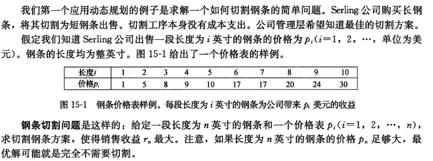
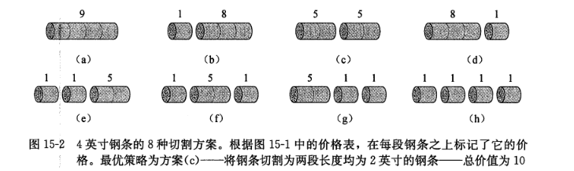

## 读书笔记

### 说文解字

动态规划（dynamic programming），描述了它区别与其他算法的最大特征；

其中$programming$表示的是一种表格法，在动态规划算法执行的过程中，会动态地去将子问题的解填入表格和读取已知子问题的解，以减少不必要的运算；

### 与分治法的异同

相同点：

1. 都是通过组合子问题的解来求解原问题

不同点：

1. 动态规划子问题有重叠，分治法没有
2. 动态规划会缓存以求解的子问题的解
3. 动态规划常用于求解最优化问题

### 设计动态规划的步骤

1. 刻画一个最优解的结构特征
2. 递归地定义最优解的值
3. 计算最优解的值，通常采用自底向上的方法
4. 利用计算出的信息构造一个最优解

### 钢条切割

上面抽象地讲述了动态规划的特征和设计步骤，但是缺乏细节，下面利用钢条切割的例子加深理解。



首先需要刻画最优解的结构特征，以$n=4$为例，一共有下面$8$个解：



那么$r_n$的最优解结构如下：
$$
r_n = max(p_n, r_1+r_{n-1},r_2+r_{n-2},...,r_{n-1}+r_1)
$$

然后递归地定义最优解的值，要求解$r_n$的最优值，需要递归地求解$r_1,r_2,..,r_{n-1}$的最优值；

能够用动态规划解决的问题一定满足**最优子结构性质**：问题的最优解由相关子问题的最优解组合而成，而这些子问题可以独立求解；

最后计算最优解的值，这里有两种方法，**带备忘的自顶向下法**和**自底向上法**。

> 带备忘的自顶向下法

这种方法实际上是原本自顶向下的改良，原本自顶向下对于每个输入都会从头开始计算，比如分别输入$8$和$9$，会递归$8$次和$9$次，并不会在计算$9$的时候复用$8$的结果；

带备忘的自顶向下法，就将已知的输入的结果保留下来，减少了不必要的计算。

```python
MEMOIZED-CUT-ROD(p, n)
let r[0..n]  be a new array
for i = 0 to n
	r[i] = -∞
return MEMOIZED-CUT-ROD-AUX(p, n, r)

MEMOIZED-CUT-ROD-AUX(p, n, r)
if r[n] >= 0
	return r[n]
if n == 0
	q = 0
else q = -∞
	for i = 1 to n
		q = max(q, p[i] + MEMOIZED-CUT-ROD-AUX(p, n-i, r))
r[n] = q
return q
```

> 自底向上法

这种方法更加符合逻辑，在解决问题之前先将所有的子问题解决，然后直接得到答案。

```python
BOTTOM-UP-CUT-ROD(p, n)
let r[0..n]  be a new array
r[0] = 0
for j = 1 to n
	q = -∞
	for i = 1 to j
		q = max(q, p[i] + r[j-1])
	r[j] = q
return r[n]
```

这两种方法，时间复杂度相同，但是自顶向下是递归求解，函数调用后者较高的开销，所以有着较大的系数；

## 课后习题

### 15.1-1

> 由公式$(15.3)$和初始条件$T(0)=1$ ，证明公式$(15.4)$成立。

公式$15.3$：
$$
T(n) = 1 + \sum_{j=0}^{n-1}T(j)
$$
公式$15.4$：
$$
T(n) = 2^n
$$

令$S(n) = \sum_{j=0}^{n} T(j)$
$$
\begin{aligned}
&\therefore T(n) = 1 + S(n-1)\\[2ex]
&\therefore T(n-1) = 1 + S(n-2)\\[2ex]
&\therefore T(n) - T(n-1) = S(n-1) - S(n-2) = T(n-1)\\[2ex]
&\therefore T(n) = 2T(n-1)\\[2ex]
&\text{又} T(0) = 1, \therefore T(n) = 2^n
&\end{aligned}
$$

### 15.1-2

> 举反例证明下面的“贪心”策略不能保证总是得到最有切割方案。定义长度为$i$的钢条密度为$p_i / i$，即每英寸的价值。贪心策略将长度为$n$的钢条切割下长度为$i(1\le i \le n)$的一段，其密度最高。接下来继续使用相同的策略切割长度为$n-i$的剩余部分。


当长度$n = 4$时，按照“贪心”策略则切割成长度为$1$和$3$的钢条（$p = 1 + 8 = 9$）；而最优解为切割成$2$条长度为$2$的钢条（$p = 5 + 5 = 10 > 9$）。

### 15.1-3

>  我们对钢条切割问题进行一点修改，除了切割下的钢条段具有不同的价格$p_i$外，每次切割还要付出固定的成本$c$。这样，切割方案的收益就等于钢条段的价格之和减去切割的成本。设计一个动态规划算法解决修改后的钢条切割问题。

```python
BOTTOM_UP_CUT_ROD_COST(p, n, c):
    let r[0...n] and m[0...n] be new arrays
    r[0] = 0, m[0] = 0
    for i = 1 to n
        q = -∞
        for j = 1 to i
            if q < p[j] + r[i-j] - m[i-j]*c
                q = p[j] + r[i-j] - m[i-j]*c
                m[i] = m[i-j] + 1
        r[i] = q
    return r[n]
```

### 15.1-4

> 修改$MEMOIZED-CUT-ROD$，使之不仅返回最优收益值，还返回切割方案。

```python
CUT_WAY(s, n):
    i = 0
    while n > 0
        t[i] = s[n]
        n = n - s[n]
        i = i + 1
    return t[0...i-1]
```

### 15.1-5

> 斐波那契数列可以用递归式$(3.22)$定义。设计一个$O(n)$时间的动态规划算法计算第$n$个斐波那契数。画出子问题图。图中有多少顶点和边？

```python
FIBONACCI(n)
if n <=2
	return 1
x = 1
y = 1
for i = 3 to n
	result = x + y
	x = y
	y = res
return res
```

一共有$n$个节点，$2n-3$条边。
