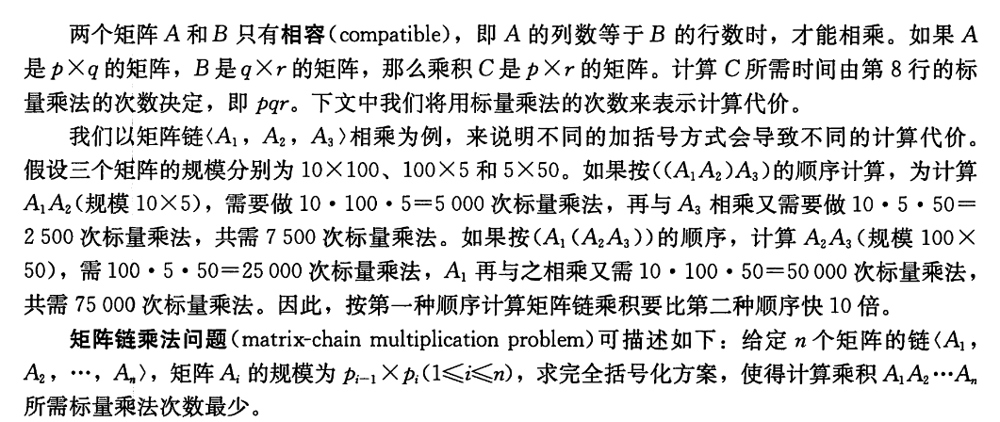
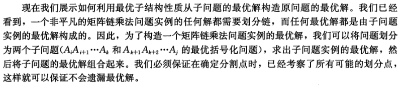

## 读书笔记

本小节介绍了利用动态规划解决**矩阵链乘法**的过程。



### 穷举不可行

想要通过穷举的方法，获得所有的解决方案是不可行的。

对于一个矩阵链，我们可以宏观地将它看作两个子矩阵链相乘，即$A_1..A_k$和$A_(k+1)..A_n$；

所以代价$P(n)$的表达式如下：
$$
\begin{aligned}
P(n) = \begin{cases} 1, & if \; n = 1\\[2ex]
\sum_{k=1}^{n-1}P(k)P(n-k), & if \;n \ge 2
\end{cases}
\end{aligned}
$$
在练习题$15.2-3$中会要求证明上述公式的时间复杂度为$\Omega(2^n)$。

一个指数级的时间复杂度是难以接受的。

### 应用动态规划算法

#### 最优括号化方案的结构特征



其实这个结构特征和上面穷举所描述的是一致的，但是动态规划接下来的做法有所不同。

#### 一个递归解决方案

假设我们已经知道一个矩阵链分割点$k$的值，那么矩阵链$A_{i..j}$的最小代价由三部分组成：左子矩阵链的最小代价，右子矩阵链的最小代价和这两个大矩阵相乘的代价；

即：
$$
m[i,j] = m[i,k] + m[k+1, j] +  P_{i-1}P_kP_j
$$
但是实际上我们并不知道$k$的值，所以需要在$i$与$j$之间遍历出代价最小的$k$值。

#### 计算最优代价

采用自底向上方法：

```python
MATRIX-CHAIN-ORDER(p)
n = p.length - 1
let m[1..n,1..n] and s[1..n-1, 2..n] be new tables
for i = 1 to n
	m[i, i] = 0
for l = 2 to n	// l is the chain length
	for i = 1 to n-l+1
		j = i + l -1
		m[i, j] = ∞
		for k = i to j-1
			q = m[i,k] + m[k+1,j]+ p(i-1)p(k)p(j)
			if q < m[i,j]
				m[i,j] = q
				s[i,j] = k
return m and s
```

时间复杂度为$\Omega(n^3)$。

#### 构造最优解

```python
PRINT-OPTIMAL-PARENS(s,i,j)
if i = j
	print A(i)
else 
	print "("
	PRINT-OPTIMAL-PARENS(s, i, s[i,j])
	PRINT-OPTIMAL-PARENS(s, s[i,j]+1, j)
	print ")"
```

## 课后习题

### 15.2-1

> 对矩阵规模序列$<5,10,3,12,5,50,6>$，求矩阵链最优括号化方案。

//todo

### 15.2-2

> 设计递归算法$MATRIX-CHAIN-MULTIPLY(A,s,i,j)$，实现矩阵链最优代价乘法的真正计算过程，其输入参数为矩阵序列$<A_1,A_2,...,A_n>$，$MATRIX-CHAIN-ORDER $得到的表$s$，以及下标$i$和$j$。（初始调用应为$MATRIX-CHAIN-MULTIPLY(A,s,1,n)$。）

```python
MATRIX-CHAIN-MULTIPLY(A,s,i,j)
k = s[i,j]
return MATRIX-CHAIN-MULTIPLY(A,s,i,k)*MATRIX-CHAIN-MULTIPLY(A,s,k+1,j)
```

### 15.2-3

> 用代入法证明递归公式$(15.6)$的结果为$\Omega(2^n)$。

**略**

### 15.2-4

> 对输入链长度为$n$的矩阵链乘法问题，描述其子问题图：它包含多少个顶点？包含多少条边？这些边分别连接哪些顶点？

包含$n^2$个顶点，$n^3$条边连接$n^2$个顶点

