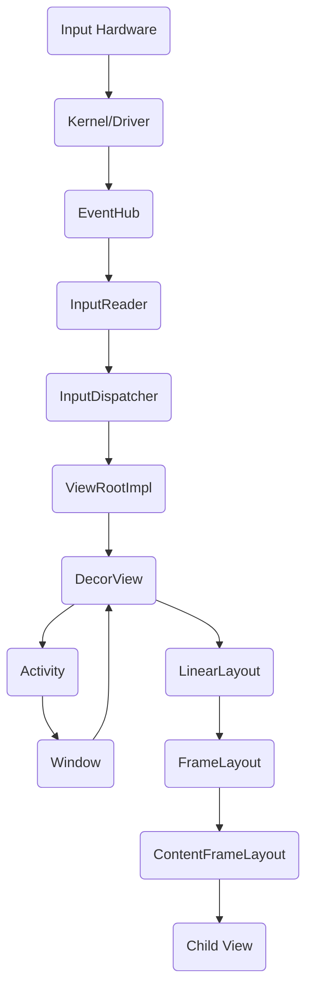
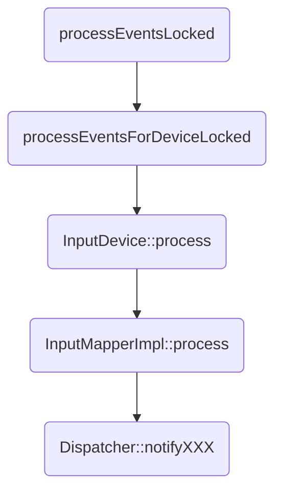
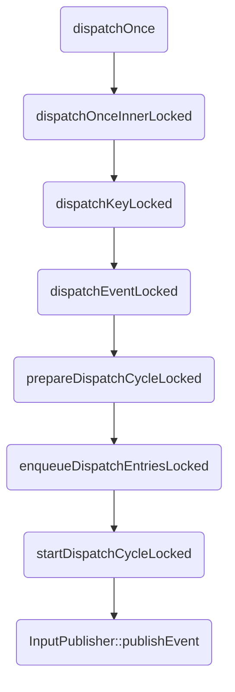

## 整体分发流程

[Android Input Framework](http://strayinsights.blogspot.com/2018/08/android-input-framework.html) 这篇详细讲解了触摸事件从硬件分发到Activity之前的过程。


接下来，我们就从`EventHub`开始一点一点研究事件的分发过程。

## EventHub

[EventHub.h](https://cs.android.com/android/platform/superproject/+/master:frameworks/native/services/inputflinger/reader/include/EventHub.h)，这是`EventHub.h`的源码，以便下面讲解不懂的查阅。

首先，`EventHub`实现了`EventHubInterface`接口，`EventHubInterface`功能如下：
```C++
/*
 * Grand Central Station for events.
 *
 * The event hub aggregates input events received across all known input
 * devices on the system, including devices that may be emulated by the simulator
 * environment.  In addition, the event hub generates fake input events to indicate
 * when devices are added or removed.
 *
 * The event hub provides a stream of input events (via the getEvent function).
 * It also supports querying the current actual state of input devices such as identifying
 * which keys are currently down.  Finally, the event hub keeps track of the capabilities of
 * individual input devices, such as their class and the set of key codes that they support.
 */
```
接收系统内所有已知设备的输入事件（包括模拟设备）；当设备添加或者移除时，会生成假消息通知；可以通过`getEvent`函数获得输入事件；它还支持查询输入设备的当前实际状态，例如标识哪些键当前处于关闭状态。最后，`EventHub`跟踪各个输入设备的功能，例如它们的类和它们支持的关键代码集。

`EventHub`所支持的设备如下：
```C++
/*
 * Input device classes.
 */
enum {
    /* The input device is a keyboard or has buttons. */
    INPUT_DEVICE_CLASS_KEYBOARD = 0x00000001,

    /* The input device is an alpha-numeric keyboard (not just a dial pad). */
    INPUT_DEVICE_CLASS_ALPHAKEY = 0x00000002,

    /* The input device is a touchscreen or a touchpad (either single-touch or multi-touch). */
    INPUT_DEVICE_CLASS_TOUCH = 0x00000004,

    /* The input device is a cursor device such as a trackball or mouse. */
    INPUT_DEVICE_CLASS_CURSOR = 0x00000008,

    /* The input device is a multi-touch touchscreen. */
    INPUT_DEVICE_CLASS_TOUCH_MT = 0x00000010,

    /* The input device is a directional pad (implies keyboard, has DPAD keys). */
    INPUT_DEVICE_CLASS_DPAD = 0x00000020,

    /* The input device is a gamepad (implies keyboard, has BUTTON keys). */
    INPUT_DEVICE_CLASS_GAMEPAD = 0x00000040,

    /* The input device has switches. */
    INPUT_DEVICE_CLASS_SWITCH = 0x00000080,

    /* The input device is a joystick (implies gamepad, has joystick absolute axes). */
    INPUT_DEVICE_CLASS_JOYSTICK = 0x00000100,

    /* The input device has a vibrator (supports FF_RUMBLE). */
    INPUT_DEVICE_CLASS_VIBRATOR = 0x00000200,

    /* The input device has a microphone. */
    INPUT_DEVICE_CLASS_MIC = 0x00000400,

    /* The input device is an external stylus (has data we want to fuse with touch data). */
    INPUT_DEVICE_CLASS_EXTERNAL_STYLUS = 0x00000800,

    /* The input device has a rotary encoder */
    INPUT_DEVICE_CLASS_ROTARY_ENCODER = 0x00001000,

    /* The input device is virtual (not a real device, not part of UI configuration). */
    INPUT_DEVICE_CLASS_VIRTUAL = 0x40000000,

    /* The input device is external (not built-in). */
    INPUT_DEVICE_CLASS_EXTERNAL = 0x80000000,
};

```

## InputReader

[InputReader.cpp](https://cs.android.com/android/platform/superproject/+/master:frameworks/native/services/inputflinger/reader/InputReader.cpp;bpv=0;bpt=1)
`InputReader`的主要功能就是不断地从`EventHub`中获取硬件消息，然后处理数据，最后分发到`InputDispatcher`，值得注意的是，`InputReader`运行在一个独立的线程中。

主要代码如下：
```C++

    // With each iteration of the loop, InputReader reads and processes one incoming message from
    // the EventHub.
void InputReader::loopOnce() {
    int32_t oldGeneration;
    int32_t timeoutMillis;
    bool inputDevicesChanged = false;
    std::vector<InputDeviceInfo> inputDevices;
    { // acquire lock
        AutoMutex _l(mLock);

        oldGeneration = mGeneration;
        timeoutMillis = -1;

        uint32_t changes = mConfigurationChangesToRefresh;
        if (changes) {
            mConfigurationChangesToRefresh = 0;
            timeoutMillis = 0;
            refreshConfigurationLocked(changes);
        } else if (mNextTimeout != LLONG_MAX) {
            nsecs_t now = systemTime(SYSTEM_TIME_MONOTONIC);
            timeoutMillis = toMillisecondTimeoutDelay(now, mNextTimeout);
        }
    } // release lock

    size_t count = mEventHub->getEvents(timeoutMillis, mEventBuffer, EVENT_BUFFER_SIZE);

    { // acquire lock
        AutoMutex _l(mLock);
        mReaderIsAliveCondition.broadcast();

        if (count) {
            processEventsLocked(mEventBuffer, count);
        }

        if (mNextTimeout != LLONG_MAX) {
            nsecs_t now = systemTime(SYSTEM_TIME_MONOTONIC);
            if (now >= mNextTimeout) {
#if DEBUG_RAW_EVENTS
                ALOGD("Timeout expired, latency=%0.3fms", (now - mNextTimeout) * 0.000001f);
#endif
                mNextTimeout = LLONG_MAX;
                timeoutExpiredLocked(now);
            }
        }

        if (oldGeneration != mGeneration) {
            inputDevicesChanged = true;
            getInputDevicesLocked(inputDevices);
        }
    } // release lock

    // Send out a message that the describes the changed input devices.
    if (inputDevicesChanged) {
        mPolicy->notifyInputDevicesChanged(inputDevices);
    }

    // Flush queued events out to the listener.
    // This must happen outside of the lock because the listener could potentially call
    // back into the InputReader's methods, such as getScanCodeState, or become blocked
    // on another thread similarly waiting to acquire the InputReader lock thereby
    // resulting in a deadlock.  This situation is actually quite plausible because the
    // listener is actually the input dispatcher, which calls into the window manager,
    // which occasionally calls into the input reader.
    mQueuedListener->flush();
}


```

值得注意的是`processEventsLocked(mEventBuffer, count)`这一处调用，其深层调用过程如下：



此处的`InputMapperImpl`并不是指某一具体类，而是Android系统针对上述所支持的设备所创建的实现类。


## InputDispatcher

`InputDispatcher`同样运行在一个独立的线程中，其构造函数如下：

```C++
InputDispatcher::InputDispatcher(const sp<InputDispatcherPolicyInterface>& policy)
      : mPolicy(policy),
        mPendingEvent(nullptr),
        mLastDropReason(DropReason::NOT_DROPPED),
        mIdGenerator(IdGenerator::Source::INPUT_DISPATCHER),
        mAppSwitchSawKeyDown(false),
        mAppSwitchDueTime(LONG_LONG_MAX),
        mNextUnblockedEvent(nullptr),
        mDispatchEnabled(false),
        mDispatchFrozen(false),
        mInputFilterEnabled(false),
        // mInTouchMode will be initialized by the WindowManager to the default device config.
        // To avoid leaking stack in case that call never comes, and for tests,
        // initialize it here anyways.
        mInTouchMode(true),
        mFocusedDisplayId(ADISPLAY_ID_DEFAULT) {
    mLooper = new Looper(false);
    mReporter = createInputReporter();

    mKeyRepeatState.lastKeyEntry = nullptr;

    policy->getDispatcherConfiguration(&mConfig);
}
```

可以看到其拥有一个`Looper`；

前面说到`InputReader`通过`notifyXXX` 函数将事件分发到了`InputDispatcher`；

`notifyXXX`主要做了四件事：

1. 将分发过来的`RawEvent`包装为最终消费的`KeyEvent`
2. 为`KeyEvent`打上标记，有一些`KeyEvent`并不需要交给应用响应，直接交给Framework，例如电源键；
3. 将`KeyEvent`添加到队列
4. 唤醒`Looper`，进行更深层次处理

队列处理调用过程如下：



`InputPublisher::publishXXX`函数会将参数包装成`InputMessage`，然后通过`InputChannel`将`InputMessage`发送到`Socket`。

## ViewRootImpl

[WindowInputEventReceiver.class](https://cs.android.com/android/platform/superproject/+/master:frameworks/base/core/java/android/view/ViewRootImpl.java?q=WindowInputEventReceiver&ss=android%2Fplatform%2Fsuperproject)

从`socket`读取数据再次包装，放入`Looper`，通过`Hanlder`处理；

```java
    private void deliverInputEvent(QueuedInputEvent q) {
        Trace.asyncTraceBegin(Trace.TRACE_TAG_VIEW, "deliverInputEvent",
                q.mEvent.getId());

        if (Trace.isTagEnabled(Trace.TRACE_TAG_VIEW)) {
            Trace.traceBegin(Trace.TRACE_TAG_VIEW, "deliverInputEvent src=0x"
                    + Integer.toHexString(q.mEvent.getSource()) + " eventTimeNano="
                    + q.mEvent.getEventTimeNano() + " id=0x"
                    + Integer.toHexString(q.mEvent.getId()));
        }
        try {
            if (mInputEventConsistencyVerifier != null) {
                Trace.traceBegin(Trace.TRACE_TAG_VIEW, "verifyEventConsistency");
                try {
                    mInputEventConsistencyVerifier.onInputEvent(q.mEvent, 0);
                } finally {
                    Trace.traceEnd(Trace.TRACE_TAG_VIEW);
                }
            }

            InputStage stage;
            if (q.shouldSendToSynthesizer()) {
                stage = mSyntheticInputStage;
            } else {
                stage = q.shouldSkipIme() ? mFirstPostImeInputStage : mFirstInputStage;
            }

            if (q.mEvent instanceof KeyEvent) {
                Trace.traceBegin(Trace.TRACE_TAG_VIEW, "preDispatchToUnhandledKeyManager");
                try {
                    mUnhandledKeyManager.preDispatch((KeyEvent) q.mEvent);
                } finally {
                    Trace.traceEnd(Trace.TRACE_TAG_VIEW);
                }
            }

            if (stage != null) {
                handleWindowFocusChanged();
                stage.deliver(q);
            } else {
                finishInputEvent(q);
            }
        } finally {
            Trace.traceEnd(Trace.TRACE_TAG_VIEW);
        }
    }

```

最终交给了`InputStage`处理，`InputStage`功能如下：

```java
    /**
     * Base class for implementing a stage in the chain of responsibility
     * for processing input events.
     * <p>
     * Events are delivered to the stage by the {@link #deliver} method.  The stage
     * then has the choice of finishing the event or forwarding it to the next stage.
     * </p>
     */
```

```java
                // Set up the input pipeline.
                CharSequence counterSuffix = attrs.getTitle();
                mSyntheticInputStage = new SyntheticInputStage();
                InputStage viewPostImeStage = new ViewPostImeInputStage(mSyntheticInputStage);
                InputStage nativePostImeStage = new NativePostImeInputStage(viewPostImeStage,
                        "aq:native-post-ime:" + counterSuffix);
                InputStage earlyPostImeStage = new EarlyPostImeInputStage(nativePostImeStage);
                InputStage imeStage = new ImeInputStage(earlyPostImeStage,
                        "aq:ime:" + counterSuffix);
                InputStage viewPreImeStage = new ViewPreImeInputStage(imeStage);
                InputStage nativePreImeStage = new NativePreImeInputStage(viewPreImeStage,
                        "aq:native-pre-ime:" + counterSuffix);

                mFirstInputStage = nativePreImeStage;
                mFirstPostImeInputStage = earlyPostImeStage;
                mPendingInputEventQueueLengthCounterName = "aq:pending:" + counterSuffix;

```

最终会分发到`ViewPostImeInputState`，具体处理如下：

```java
        private int processPointerEvent(QueuedInputEvent q) {
            final MotionEvent event = (MotionEvent)q.mEvent;

            mAttachInfo.mUnbufferedDispatchRequested = false;
            mAttachInfo.mHandlingPointerEvent = true;
            boolean handled = mView.dispatchPointerEvent(event);
            maybeUpdatePointerIcon(event);
            maybeUpdateTooltip(event);
            mAttachInfo.mHandlingPointerEvent = false;
            if (mAttachInfo.mUnbufferedDispatchRequested && !mUnbufferedInputDispatch) {
                mUnbufferedInputDispatch = true;
                if (mConsumeBatchedInputScheduled) {
                    scheduleConsumeBatchedInputImmediately();
                }
            }
            return handled ? FINISH_HANDLED : FORWARD;
        }
```

## DecorView

上述代码中的`mView`实际上就是`DecorView`，它重写了`View`的方法；

```
    @Override
    public boolean dispatchTouchEvent(MotionEvent ev) {
        final Window.Callback cb = mWindow.getCallback();
        return cb != null && !mWindow.isDestroyed() && mFeatureId < 0
                ? cb.dispatchTouchEvent(ev) : super.dispatchTouchEvent(ev);
    }

```

这里的`cb`就是`Activity`，具体代码如下：

```java
    /**
     * Called to process touch screen events.  You can override this to
     * intercept all touch screen events before they are dispatched to the
     * window.  Be sure to call this implementation for touch screen events
     * that should be handled normally.
     *
     * @param ev The touch screen event.
     *
     * @return boolean Return true if this event was consumed.
     */    
public boolean dispatchTouchEvent(MotionEvent ev) {
        if (ev.getAction() == MotionEvent.ACTION_DOWN) {
            onUserInteraction();
        }
        if (getWindow().superDispatchTouchEvent(ev)) {
            return true;
        }
        return onTouchEvent(ev);
    }

```

`Window`的具体调用如下：

```java
    @Override
    public boolean superDispatchTouchEvent(MotionEvent event) {
        return mDecor.superDispatchTouchEvent(event);
    }
```

接下来就是传统的分析过程。