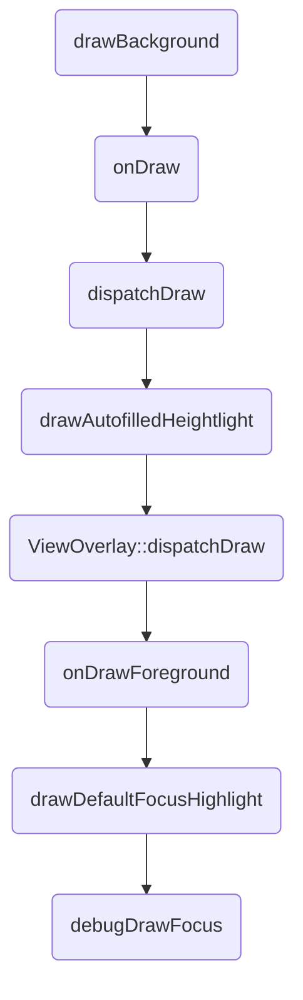
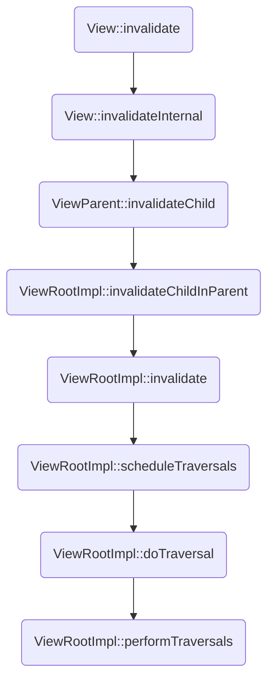

## 概论

所谓`自定义View`其实就是在屏幕大小画布的某一区域内作画的过程，这里面分为两个部分：`在哪画？`，`画什么?`；

## 在哪画？

这里面同样包含两部分：`获得这片区域的宽高`，`获得这片区域左上角相较于屏幕左上角的坐标`；

至于为什么顺序是这样的？是因为后者的形成依赖着前者，比如在`LinearLayout`中，如果不先获得所有的子视图的宽高，则无从计算其坐标；

### 画布的大小

在设置视图大小时，我们使用三种值：`MATCH_PARENT`，`WRAP_CONTENT`，`确切大小`；

`MATCH_PARENT`：占满父布局；

`WRAP_CONTENT`：刚好显示视图内容且不大于父布局；

`确切大小`：一个确切的值；

在测量过程中，系统会将视图的`LayoutParams`根据父布局的规则转化为对应的`MeasureSpec`，然后根据这个`MeasureSpec`来测量视图的宽高；

#### MeasureSpec的定义与生成

`MeasureSpec`代表一个$32$位的`int`值，高$2$位代表$SpecMode$，低$30$位代表$SpecSize$；

`SpecMode`代表测量模式，`SpecSize`代表在该测量模式下的参考尺寸；

`SpecMode`有三种模式：

`UNSPECIFIED`：父布局对子视图没有任何约束，子视图想要多大就给多大；

`EXACTLY`：对应`MATCH_PARENT`和`确切大小`两种模式，`SpecSize`代表子视图大小的精确值；

`AT_MOST`：对应`WRAP_CONTENT`模式，`SpecSize`代表子视图大小的最大值；

```java
    public static class MeasureSpec {
        private static final int MODE_SHIFT = 30;
        private static final int MODE_MASK  = 0x3 << MODE_SHIFT;

        /** @hide */
        @IntDef({UNSPECIFIED, EXACTLY, AT_MOST})
        @Retention(RetentionPolicy.SOURCE)
        public @interface MeasureSpecMode {}

        /**
         * Measure specification mode: The parent has not imposed any constraint
         * on the child. It can be whatever size it wants.
         */
        public static final int UNSPECIFIED = 0 << MODE_SHIFT;

        /**
         * Measure specification mode: The parent has determined an exact size
         * for the child. The child is going to be given those bounds regardless
         * of how big it wants to be.
         */
        public static final int EXACTLY     = 1 << MODE_SHIFT;

        /**
         * Measure specification mode: The child can be as large as it wants up
         * to the specified size.
         */
        public static final int AT_MOST     = 2 << MODE_SHIFT;

        /**
         * Creates a measure specification based on the supplied size and mode.
         *
         * The mode must always be one of the following:
         * <ul>
         *  <li>{@link android.view.View.MeasureSpec#UNSPECIFIED}</li>
         *  <li>{@link android.view.View.MeasureSpec#EXACTLY}</li>
         *  <li>{@link android.view.View.MeasureSpec#AT_MOST}</li>
         * </ul>
         *
         * <p><strong>Note:</strong> On API level 17 and lower, makeMeasureSpec's
         * implementation was such that the order of arguments did not matter
         * and overflow in either value could impact the resulting MeasureSpec.
         * {@link android.widget.RelativeLayout} was affected by this bug.
         * Apps targeting API levels greater than 17 will get the fixed, more strict
         * behavior.</p>
         *
         * @param size the size of the measure specification
         * @param mode the mode of the measure specification
         * @return the measure specification based on size and mode
         */
        public static int makeMeasureSpec(@IntRange(from = 0, to = (1 << MeasureSpec.MODE_SHIFT) - 1) int size,
                                          @MeasureSpecMode int mode) {
            if (sUseBrokenMakeMeasureSpec) {
                return size + mode;
            } else {
                return (size & ~MODE_MASK) | (mode & MODE_MASK);
            }
        }

        /**
         * Extracts the mode from the supplied measure specification.
         *
         * @param measureSpec the measure specification to extract the mode from
         * @return {@link android.view.View.MeasureSpec#UNSPECIFIED},
         *         {@link android.view.View.MeasureSpec#AT_MOST} or
         *         {@link android.view.View.MeasureSpec#EXACTLY}
         */
        @MeasureSpecMode
        public static int getMode(int measureSpec) {
            //noinspection ResourceType
            return (measureSpec & MODE_MASK);
        }

        /**
         * Extracts the size from the supplied measure specification.
         *
         * @param measureSpec the measure specification to extract the size from
         * @return the size in pixels defined in the supplied measure specification
         */
        public static int getSize(int measureSpec) {
            return (measureSpec & ~MODE_MASK);
        }

        static int adjust(int measureSpec, int delta) {
            final int mode = getMode(measureSpec);
            int size = getSize(measureSpec);
            if (mode == UNSPECIFIED) {
                // No need to adjust size for UNSPECIFIED mode.
                return makeMeasureSpec(size, UNSPECIFIED);
            }
            size += delta;
            if (size < 0) {
                Log.e(VIEW_LOG_TAG, "MeasureSpec.adjust: new size would be negative! (" + size +
                        ") spec: " + toString(measureSpec) + " delta: " + delta);
                size = 0;
            }
            return makeMeasureSpec(size, mode);
        }
    }

```

#### 最初的MeasureSpec

作为视图的最顶层`DecorView`，它的`MeasureSpec`由`WindowManager.LayoutParams`和自身的`View.LayoutParams`生成；

在`ViewRootImpl`中代码如下：

```java
    /**
     * Figures out the measure spec for the root view in a window based on it's
     * layout params.
     *
     * @param windowSize
     *            The available width or height of the window
     *
     * @param rootDimension
     *            The layout params for one dimension (width or height) of the
     *            window.
     *
     * @return The measure spec to use to measure the root view.
     */
    private static int getRootMeasureSpec(int windowSize, int rootDimension) {
        int measureSpec;
        switch (rootDimension) {

        case ViewGroup.LayoutParams.MATCH_PARENT:
            // Window can't resize. Force root view to be windowSize.
            measureSpec = MeasureSpec.makeMeasureSpec(windowSize, MeasureSpec.EXACTLY);
            break;
        case ViewGroup.LayoutParams.WRAP_CONTENT:
            // Window can resize. Set max size for root view.
            measureSpec = MeasureSpec.makeMeasureSpec(windowSize, MeasureSpec.AT_MOST);
            break;
        default:
            // Window wants to be an exact size. Force root view to be that size.
            measureSpec = MeasureSpec.makeMeasureSpec(rootDimension, MeasureSpec.EXACTLY);
            break;
        }
        return measureSpec;
    }

```

#### 测量过程中的MeasureSpec

测量过程中，`ViewGroup`会轮询子视图来计算其`MeasureSpec`，并在过程中不断更新`widthUsed`和`heightUsed`的值;

子视图的`MeasureSpec`由`ViewGroup`计算而来：

```java
/**
     * Ask one of the children of this view to measure itself, taking into
     * account both the MeasureSpec requirements for this view and its padding
     * and margins. The child must have MarginLayoutParams The heavy lifting is
     * done in getChildMeasureSpec.
     *
     * @param child The child to measure
     * @param parentWidthMeasureSpec The width requirements for this view
     * @param widthUsed Extra space that has been used up by the parent
     *        horizontally (possibly by other children of the parent)
     * @param parentHeightMeasureSpec The height requirements for this view
     * @param heightUsed Extra space that has been used up by the parent
     *        vertically (possibly by other children of the parent)
     */
    protected void measureChildWithMargins(View child,
            int parentWidthMeasureSpec, int widthUsed,
            int parentHeightMeasureSpec, int heightUsed) {
        final MarginLayoutParams lp = (MarginLayoutParams) child.getLayoutParams();

        final int childWidthMeasureSpec = getChildMeasureSpec(parentWidthMeasureSpec,
                mPaddingLeft + mPaddingRight + lp.leftMargin + lp.rightMargin
                        + widthUsed, lp.width);
        final int childHeightMeasureSpec = getChildMeasureSpec(parentHeightMeasureSpec,
                mPaddingTop + mPaddingBottom + lp.topMargin + lp.bottomMargin
                        + heightUsed, lp.height);

        child.measure(childWidthMeasureSpec, childHeightMeasureSpec);
    }
```

```java
/**
     * Does the hard part of measureChildren: figuring out the MeasureSpec to
     * pass to a particular child. This method figures out the right MeasureSpec
     * for one dimension (height or width) of one child view.
     *
     * The goal is to combine information from our MeasureSpec with the
     * LayoutParams of the child to get the best possible results. For example,
     * if the this view knows its size (because its MeasureSpec has a mode of
     * EXACTLY), and the child has indicated in its LayoutParams that it wants
     * to be the same size as the parent, the parent should ask the child to
     * layout given an exact size.
     *
     * @param spec The requirements for this view
     * @param padding The padding of this view for the current dimension and
     *        margins, if applicable
     * @param childDimension How big the child wants to be in the current
     *        dimension
     * @return a MeasureSpec integer for the child
     */
    public static int getChildMeasureSpec(int spec, int padding, int childDimension) {
        int specMode = MeasureSpec.getMode(spec);
        int specSize = MeasureSpec.getSize(spec);

        int size = Math.max(0, specSize - padding);

        int resultSize = 0;
        int resultMode = 0;

        switch (specMode) {
        // Parent has imposed an exact size on us
        case MeasureSpec.EXACTLY:
            if (childDimension >= 0) {
                resultSize = childDimension;
                resultMode = MeasureSpec.EXACTLY;
            } else if (childDimension == LayoutParams.MATCH_PARENT) {
                // Child wants to be our size. So be it.
                resultSize = size;
                resultMode = MeasureSpec.EXACTLY;
            } else if (childDimension == LayoutParams.WRAP_CONTENT) {
                // Child wants to determine its own size. It can't be
                // bigger than us.
                resultSize = size;
                resultMode = MeasureSpec.AT_MOST;
            }
            break;

        // Parent has imposed a maximum size on us
        case MeasureSpec.AT_MOST:
            if (childDimension >= 0) {
                // Child wants a specific size... so be it
                resultSize = childDimension;
                resultMode = MeasureSpec.EXACTLY;
            } else if (childDimension == LayoutParams.MATCH_PARENT) {
                // Child wants to be our size, but our size is not fixed.
                // Constrain child to not be bigger than us.
                resultSize = size;
                resultMode = MeasureSpec.AT_MOST;
            } else if (childDimension == LayoutParams.WRAP_CONTENT) {
                // Child wants to determine its own size. It can't be
                // bigger than us.
                resultSize = size;
                resultMode = MeasureSpec.AT_MOST;
            }
            break;

        // Parent asked to see how big we want to be
        case MeasureSpec.UNSPECIFIED:
            if (childDimension >= 0) {
                // Child wants a specific size... let him have it
                resultSize = childDimension;
                resultMode = MeasureSpec.EXACTLY;
            } else if (childDimension == LayoutParams.MATCH_PARENT) {
                // Child wants to be our size... find out how big it should
                // be
                resultSize = View.sUseZeroUnspecifiedMeasureSpec ? 0 : size;
                resultMode = MeasureSpec.UNSPECIFIED;
            } else if (childDimension == LayoutParams.WRAP_CONTENT) {
                // Child wants to determine its own size.... find out how
                // big it should be
                resultSize = View.sUseZeroUnspecifiedMeasureSpec ? 0 : size;
                resultMode = MeasureSpec.UNSPECIFIED;
            }
            break;
        }
        //noinspection ResourceType
        return MeasureSpec.makeMeasureSpec(resultSize, resultMode);
    }
```

 #### 最终根据MeasureSpec获得视图的宽高

```java
    /**
     * <p>
     * Measure the view and its content to determine the measured width and the
     * measured height. This method is invoked by {@link #measure(int, int)} and
     * should be overridden by subclasses to provide accurate and efficient
     * measurement of their contents.
     * </p>
     *
     * <p>
     * <strong>CONTRACT:</strong> When overriding this method, you
     * <em>must</em> call {@link #setMeasuredDimension(int, int)} to store the
     * measured width and height of this view. Failure to do so will trigger an
     * <code>IllegalStateException</code>, thrown by
     * {@link #measure(int, int)}. Calling the superclass'
     * {@link #onMeasure(int, int)} is a valid use.
     * </p>
     *
     * <p>
     * The base class implementation of measure defaults to the background size,
     * unless a larger size is allowed by the MeasureSpec. Subclasses should
     * override {@link #onMeasure(int, int)} to provide better measurements of
     * their content.
     * </p>
     *
     * <p>
     * If this method is overridden, it is the subclass's responsibility to make
     * sure the measured height and width are at least the view's minimum height
     * and width ({@link #getSuggestedMinimumHeight()} and
     * {@link #getSuggestedMinimumWidth()}).
     * </p>
     *
     * @param widthMeasureSpec horizontal space requirements as imposed by the parent.
     *                         The requirements are encoded with
     *                         {@link android.view.View.MeasureSpec}.
     * @param heightMeasureSpec vertical space requirements as imposed by the parent.
     *                         The requirements are encoded with
     *                         {@link android.view.View.MeasureSpec}.
     *
     * @see #getMeasuredWidth()
     * @see #getMeasuredHeight()
     * @see #setMeasuredDimension(int, int)
     * @see #getSuggestedMinimumHeight()
     * @see #getSuggestedMinimumWidth()
     * @see android.view.View.MeasureSpec#getMode(int)
     * @see android.view.View.MeasureSpec#getSize(int)
     */
    protected void onMeasure(int widthMeasureSpec, int heightMeasureSpec) {
        setMeasuredDimension(getDefaultSize(getSuggestedMinimumWidth(), widthMeasureSpec),
                getDefaultSize(getSuggestedMinimumHeight(), heightMeasureSpec));
    }

```

实际上这里是可以自定义的，只要根据少数规则，调用`setMeasureDimension`就好；

### 画布的位置

 `Layout()`函数主要做了两件事：

1. 调用`SetFrame()`函数，更新`mLeft,mTop,mRight,mBottom` ；
2. 调用`onLayout()`函数，遍历子视图的`Layout()`函数；

## 画什么？

### 绘制流程



1. `drawBackground`：绘制背景；
2. `onDraw`：绘制当前视图的内容；
3. `dispatchDraw`：遍历子视图调用其`draw()`函数；
4. `drawAutofilledHighlight`：绘制自动填充视图的高亮；
5. `ViewOverlay::dispatchDraw`：当覆盖层存在时，则绘制覆盖层；
6. `onDrawForeground`：绘制装饰器，比如前景或者滑动条之类的；
7. `drawDefaultFocusHighlight`：绘制默认焦点的高亮；
8. `debugDrawFocus`：这其实就是开发者选项中的`显示布局边界`的效果；

其中能够重写的有以下几项：

- `onDraw()`
- `dispatchDraw()`
- `onDrawForeground()`

 ### Paint介绍

`Paint`的内容较多，我犯了懒，直接引用 [[赤兔欢](https://www.jianshu.com/u/d249d54f69fc)](https://www.jianshu.com/u/d249d54f69fc) 的 [Android View — Paint 详解](https://www.jianshu.com/p/5ef2e63a7bb8)，同时为了防止链接失效，我同样截了图在下面；


### Canvas介绍

这里引用了[Carson_Ho](https://www.jianshu.com/u/383970bef0a0)的[文章](https://www.jianshu.com/p/762b490403c3)，同样为了防止链接失效，截图如下：


### Path介绍

这里引用了[Carson_Ho](https://www.jianshu.com/u/383970bef0a0)的[文章](https://www.jianshu.com/p/2c19abde958c)，同样为了防止链接失效，截图如下：


### 更新画布内容

更新画布内容，一定需要先将画布内容清除，然后画上新的内容；

我们通常调用`invalidate()`函数刷新画布；

其具体的调用过程如下：



然后就会重走上面的三大流程，在`draw`函数中调用`drawSoftware`函数：

```java
            // If this bitmap's format includes an alpha channel, we
            // need to clear it before drawing so that the child will
            // properly re-composite its drawing on a transparent
            // background. This automatically respects the clip/dirty region
            // or
            // If we are applying an offset, we need to clear the area
            // where the offset doesn't appear to avoid having garbage
            // left in the blank areas.
            if (!canvas.isOpaque() || yoff != 0 || xoff != 0) {
                canvas.drawColor(0, PorterDuff.Mode.CLEAR);
            }

```

进行清空画布，从而形成动画；