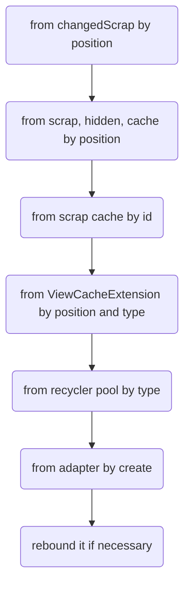
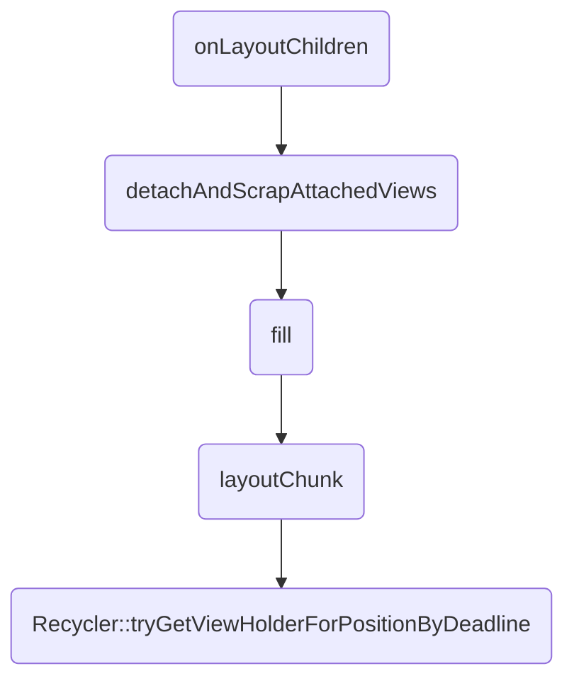
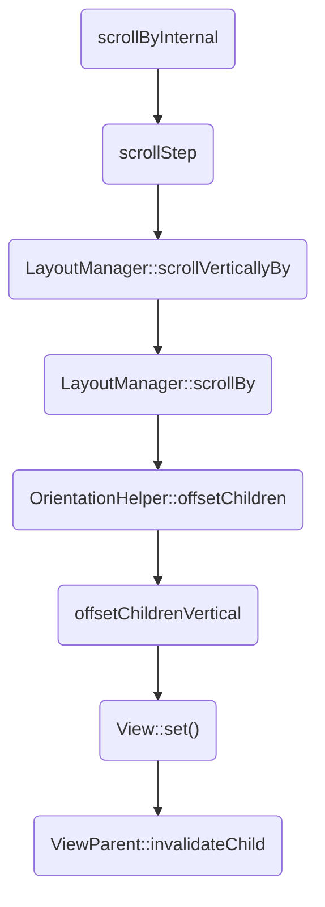
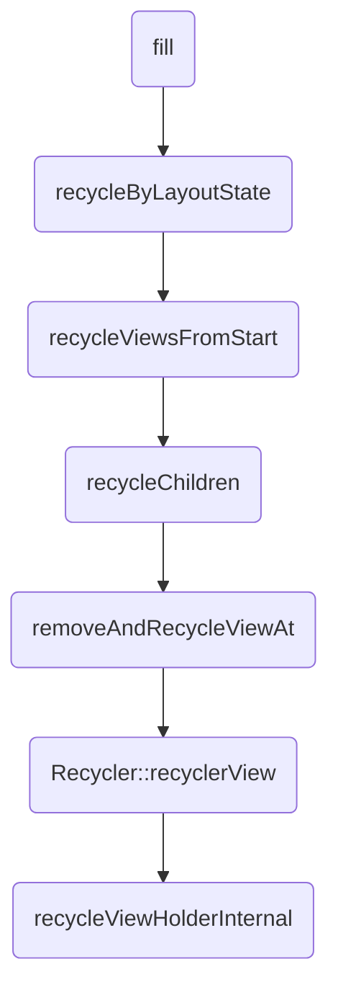

## 概论

`RecyclerView`是一个在有限窗口显示大量数据的灵活视图；

## 绘制过程

`ChildView`的实际绘制过程由`LayoutManager`所掌控；

### onMeasure

```java
@Override
protected void onMeasure(int widthSpec, int heightSpec)
{
    // 没有自定义LayoutManager，设置默认的宽高，并不测量子视图的宽高；
    if (mLayout == null)
    {
        // 以高度为例，
        // EXACTLY：MeasureSpec中的size
        // AT_MOST：padding之和和minHeight中的较大值，
        //          这个较大值与MeasureSpec中的size的较小值；
        // UNSPECIFIED：padding之和和minHeight中的较大值
        defaultOnMeasure(widthSpec, heightSpec);
        return;
    }
    
    // 这个auto-measure代表是否由RecyclerView控制测量过程，默认情况下为false
    // 如果这个函数被重载为true，则LayoutManager::onMeasure不应该被重载
    if (mLayout.isAutoMeasureEnabled())
    {
        final int widthMode = MeasureSpec.getMode(widthSpec);
        final int heightMode = MeasureSpec.getMode(heightSpec);

        /**
         * 在默认测量流程中，此处应当直接调用RecyclerView::defaultOnMeasure()，但是很多第三方库并未
         * 按照文档编写代码，而重载了LayoutManager::onMeasure()；默认情况下，LayoutManager::onMeasure()
         * 调用了RecyclerView::defaultOnMeasure()；
         */
        mLayout.onMeasure(mRecycler, mState, widthSpec, heightSpec);

        // 如果宽高都指定了尺寸，则不再测量
        final boolean measureSpecModeIsExactly =
            widthMode == MeasureSpec.EXACTLY && heightMode == MeasureSpec.EXACTLY;
        if (measureSpecModeIsExactly || mAdapter == null)
        {
            return;
        }

        // 在onMeasure和onLayout过程中，有三个状态，代表测量子视图的三个阶段
        // 分别是：
        // STEP_START：
        //     对应dispatchLayoutStep1函数，这个函数的功能是：
        //     1. 处理Adapter更新
        //     2. 更新动画信息
        //     3. 记录数据集改变前的子控件信息
        // STEP_LAYOUT:
        //     对应dispatchLayoutStep2函数，这个函数的功能是：
        //     实际执行子视图的onMeasure和onLayout，调用
        //     LayoutManager::onLayoutChildren这个抽象函数；
        // STEP_ANIMATIONS：
        //     对应dispatchLayoutStep3函数，这个函数的功能是：
        //     记录数据集改变后的子控件信息及触发动画，并且清除一些记录信息；
        if (mState.mLayoutStep == State.STEP_START)
        {
            dispatchLayoutStep1();
        }
        // set dimensions in 2nd step. Pre-layout should happen with old dimensions for
        // consistency
        mLayout.setMeasureSpecs(widthSpec, heightSpec);
        mState.mIsMeasuring = true;
        dispatchLayoutStep2();

        // 调用过dispatchLayoutStep2函数后，子视图的宽高都有了，
        // 根据子视图的宽高再次更新父视图宽高
        mLayout.setMeasuredDimensionFromChildren(widthSpec, heightSpec);

        // if RecyclerView has non-exact width and height and if there is at least one child
        // which also has non-exact width & height, we have to re-measure.
        if (mLayout.shouldMeasureTwice())
        {
            mLayout.setMeasureSpecs(
                MeasureSpec.makeMeasureSpec(getMeasuredWidth(), MeasureSpec.EXACTLY),
                MeasureSpec.makeMeasureSpec(getMeasuredHeight(), MeasureSpec.EXACTLY));
            mState.mIsMeasuring = true;
            dispatchLayoutStep2();
            // now we can get the width and height from the children.
            mLayout.setMeasuredDimensionFromChildren(widthSpec, heightSpec);
        }
    }
    else
    {
        // Adapter数据的变化是否会使得RecyclerView的宽高发生变化
        if (mHasFixedSize)
        {
            mLayout.onMeasure(mRecycler, mState, widthSpec, heightSpec);
            return;
        }
        // custom onMeasure
        if (mAdapterUpdateDuringMeasure)
        {
            startInterceptRequestLayout();
            onEnterLayoutOrScroll();
            processAdapterUpdatesAndSetAnimationFlags();
            onExitLayoutOrScroll();

            if (mState.mRunPredictiveAnimations)
            {
                mState.mInPreLayout = true;
            }
            else
            {
                // consume remaining updates to provide a consistent state with the layout pass.
                mAdapterHelper.consumeUpdatesInOnePass();
                mState.mInPreLayout = false;
            }
            mAdapterUpdateDuringMeasure = false;
            stopInterceptRequestLayout(false);
        }
        else if (mState.mRunPredictiveAnimations)
        {
            // If mAdapterUpdateDuringMeasure is false and mRunPredictiveAnimations is true:
            // this means there is already an onMeasure() call performed to handle the pending
            // adapter change, two onMeasure() calls can happen if RV is a child of LinearLayout
            // with layout_width=MATCH_PARENT. RV cannot call LM.onMeasure() second time
            // because getViewForPosition() will crash when LM uses a child to measure.
            setMeasuredDimension(getMeasuredWidth(), getMeasuredHeight());
            return;
        }

        if (mAdapter != null)
        {
            mState.mItemCount = mAdapter.getItemCount();
        }
        else
        {
            mState.mItemCount = 0;
        }
        startInterceptRequestLayout();
        mLayout.onMeasure(mRecycler, mState, widthSpec, heightSpec);
        stopInterceptRequestLayout(false);
        mState.mInPreLayout = false; // clear
    }
}
```


### onLayout

`onLayout`实际上就是调用了`dispatchLayout`函数；

```java
void dispatchLayout() {
        if (mAdapter == null) {
            Log.e(TAG, "No adapter attached; skipping layout");
            // leave the state in START
            return;
        }
        if (mLayout == null) {
            Log.e(TAG, "No layout manager attached; skipping layout");
            // leave the state in START
            return;
        }
        mState.mIsMeasuring = false;
        if (mState.mLayoutStep == State.STEP_START) {
            dispatchLayoutStep1();
            mLayout.setExactMeasureSpecsFrom(this);
            dispatchLayoutStep2();
        } else if (mAdapterHelper.hasUpdates() || mLayout.getWidth() != getWidth()
                || mLayout.getHeight() != getHeight()) {
            // First 2 steps are done in onMeasure but looks like we have to run again due to
            // changed size.
            mLayout.setExactMeasureSpecsFrom(this);
            dispatchLayoutStep2();
        } else {
            // always make sure we sync them (to ensure mode is exact)
            mLayout.setExactMeasureSpecsFrom(this);
        }
        dispatchLayoutStep3();
    }
```

主要还是调用`dispatchLayoutStep3`函数，具体功能在上面已经解释过了；

### onDraw

```java
public void onDraw(Canvas c) {
        // 通过上述操作，所有子视图的位置和宽高都已知晓，所以子视图的绘制交给了父类；
        super.onDraw(c);

		// 绘制子视图装饰器
        final int count = mItemDecorations.size();
        for (int i = 0; i < count; i++) {
            mItemDecorations.get(i).onDraw(c, this, mState);
        }
}
```

## 事件分发

关于事件分发，`NestedScrollingChild`，`NestedScrollingParent`之间的关系极为重要；

### NestedScrollingChild

```java
public interface NestedScrollingChild {
    /**
     * 设置是否支持嵌套滑动
     */
    void setNestedScrollingEnabled(boolean enabled);

    /**
     * 返回是否支持嵌套滑动的状态
     */
    boolean isNestedScrollingEnabled();

    /**
     * 当找到一个支持嵌套滑动的父视图且当前视图支持此滑动方向，返回true
     * 传参是
     * SCROLL_AXIS_NONE：无坐标轴
     * SCROLL_AXIS_HORIZONTAL：水平坐标轴
     * SCROLL_AXIS_VERTICAL：垂直坐标轴
     */
    boolean startNestedScroll(@ScrollAxis int axes);

    /**
     * 停止嵌套滑动
     */
    void stopNestedScroll();

    /**
     * 如果当前视图有一个支持嵌套滑动的父视图，返回true
     */
    boolean hasNestedScrollingParent();

    /**
     * 在当前视图处理了滑动之后继续分配滑动操作 (一般在自己处理滑动之后，给NestedScrollingParent机会处理剩余的滑动距离)
     * @param dxConsumed 已经消耗了的x轴滑动距离
     * @param dyConsumed 已经消耗了的y轴滑动距离
     * @param dxUnconsumed 未消耗的x轴滑动距离
     * @param dyUnconsumed 未消耗的y轴滑动距离
     * @param offsetInWindow 可选参数，可以为null。为输出参数，获取预处理操作使当前view的位置偏移(offsetInWindow[0]和offsetInWindow[1]分别为x轴和y轴偏移)
     * @return 当前视图是否消费了滑动事件
     */
    boolean dispatchNestedScroll(int dxConsumed, int dyConsumed,
            int dxUnconsumed, int dyUnconsumed, @Nullable int[] offsetInWindow);

    /**
     * 当前视图开始滑动处理之前，分配预处理操作（一般为询问NestedScrollingParent是否消耗部分滑动距离）
     * @param dx 当前这一步滑动的x轴总距离
     * @param dy 当前这一步滑动的y轴总距离
     * @param consumed 预处理操作消耗掉的距离（此为输出参数，consumed[0]为预处理操作消耗掉的x轴距离，consumed[1]为预处理操作消耗掉的y轴距离）
     * @param offsetInWindow 可选参数，可以为null。为输出参数，获取预处理操作使当前view的位置偏移(offsetInWindow[0]和offsetInWindow[1]分别为x轴和y轴偏移)
     * @return 父视图是否消耗了部分或者全部滑动距离
     */
    boolean dispatchNestedPreScroll(int dx, int dy, @Nullable int[] consumed,
            @Nullable int[] offsetInWindow);

    /**
     * 分发快速滑动事件到父视图
     *
     * @param velocityX 水平速度
     * @param velocityY 垂直速度
     * @param consumed 子视图是否消费了快速滑动事件
     * @return 父视图是否消费了剩余的快速滑动事件
     */
    boolean dispatchNestedFling(float velocityX, float velocityY, boolean consumed);

    /**
     * 在当前NestedScrollingChild处理fling事件之前进行预处理(一般询问NestedScrollingParent是否处理消耗此次fling)
     * @param velocityX x轴速度
     * @param velocityY y轴速度
     * @return 父视图是否处理消耗了此次fling
     */
    boolean dispatchNestedPreFling(float velocityX, float velocityY);
}

```

`NestedScrollingChild2`继承了`NestedScrollingChild`接口，为`NestedScrollingChild`中所有的接口添加了`type`这个参数，这个参数有两个值：

```java
    /**
     * 由用户操作引起的
     */
    public static final int TYPE_TOUCH = 0;

    /**
     * 非用户操作引起的，一般是快速滑动事件，也就是当我们快速滑动一个列表，
     * 虽然手已经离开屏幕，列表仍然在滚动
     */
    public static final int TYPE_NON_TOUCH = 1;
```

`NestedScrollingChild3`继承了`NestedScrollingChild2`接口，并且添加了一个新的方法：

```java
    /**
     * 在当前视图处理了滑动之后继续分配滑动操作 (一般在自己处理滑动之后，给NestedScrollingParent机会处理剩余的滑动距离)
     *
     * @param dxConsumed 已经消耗了的x轴滑动距离
     * @param dyConsumed 已经消耗了的y轴滑动距离
     * @param dxUnconsumed 未消耗的x轴滑动距离
     * @param dyUnconsumed 未消耗的y轴滑动距离
     * @param offsetInWindow 可选参数，可以为null。为输出参数，获取预处理操作使当前view的位置偏移(offsetInWindow[0]和offsetInWindow[1]分别为x轴和y轴偏移)
     * @param type 滑动事件的类型
     * @param consumed 回填参数，数组大小为2，下标为0的值为x轴其原始值加上视图层次结构中所有嵌套滚动父级所消费的滚动距离，下表为1的值为Y轴
     */
    void dispatchNestedScroll(int dxConsumed, int dyConsumed, int dxUnconsumed, int dyUnconsumed,
            @Nullable int[] offsetInWindow, @ViewCompat.NestedScrollType int type,
            @NonNull int[] consumed);
```

### NestedScrollingParent

```java
public interface NestedScrollingParent {
    /**
     * 对子视图开始嵌套滑动请求的回应
     *
     * @param child 包含发起嵌套滑动请求的子视图的直接子视图
     * @param target 发起嵌套滑动请求的子视图
     * @param axes 滑动方向标记
     * @return true 当前父视图是否响应
     */
    boolean onStartNestedScroll(@NonNull View child, @NonNull View target, @ScrollAxis int axes);

    /**
     * 对开始滑动响应的回调
     *
     * @param child 包含发起嵌套滑动请求的子视图的直接子视图
     * @param target 发起嵌套滑动请求的子视图
     * @param axes 滑动方向标记
     */
    void onNestedScrollAccepted(@NonNull View child, @NonNull View target, @ScrollAxis int axes);

    /**
     * 停止滑动的回调
     *
     * @param target 发起嵌套滑动请求的子视图
     */
    void onStopNestedScroll(@NonNull View target);

    /**
     * 处理NestedScrollingChild未消耗完的滑动距离
     *
     * @param target 发起嵌套滑动请求的子视图
     * @param dxConsumed 已消耗的x轴滑动距离
     * @param dyConsumed 已消耗的y轴滑动距离
     * @param dxUnconsumed 未消耗的x轴滑动距离
     * @param dyUnconsumed 未消耗的y轴滑动距离
     */
    void onNestedScroll(@NonNull View target, int dxConsumed, int dyConsumed,
            int dxUnconsumed, int dyUnconsumed);

    /**
     * 在NestedScrollingChild处理滑动之前，预处理此滑动
     *
     * @param target 发起嵌套滑动请求的子视图
     * @param dx x轴滑动距离
     * @param dy y轴滑动距离
     * @param consumed 回填参数，数组大小为2，填入此次消费的滑动距离，默认值为0
     */
    void onNestedPreScroll(@NonNull View target, int dx, int dy, @NonNull int[] consumed);

    /**
     * 处理fling事件
     * @param target 发起嵌套滑动请求的子视图
     * @param velocityX x轴fling速度
     * @param velocityY y轴fling速度
     * @param consumed NestedScrollingChild是否已处理此fling
     * @return 是否处理此fling
     */
    boolean onNestedFling(@NonNull View target, float velocityX, float velocityY, boolean consumed);

    /**
     * * 在NestedScrollingChild之前预处理fling事件
     * @param target 发起嵌套滑动请求的子视图
     * @param velocityX x轴fling速度
     * @param velocityY y轴fling速度
     * @return 是否处理此fling
     */
    boolean onNestedPreFling(@NonNull View target, float velocityX, float velocityY);

    /**
     * 获取滑动方向
     * @return 滑动方向
     */
    @ScrollAxis
    int getNestedScrollAxes();
}

```

`NestedScrollingParent2`继承了`NestedScrollingParent` ，并且为`NestedScrollingParent`中的方法添加了`type`参数，这个和`NestedScrollingChild2`相似；

`NestedScrollingParent3`继承了`NestedScrollingParent2`，并且添加了一个新的方法：

```java
/**
 * 在子视图消费过滑动事件后，父视图再次消费
 * @param target 发起嵌套滚动的子视图
 * @param dxConsumed 水平方向上子视图已消费的距离
 * @param dyConsumed 垂直方向上子视图已消费的距离
 * @param dxUnconsumed 水平方向上子视图未消费的距离
 * @param dxUnconsumed 垂直方向上子视图未消费的距离
 * @param type 滚动输入类型
 * @param consumed 回填参数，父视图所消费的距离
 */

void onNestedScroll(@NonNull View target, int dxConsumed, int dyConsumed, int dxUnconsumed,
            int dyUnconsumed, @ViewCompat.NestedScrollType int type, @NonNull int[] consumed);
```


### 具体分发过程

```java
    @Override
    public boolean onTouchEvent(MotionEvent e) {
        if (mLayoutSuppressed || mIgnoreMotionEventTillDown) {
            return false;
        }
        
        // 先分发给OnItemTouchListener，如果分发成功，则不再分发
        if (dispatchToOnItemTouchListeners(e)) {
            cancelScroll();
            return true;
        }

        // 如果没有设置LayoutManager，不会分发事件
        if (mLayout == null) {
            return false;
        }

        final boolean canScrollHorizontally = mLayout.canScrollHorizontally();
        final boolean canScrollVertically = mLayout.canScrollVertically();

        if (mVelocityTracker == null) {
            mVelocityTracker = VelocityTracker.obtain();
        }
        boolean eventAddedToVelocityTracker = false;

        final int action = e.getActionMasked();
        final int actionIndex = e.getActionIndex();

        if (action == MotionEvent.ACTION_DOWN) {
            mNestedOffsets[0] = mNestedOffsets[1] = 0;
        }
        final MotionEvent vtev = MotionEvent.obtain(e);
        vtev.offsetLocation(mNestedOffsets[0], mNestedOffsets[1]);

        switch (action) {
            case MotionEvent.ACTION_DOWN: {
                // 初始化点击位置
                mScrollPointerId = e.getPointerId(0);
                mInitialTouchX = mLastTouchX = (int) (e.getX() + 0.5f);
                mInitialTouchY = mLastTouchY = (int) (e.getY() + 0.5f);

                int nestedScrollAxis = ViewCompat.SCROLL_AXIS_NONE;
                if (canScrollHorizontally) {
                    nestedScrollAxis |= ViewCompat.SCROLL_AXIS_HORIZONTAL;
                }
                if (canScrollVertically) {
                    nestedScrollAxis |= ViewCompat.SCROLL_AXIS_VERTICAL;
                }
                // 请求开始嵌套滑动
                startNestedScroll(nestedScrollAxis, TYPE_TOUCH);
            } break;

            case MotionEvent.ACTION_POINTER_DOWN: {
                mScrollPointerId = e.getPointerId(actionIndex);
                mInitialTouchX = mLastTouchX = (int) (e.getX(actionIndex) + 0.5f);
                mInitialTouchY = mLastTouchY = (int) (e.getY(actionIndex) + 0.5f);
            } break;

            case MotionEvent.ACTION_MOVE: {
                final int index = e.findPointerIndex(mScrollPointerId);
                if (index < 0) {
                    Log.e(TAG, "Error processing scroll; pointer index for id "
                            + mScrollPointerId + " not found. Did any MotionEvents get skipped?");
                    return false;
                }
				
                // 获得滑动距离
                final int x = (int) (e.getX(index) + 0.5f);
                final int y = (int) (e.getY(index) + 0.5f);
                int dx = mLastTouchX - x;
                int dy = mLastTouchY - y;
                // 如果不处于滑动状态
                // 一共由三种状态：
                // SCROLL_STATE_IDLE：普通状态，没有任何滑动事件
                // SCROLL_STATE_DRAGGING：滑动状态
                // SCROLL_STATE_SETTLING：手指离开屏幕后的，减速滚动状态
                if (mScrollState != SCROLL_STATE_DRAGGING) {
                    boolean startScroll = false;
                    if (canScrollHorizontally) {
                        if (dx > 0) {
                            dx = Math.max(0, dx - mTouchSlop);
                        } else {
                            dx = Math.min(0, dx + mTouchSlop);
                        }
                        if (dx != 0) {
                            startScroll = true;
                        }
                    }
                    if (canScrollVertically) {
                        if (dy > 0) {
                            dy = Math.max(0, dy - mTouchSlop);
                        } else {
                            dy = Math.min(0, dy + mTouchSlop);
                        }
                        if (dy != 0) {
                            startScroll = true;
                        }
                    }
                    if (startScroll) {
                        setScrollState(SCROLL_STATE_DRAGGING);
                    }
                }

                if (mScrollState == SCROLL_STATE_DRAGGING) {
                    mReusableIntPair[0] = 0;
                    mReusableIntPair[1] = 0;
                    // 询问父视图是否消费事件，如果消费则对滑动距离进行更新
                    if (dispatchNestedPreScroll(
                            canScrollHorizontally ? dx : 0,
                            canScrollVertically ? dy : 0,
                            mReusableIntPair, mScrollOffset, TYPE_TOUCH
                    )) {
                        dx -= mReusableIntPair[0];
                        dy -= mReusableIntPair[1];
                        // Updated the nested offsets
                        mNestedOffsets[0] += mScrollOffset[0];
                        mNestedOffsets[1] += mScrollOffset[1];
                        // 滑动开始，父视图不要再拦截事件
                        getParent().requestDisallowInterceptTouchEvent(true);
                    }

                    mLastTouchX = x - mScrollOffset[0];
                    mLastTouchY = y - mScrollOffset[1];
					
                    // 子视图真正开始消费滑动事件(LayoutManager::scrollVerticallyBy)，
                    // 并且消费完之后, 再让父视图消费
                    if (scrollByInternal(
                            canScrollHorizontally ? dx : 0,
                            canScrollVertically ? dy : 0,
                            e)) {
                        getParent().requestDisallowInterceptTouchEvent(true);
                    }
                    // 预取下一个ViewHolder
                    if (mGapWorker != null && (dx != 0 || dy != 0)) {
                        mGapWorker.postFromTraversal(this, dx, dy);
                    }
                }
            } break;

            case MotionEvent.ACTION_POINTER_UP: {
                onPointerUp(e);
            } break;

            case MotionEvent.ACTION_UP: {
                mVelocityTracker.addMovement(vtev);
                eventAddedToVelocityTracker = true;
                mVelocityTracker.computeCurrentVelocity(1000, mMaxFlingVelocity);
                final float xvel = canScrollHorizontally
                        ? -mVelocityTracker.getXVelocity(mScrollPointerId) : 0;
                final float yvel = canScrollVertically
                        ? -mVelocityTracker.getYVelocity(mScrollPointerId) : 0;
                // 处理快速滑动
                if (!((xvel != 0 || yvel != 0) && fling((int) xvel, (int) yvel))) {
                    // 重置状态
                    setScrollState(SCROLL_STATE_IDLE);
                }
                resetScroll();
            } break;
			
            case MotionEvent.ACTION_CANCEL: {
                // 取消滑动
                cancelScroll();
            } break;
        }

        if (!eventAddedToVelocityTracker) {
            mVelocityTracker.addMovement(vtev);
        }
        vtev.recycle();

        return true;
    }
```

1. `ACTION_DOWN`：
   1. Child.startNestedScroll
   2. Parent.onStartNestedScroll
   3. Parent.onNestedScrollAccepted
2. `ACTION_MOVE`:
   1. Child.dispatchNestedPreScroll
   2. Parent.onNestedPreScroll
   3. Child.scrollStep
   4. Child.dispatchNestedScroll
   5. Parent.onNestedScroll
3. `ACTION_UP`:
   1. Child.dispatchNestedPreFling
   2. Parent.onNestedPreFling
   3. Parent.onNestedFling
   4. Child.startNestedScroll
   5. Child.fling

## Adapter详解

`Adapter`主要是提供`ViewHolder`，`ViewHolder`是`RecyclerView`的缓存对象；

### ViewHolder详解

`ViewHolder`是一种包含了子项视图和相关描述消息的数据结构，主要字段如下：

```java
		// 子项视图，从构造函数传入
        public final View itemView;
        // 对ViewHolder内部的RecyclerView的弱引用
        WeakReference<RecyclerView> mNestedRecyclerView;
        // 当前ViewHolder在视图中的位置
        int mPosition = NO_POSITION;
		// 当前ViewHolder在之前视图中的位置
        int mOldPosition = NO_POSITION;
		// 当前ViewHolder的唯一标识符，默认为NO_ID;
		// 当 Adapter.hasStableIds() == true 时，应当重写Adapter.getItemId()
        long mItemId = NO_ID;
		// 当前ViewHolder的类型，RecyclerView可以显示多个类型的ViewHolder
        int mItemViewType = INVALID_TYPE;
		// 在预布局中的位置
        int mPreLayoutPosition = NO_POSITION;

		// 和动画有关的两个ViewHolder
        ViewHolder mShadowedHolder = null;
        ViewHolder mShadowingHolder = null;
		// 保留当前ViewHolder的一些信息
		int mFlags;

		// 不知道具体用处，但是看源码是在Viewholder的添加移除更新移动过程中使用
		private static final List<Object> FULLUPDATE_PAYLOADS = Collections.emptyList();
        List<Object> mPayloads = null;
        List<Object> mUnmodifiedPayloads = null;

		// 标记当前ViewHolder是否可被回收，
		// 事实上应该用布尔量，这里用int应该是是为了防止在反复调用过程中出错
        private int mIsRecyclableCount = 0;

        // 缓存容器
        Recycler mScrapContainer = null;
        // 标记当前ViewHolder应该保留在哪种缓存中
        boolean mInChangeScrap = false;

        // 这两个是关于无障碍使用的，和整体代码分析无太大关系
        private int mWasImportantForAccessibilityBeforeHidden =
                ViewCompat.IMPORTANT_FOR_ACCESSIBILITY_AUTO;
        int mPendingAccessibilityState = PENDING_ACCESSIBILITY_STATE_NOT_SET;

        // 绑定的RecyclerView
        RecyclerView mOwnerRecyclerView;
```

`Adapter`是一个抽象类，主要的抽象方法如下：

```java
/**
 * 根据viewType，创建一个ViewHolder
 * @param parent 父视图
 * @param viewType 视图类型
 * @return Viewholder
 */
public abstract VH onCreateViewHolder(@NonNull ViewGroup parent, int viewType);
 
/**
 * 根据所给出的位置，对ViewHolder进行更新
 * @param holder 需要更新的ViewHolder
 * @param position 这个ViewHolder所处位置
 */
public abstract void onBindViewHolder(@NonNull VH holder, int position);

/**
 * 获取逻辑上条目的数目
 * @return 条目数目
 *
public abstract int getItemCount();
```

还有一些其他方法值得注意：

```java
/**
 * 根据位置返回视图类型
 * 默认是没有实现的，如果你想要显示多种类型的视图，需要重载这个函数
 * @return 视图类型
 */
public int getItemViewType(int position) {
    return 0;
 }
```

```java
/**
 * 通知数据的改变，同样还有其他的notify方法
 * 这是一个观察者模式，最终都交给了RecyclerView的私有类RecyclerViewDataObserver处理
 */
public final void notifyDataSetChanged() {
            mObservable.notifyChanged();
}
```


## 缓存机制

在开始讲解缓存机制之前，需要思考一些问题：

1. 有几类缓存
2. 各种缓存具体意义
3. 各种缓存的增删查改的时机

各种缓存的分类标准是`ViewHolder`的状态，`ViewHolder`使用`int mFlags`保存了诸多状态；

```java
// 已被绑定到正确的位置
static final int FLAG_BOUND = 1 << 0;

// 所绑定的数据过时了，需要重新绑定
static final int FLAG_UPDATE = 1 << 1;

// 所保留的位置信息和Id信息已完全不可信任，需要再进行完整的重新绑定
static final int FLAG_INVALID = 1 << 2;

// 标志当前ViewHolder已被移除，但是它的视图还有可能存在，用来显示动画
static final int FLAG_REMOVED = 1 << 3;

// 标记当前ViewHolder暂时不可回收，一般是为了显示动画
static final int FLAG_NOT_RECYCLABLE = 1 << 4;

/**
 * 标记当前ViewHolder来自scrap缓存，这个缓存里的ViewHolder有可能再次添加到RecyclerView；
 */
static final int FLAG_RETURNED_FROM_SCRAP = 1 << 5;

/**
 * 完全被LayoutManager管理，不会被Recycler管理；
 */
static final int FLAG_IGNORE = 1 << 7;

/**
 * 标记当前ViewHolder和RecyclerView短暂分离，以便后面进行添加或者删除；
 */
static final int FLAG_TMP_DETACHED = 1 << 8;

/**
 * 当我们不再确定此ViewHolder的位置时，设置此标志；
 * 与 FLAG_INVALID 有两点不同：
 * 		1. FLAG_INVALID 包括ViewHolder类型不匹配
 * 		2. FLAG_ADAPTER_POSITION_UNKNOWN 是Adapter通知就立即设置，
 *  	   而 FLAG_INVALID 则会延迟到重新计算layout之前；
 */
static final int FLAG_ADAPTER_POSITION_UNKNOWN = 1 << 9;

/**
 * 当调用 addChangePayload 函数时设置
 */
static final int FLAG_ADAPTER_FULLUPDATE = 1 << 10;

/**
 * 当 ViewHolder 位置发生变化时，被 ItemAnimator 使用；
 */
static final int FLAG_MOVED = 1 << 11;

/**
 * 在预布局期间，被 ItemAnimator 使用；
 */
static final int FLAG_APPEARED_IN_PRE_LAYOUT = 1 << 12;

static final int PENDING_ACCESSIBILITY_STATE_NOT_SET = -1;

/**
 * 标记当前ViewHolder是从hidden_list里绑定的
 * 当一个ViewHolder被标记为hidden，有两种方式复用它；
 * 1. 动画结束时，ViewHolder会被回收
 * 2. LayoutManager需要一个此位置上的ViewHolder，尽管它是hidden的
 * 这个标记属于第二种；
 */
static final int FLAG_BOUNCED_FROM_HIDDEN_LIST = 1 << 13;
```

缓存由`Recycler`处理，具体有以下缓存：

```java
// 当前RecyclerView显示ViewHolder
final ArrayList<ViewHolder> mAttachedScrap = new ArrayList<>();
// 数据已经改变的ViewHolder，和notify方法相关
ArrayList<ViewHolder> mChangedScrap = null;

// 已经和RecyclerView分离的ViewHolder，默认容量为2
final ArrayList<ViewHolder> mCachedViews = new ArrayList<ViewHolder>();

// 一个只读副本，供外部使用
private final List<ViewHolder>
mUnmodifiableAttachedScrap = Collections.unmodifiableList(mAttachedScrap);

// 开发者自定义缓存，默认为null
private ViewCacheExtension mViewCacheExtension;

// 缓存池，
// mCachedViews 无法保存屏幕上所有移除的 ViewHolder 时，剩余的 ViewHolder 根据 type 分类放入缓存池中
RecycledViewPool mRecyclerPool;
```

根据位置获取`ViewHolder`的过程，在`tryGetViewHolderForPositionByDeadline`函数中，但是代码太长了，就不贴了，流程图如下：



### 初次刷新

在调用`LayoutManager::onLayoutChildren`之前，这些缓存要么是空的要么就是`null`；

以`LinearLayoutManager`为例，调用过程如下：



`detachAndScrapAttachedViews`：短暂移除和回收所有子视图到`Recycler`；

`layoutChunk`：不断从`Recycler`中获取ViewHolder进行布局；

初次调用`detachAndScrapAttachedViews`，由于当前`RecyclerView`并无子视图，所以什么都没做；

初次调用`layoutChunk`，各种缓存都是空的，所以都是通过`Adapter::createViewHolder` 获得ViewHolder；

第一次刷新完成后，各种缓存中仍然是空的，但是完成了`RecycledViewPool`的初始化；

### 主动调用invaliate()

在初次刷新完成后，主动调用`invalidate`函数；

调用`detachAndScrapAttachedViews`，所有的子视图回收到`Recycler`的`AttachScrap`或者`ChangedScrap`；

调用`layoutChunk`，可以从缓存中获取`ViewHolder`，不必再调用`Adapter::createViewHolder`；

### 滚动刷新

这个动作分为两个部分，新的`ViewHolder`添加到屏幕，旧的`ViewHolder`移出屏幕；

滚动操作的调用路径如下，此处仍然以`LinearLayoutManager`为例



上述流程的最后两步，先是修改了每个子视图的`top`和`bottom`，然后再重新渲染子视图；

走完上述流程后，还会进行一个预取操作，详情请看`GapWorker.java`，关键函数是`prefetchPositionWithDeadline`；

仍然缺少一个部分，就是对移出屏幕的`ViewHolder`的处理；

实际上在`fill`函数中就已处理这一问题，调用过程如下：




## 其他问题

### ItemDecoration

`ItemDecoration`是一个抽象类，一个`ViewHolder`可以有多层装饰，在`RecyclerView`中用`mItemDecorations`变量存储这些装饰；

在绘制完所有子视图后，开始绘制所有装饰；

在`DividerItemDecoration.java`中详细讲解了其绘制过程：

```java
private void drawVertical(Canvas canvas, RecyclerView parent)
{
    canvas.save();
    final int left;
    final int right;
    //noinspection AndroidLintNewApi - NewApi lint fails to handle overrides.
    if (parent.getClipToPadding())
    {
        left = parent.getPaddingLeft();
        right = parent.getWidth() - parent.getPaddingRight();
        canvas.clipRect(left, parent.getPaddingTop(), right,
                        parent.getHeight() - parent.getPaddingBottom());
    }
    else
    {
        left = 0;
        right = parent.getWidth();
    }

    final int childCount = parent.getChildCount();
    for (int i = 0; i < childCount; i++)
    {
        final View child = parent.getChildAt(i);
        parent.getDecoratedBoundsWithMargins(child, mBounds);
        final int bottom = mBounds.bottom + Math.round(child.getTranslationY());
        final int top = bottom - mDivider.getIntrinsicHeight();
        mDivider.setBounds(left, top, right, bottom);
        mDivider.draw(canvas);
    }
    canvas.restore();
}
```

找到每个子视图的下边界，然后开始绘制`Drawable`。

