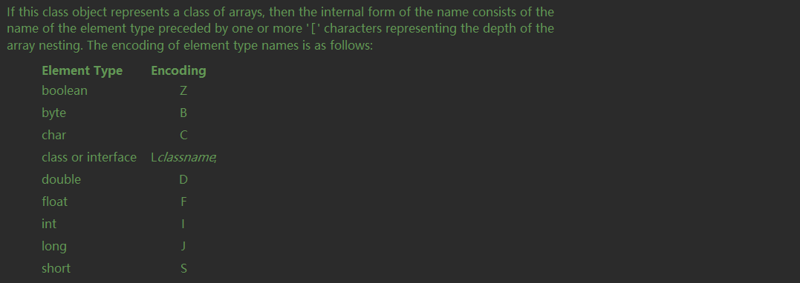

## Type

`Type`是`Java`中所有类型的父接口。

其子类和子接口如下：

1. `Class<T>`
2. `TypeVariable<D>`
3. `ParameterizedType`
4. `GenericArrayType`
5. `WildcardType`

`Type` 只有一个默认方法：

```java
// 返回描述类型的字符串
default String getTypeName() {
        return toString();
}
```

## Class\<T\>

`Class<T>` 封装了一个具体类的属性操作和反射操作，`T`是具体类；

`Class<T>` 实现了以下四个接口：

* Serializable
* GenericDeclaration
* Type
* AnnotatedElement

### Serializable

并无接口方法，作为序列化标记；

### GenericDeclaration

`GenericDeclaration` 是所有声明了类型变量的类的公用接口；

只有一个接口方法：

```java
// 用于获取类型变量的数组
public TypeVariable<?>[] getTypeParameters();
```

用法如下：

```kotlin
val clazz = Map::class.java
val list = clazz.typeParameters
list.forEach {
    println("${it.name} ${it.bounds.map { bound-> bound.typeName }}")
}
```

运行结果：

```
K [java.lang.Object]
V [java.lang.Object]
```

`Map`类的声明如下：

```kotlin
public interface Map<K, out V> {
	......
}
```

### Type

`Class<T>` 实现了`Type` 唯一的接口方法，具体实现如下：

```java
public String getTypeName() {
        if (isArray()) {
            try {
                Class<?> cl = this;
                int dimensions = 0;
                while (cl.isArray()) {
                    dimensions++;
                    cl = cl.getComponentType();
                }
                StringBuilder sb = new StringBuilder();
                sb.append(cl.getName());
                for (int i = 0; i < dimensions; i++) {
                    sb.append("[]");
                }
                return sb.toString();
            } catch (Throwable e) { /*FALLTHRU*/ }
        }
        return getName();
}
```

对数组类型和非数组类型分别处理，具体细节按下不表；

用法如下：

```kotlin
val clazz = Map::class.java
println(clazz.typeName)

val array = Array<IntArray>(3){
    it -> intArrayOf(0)
}
println(array.javaClass.typeName)
```

结果如下：

```
java.util.Map
int[][]
```

### AnnotatedElement

定义了一系列获取注解的接口方法，所有可以被注解标记的元素都应该实现这个接口；

在讲解接口方法之前需要了解各种注解的分类：

#### directly present

直接出现在元素上的注解；

#### indirectly present

被`@Repeatable`标记的注解，然后该注解出现在元素上；

```java
@Target(ElementType.TYPE)  
@Retention(RetentionPolicy.RUNTIME)
public @interface Persons {
	Person[] value();
}

@Repeatable(Persons.class)
public @interface Person{
	String role() default "";
}

@Person(role="CEO")
@Person(role="husband")
@Person(role="father")
@Person(role="son")
public class Man {
	String name= "";
}
```

`Person`注解相对于`Man`就是`indirectly present`的，`Persons`相对于`Man`是`directly present`，`Person`是`Persons`的参数；

#### present 

分为两种情况：

1. directly present
2. 被`@Inherited`标记的注解 `A`，然后注解`A`出现在`B`的父类`C`上，则`A`相对与`B`是`present`的；

#### associated

分为三种情况：

1. directly present
2. indirectly present
3. 第三种情况有四个小条件，注解为`A`，元素为`E`
   * 注解`A`没有直接或者间接出现在元素`E`上
   * 元素`E` 是一个类
   * 注解`A` 被`@Inherited` 标记
   * 注解`A` 和元素`E`的父类的关系为`associated`

#### isAnnotationPresent()

方法声明：

```java
default boolean isAnnotationPresent(Class<? extends Annotation> annotationClass)
```

指定注解是否为`present`状态；

#### getAnnotation()

方法声明：

```java
<T extends Annotation> T getAnnotation(Class<T> annotationClass)
```

如果给定的注解处于`present`状态，则返回注解，否则返回`null`；

#### getAnnotations()

方法声明：

```java
Annotation[] getAnnotations();
```

获取所有处于`present`状态的注解，若无符合条件的数组，则返回大小为`0`的数组；

#### getAnnotationsByType()

方法声明：

```java
default <T extends Annotation> T[] getAnnotationsByType(Class<T> annotationClass)
```

获取所有处于`associated`状态的注解；

#### getDeclaredAnnotation()

方法声明：

```java
default <T extends Annotation> T getDeclaredAnnotation(Class<T> annotationClass)
```

如果给定的注解处于`directly present`状态，则返回注解，反则返回`null`；

#### getDeclaredAnnotationsByType()

方法声明：

```java
default <T extends Annotation> T[] getDeclaredAnnotationsByType(Class<T> annotationClass)
```

如果给定的注解处于`directly present`或者`indirectly present`状态，返回注解数组；

#### getDeclaredAnnotations()

方法声明：

```java
Annotation[] getDeclaredAnnotations()
```

获取所有处于`directly present`状态的注解；

### 具体方法讲解

#### toString()

```java
public String toString() {
    return (isInterface() ? "interface " : (isPrimitive() ? "" : "class "))
            + getName();
}
```

描述当前`Class`文件，文件类型和文件的全限定名；

#### toGenericString()

描述当前`Class`文件，包括修饰符和类型变量；

#### forName()

静态方法，根据全限定名获取`Class`;

#### newInstance()

调用无参的构造函数，返回实例；

#### isInstance()

同`instanceof` 关键字作用相同；

#### isAssignableFrom()

如果给定的参数为当前`Class`的父类或者父接口，则返回`true`，否则返回`false`;

#### isInterface()

当前`Class`是否为接口；

#### isArray()

当前`Class`是否为数组；

#### isPrimitive()

当前`Class`是否为基础数据类型；

包括：Boolean.TYPE, Character.TYPE, Byte.TYPE, Short.TYPE, Integer.TYPE, Long.TYPE, Float.TYPE, Double.TYPE, Void.TYPE；

#### isAnnotation()

当前`Class`是否为注解；

#### isSynthetic()

当前`Class`是否为合成类；

合成类指的是在编译时引入的类，例如匿名类；

#### getName()

获取当前`Class`的名称；

分为三种情况：

* `Class`是引用类型，则返回其全限定名；
* `Class`是基本数据类型，则返回相应的关键字；
* `Class` 是数组类型，规则如下



#### getClassLoader()

获取当前`Class`的类加载器；

#### getTypeParameters()

详见 [GenericDeclaration](###GenericDeclaration) ；

#### getSuperclass()

获取其父类的`Class`；

#### getGenericSuperclass()

获取其直接父类的`Type`；

#### getPackage()

获取当前`Class`的`package`；

#### getInterfaces()

获取当前`Class`所有实现的接口`Class`数组；

#### getGenericInterfaces()

获取当前`Class`所有直接实现的接口`Type`数组；

#### getComponentType()

如果当前`Class`是数组，则返回数组元素类型`Class`；

如果当前`Class`不是数组，则返回`null`；

#### getModifiers()

获取当前`Class`的修饰符；

#### getEnclosingMethod()

如果当前`Class`是一个函数中的匿名类，则返回该函数，否则返回`null`；

#### getEnclosingConstructor()

如果当前`Class`是一个构造函数中的匿名类，则返回构造函数，否则返回`null`；

#### getDeclaringClass()

如果当前`Class`是另一个`Class B`的成员变量，则返回`Class B`，否则返回`null`；

#### getEnclosingClass()

返回声明当前`Class`的外部类；

#### getSimpleName()

对于普通类和基本类型返回其类名；

对于匿名类返回空串；

对于数组返回"${类名}[]"；

#### getTypeName()

详见 [Type](###Type) ；

#### getCanonicalName()

返回其全限定名；

#### isAnonymousClass()

是否为匿名类；

#### isLocalClass()

是否为`local class`；

`local class`指的是声明在函数体内部的类；

#### isMemberClass()

当前`Class`是否为内部类；

#### getClasses()

