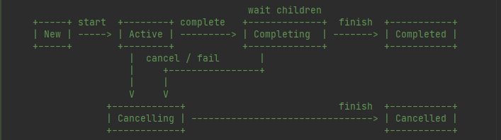

## 基础类分析
在讲解协程间是如何进行互动之前需要对协程的一些基础类进行讲解；
### CoroutineContext
协程的上下文，可以看作是一个 `map`，在协程执行过程中充当设置项集合的角色；
#### get(key)
重载运算符方法，根据 `key` 获取相应的 `element`;
#### fold(initial, operation)
将 `initial` 和 `element` 合并并返回 `initial`，不同实现类对 `operation` 操作不同；
#### plus(context)
将两个 `CortouineContext` 合并，并返回一个新的 `CoroutineContext`,此处提供了一个默认实现；
```kotlin
public operator fun plus(context: CoroutineContext): CoroutineContext =
        if (context === EmptyCoroutineContext) this else // fast path -- avoid lambda creation
            context.fold(this) { acc, element ->
                val removed = acc.minusKey(element.key)
                if (removed === EmptyCoroutineContext) element else {
                    // make sure interceptor is always last in the context (and thus is fast to get when present)
                    val interceptor = removed[ContinuationInterceptor]
                    if (interceptor == null) CombinedContext(removed, element) else {
                        val left = removed.minusKey(ContinuationInterceptor)
                        if (left === EmptyCoroutineContext) CombinedContext(element, interceptor) else
                            CombinedContext(CombinedContext(left, element), interceptor)
                    }
                }
            }
```
具体逻辑如下：
为表述方便，将当前 `CoroutineContext` 称为 `left`，将传入的 `CoroutineContext` 称为 `right`;
1. 如果 `right` 不是 `EmptyCoroutineContext`，则返回 `left`;
2. 如果 `right` 不是 `EmptyCoroutineContext`，则 `right` 调用 `fold` 方法，传入 `left` 和 `operation`;

#### minusKey(key)
返回一个不包含指定 `key` 的 `CoroutineContext`;
### Key
操作 `CoroutineContext` 所使用到的键，定义如下：
```kotlin
public interface Key<E : Element>
```
### Element
操作 `CoroutineContext` 所返回的值，继承了 `CoroutineContext` 但是缩小了对 `ContextContext` 的使用范围；
定义如下：
```kotlin
public interface Element : CoroutineContext {
        /**
         * A key of this coroutine context element.
         */
        public val key: Key<*>

        public override operator fun <E : Element> get(key: Key<E>): E? =
            @Suppress("UNCHECKED_CAST")
            if (this.key == key) this as E else null

        public override fun <R> fold(initial: R, operation: (R, Element) -> R): R =
            operation(initial, this)

        public override fun minusKey(key: Key<*>): CoroutineContext =
            if (this.key == key) EmptyCoroutineContext else this
    }
```


接下来来看 `CoroutineContext` 的两个常见的实现类；
### EmptyCoroutineContext
可以看作一个空的`CoroutineContext`，不存在任何元素；这是 `CoroutineContext` 的默认实现；
源码如下：
```kotlin
public object EmptyCoroutineContext : CoroutineContext, Serializable {
    private const val serialVersionUID: Long = 0
    private fun readResolve(): Any = EmptyCoroutineContext
    
    // 没有任何元素，直接返回 null; 下面的重载函数也是相似的实现；
    public override fun <E : Element> get(key: Key<E>): E? = null
    public override fun <R> fold(initial: R, operation: (R, Element) -> R): R = initial
    public override fun plus(context: CoroutineContext): CoroutineContext = context
    public override fun minusKey(key: Key<*>): CoroutineContext = this
    public override fun hashCode(): Int = 0
    public override fun toString(): String = "EmptyCoroutineContext"
}
```

### CombinedContext
```kotlin
// 构造函数接收两个参数
internal class CombinedContext(
    private val left: CoroutineContext,
    private val element: Element
) : CoroutineContext, Serializable {

    // 先查 element，再递归查询 left；
    override fun <E : Element> get(key: Key<E>): E? {
        var cur = this
        while (true) {
            cur.element[key]?.let { return it }
            val next = cur.left
            if (next is CombinedContext) {
                cur = next
            } else {
                return next[key]
            }
        }
    }

    // left 先和 initial 进行递归合并得到 newLeft，然后 newLeft 和 element 进行合并；
    public override fun <R> fold(initial: R, operation: (R, Element) -> R): R =
        operation(left.fold(initial, operation), element)

    // 如果 element 包含 key，则直接返回 left；
    // 如果 left 不包含 key，返回当前 CombinedContext；
    // 如果 left 只包含了 key ，则返回 element；
    // 如果 left 不止包含了 key，则返回 新的 CombinedContext；
    public override fun minusKey(key: Key<*>): CoroutineContext {
        element[key]?.let { return left }
        val newLeft = left.minusKey(key)
        return when {
            newLeft === left -> this
            newLeft === EmptyCoroutineContext -> element
            else -> CombinedContext(newLeft, element)
        }
    }
}
```
从实现来看，`CombinedContext` 有点像链表；

### CoroutineScope
为了方便在协程执行过程中访问 `CoroutineContext` 而创建的接口；
```kotlin
public interface CoroutineScope {
    // 只有一个接口方法，来提供 `CoroutineContext`
    public val coroutineContext: CoroutineContext
}
```

### Job

`Job`用于构建协程间的父子层级，具有以下特性：

1. 取消父协程会递归地取消子协程；
2. 子协程异常失败会取消父协程及其他的子协程；`SupervisorJob`可以自定义这一行为；
3. 父协程会等待所有的子协程完成。

```kotlin
// 继承了 Element 接口，是 CoroutineContext 所存储的对象
public interface Job : CoroutineContext.Element {
    // Job 具有以下三种状态
    public val isActive: Boolean
    public val isCompleted: Boolean
    public val isCancelled: Boolean
    
    // 开始执行协程，如果执行成功返回 true，如果已经执行或者执行过了返回 false
    public fun start(): Boolean
    // 取消协程
    public fun cancel(cause: CancellationException? = null)
    // 保存子协程
    public val children: Sequence<Job>
    // 与子协程建立关系，返回 ChildHanlde 以取消与父协程的关系
    public fun attachChild(child: ChildJob): ChildHandle
    // 阻塞当前父协程，直到当前子协程执行完
    public suspend fun join()
    // 注册当前协程执行完成的回调；如果已经执行完则立即回调，如果没有执行完则等待状态变更后回调；
    public fun invokeOnCompletion(handler: CompletionHandler): DisposableHandle
}
```

下面是 `Job`  状态变更的流程图：



从上述接口的分析可以看出，`Job` 有一些父协程的特征但又不完全有，完全没有子协程的特征；`Kotlin` 又派生了两个接口来实现这些特征；

### ChildJob

```kotlin
// 子协程接口
public interface ChildJob : Job {
    // 父协程取消子协程
    public fun parentCancelled(parentJob: ParentJob)
}
```

### ParentJob

```kotlin
public interface ParentJob : Job {
    // 这个接口提供取消子协程的原因
    public fun getChildJobCancellationCause(): CancellationException
}
```
### DisposableHandle
一个用于释放资源的接口
```kotlin
public interface DisposableHandle {
    
    public fun dispose()
}
```

### ChildHandle
子协程通知父协程异常原因的接口
```kotlin
public interface ChildHandle : DisposableHandle {

    // 父协程的引用
    public val parent: Job?

    // 子协程调用这个方法向父协程通知异常
    // 这个方法会被子协程调用两次，第一次子协程为尽快取消父协程和其他兄弟协程，报告根本原因；
    // 第二次子协程确定原因后，再次调用。
    public fun childCancelled(cause: Throwable): Boolean
}
```

### JobSupport实现
所有的协程都会具有`Job`、`ParentJob`、`ChildJob`的特性，但是又不可能每个协程类都去单独实现，因此就使用 `JobSupport` 这个类来集中实现上述特性；
而`JobSupport`的实现几乎完全依赖着协程当前状态；
`JobSupport`有以下十种状态：
```
       === Internal states ===

       name       state class              public state  description
       ------     ------------             ------------  -----------
       EMPTY_N    EmptyNew               : New           no listeners
       EMPTY_A    EmptyActive            : Active        no listeners
       SINGLE     JobNode                : Active        a single listener
       SINGLE+    JobNode                : Active        a single listener + NodeList added as its next
       LIST_N     InactiveNodeList       : New           a list of listeners (promoted once, does not got back to EmptyNew)
       LIST_A     NodeList               : Active        a list of listeners (promoted once, does not got back to JobNode/EmptyActive)
       COMPLETING Finishing              : Completing    has a list of listeners (promoted once from LIST_*)
       CANCELLING Finishing              : Cancelling    -- " --
       FINAL_C    Cancelled              : Cancelled     Cancelled (final state)
       FINAL_R    <any>                  : Completed     produced some result


        === Transitions ===

           New states      Active states       Inactive states

          +---------+       +---------+                          }
          | EMPTY_N | ----> | EMPTY_A | ----+                    } Empty states
          +---------+       +---------+     |                    }
               |  |           |     ^       |    +----------+
               |  |           |     |       +--> |  FINAL_* |
               |  |           V     |       |    +----------+
               |  |         +---------+     |                    }
               |  |         | SINGLE  | ----+                    } JobNode states
               |  |         +---------+     |                    }
               |  |              |          |                    }
               |  |              V          |                    }
               |  |         +---------+     |                    }
               |  +-------> | SINGLE+ | ----+                    }
               |            +---------+     |                    }
               |                 |          |
               V                 V          |
          +---------+       +---------+     |                    }
          | LIST_N  | ----> | LIST_A  | ----+                    } [Inactive]NodeList states
          +---------+       +---------+     |                    }
             |   |             |   |        |
             |   |    +--------+   |        |
             |   |    |            V        |
             |   |    |    +------------+   |   +------------+   }
             |   +-------> | COMPLETING | --+-- | CANCELLING |   } Finishing states
             |        |    +------------+       +------------+   }
             |        |         |                    ^
             |        |         |                    |
             +--------+---------+--------------------+
```
#### Empty_New 和 Empty_Active
`Empty_New` 和 `Empty_Active` 都是 `JobSupport` 的最初状态，根据构造函数的传参不同来赋予最初的状态；
```kotlin
根据 active 进行赋值，atomic 方法请看 https://github.com/Kotlin/kotlinx.atomicfu
private val _state = atomic<Any?>(if (active) EMPTY_ACTIVE else EMPTY_NEW)
```
上述两种状态指向的是同一个类: `Empty`，只有 `isActive` 字段不同；
```kotlin
private class Empty(override val isActive: Boolean) : Incomplete {
    override val list: NodeList? get() = null
    override fun toString(): String = "Empty{${if (isActive) "Active" else "New" }}"
}
```
很多状态都实现了 `InComplete` 接口，用于标记当前协程还未结束；
```kotlin
internal interface Incomplete {
    // 标记当前协程是否可用
    val isActive: Boolean
    // 似乎是一个线程安全的不可删除节点的链表，没有细究；
    val list: NodeList? // is null only for Empty and JobNode incomplete state objects
}
```
#### SINGLE
当前协程处于`Empty_Active` 状态时，子协程调用 `attachChild` 方法，最后调用到 `invokeOnCompletion` 方法；
```kotlin
val node: JobNode = makeNode(handler, onCancelling)
when (state) {
                is Empty -> { // EMPTY_X state -- no completion handlers
                    if (state.isActive) {
                        // 处于`Empty_Active` 状态，直接将`_state`设置为 `JobNode`，称之为 `Single` 状态；
                        if (_state.compareAndSet(state, node)) return node
                    } else
                        ...
}                       
```
#### LIST_N
当前协程处于 `Empty_New` 状态时，子协程调用 `attachChild` 方法，最后调用到 `invokeOnCompletion` 方法；
```kotlin
val node: JobNode = makeNode(handler, onCancelling)
when (state) {
                is Empty -> { 
                    // Empty_New 状态，isActive 为 false
                    if (state.isActive) {
                        ...
                    } else
                        promoteEmptyToNodeList(state) // that way we can add listener for non-active coroutine
                }
}   

private fun promoteEmptyToNodeList(state: Empty) {
        // try to promote it to LIST state with the corresponding state
        val list = NodeList()
        // 此处 isActive 必为 false，将 `_state` 设置为 `InactiveNodeList`
        val update = if (state.isActive) list else InactiveNodeList(list)
        _state.compareAndSet(state, update)
    }
```

#### Single+
当协程处于 `Empty_Active` 状态，子协程调用 `attachChild` 方法，最后调用到 `invokeOnCompletion` 方法；
```kotlin
val node: JobNode = makeNode(handler, onCancelling)
loopOnState { state ->
    when (state) {
        is Empty -> { // EMPTY_X state -- no completion handlers
            if (state.isActive) {
                ...
            }
        is Incomplete -> {
            val list = state.list
            if (list == null) { // SINGLE/SINGLE+
                promoteSingleToNodeList(state as JobNode)
            }
}

private fun promoteSingleToNodeList(state: JobNode) {
    // try to promote it to list (SINGLE+ state)
    state.addOneIfEmpty(NodeList())
    // it must be in SINGLE+ state or state has changed (node could have need removed from state)
    val list = state.nextNode // either our NodeList or somebody else won the race, updated state
    // just attempt converting it to list if state is still the same, then we'll continue lock-free loop
    _state.compareAndSet(state, list)
}
```
把 `_state` 设置为 `NodeList`;

#### List_A
当前协程处于 `List_N` 或 `Single+` 时，子协程调用 `attachChild` 方法，最后调用到 `invokeOnCompletion` 方法；
```kotlin
val node: JobNode = makeNode(handler, onCancelling)
loopOnState { state ->
    when (state) {
        is Empty -> { // EMPTY_X state -- no completion handlers
            ...
        }
        is Incomplete -> {
            val list = state.list
            if (list == null) {
                ... 
            } else {
                var rootCause: Throwable? = null
                var handle: DisposableHandle = NonDisposableHandle
                ...
                if (rootCause != null) {
                    ...    
                } else {
                    if (addLastAtomic(state, list, node)) return node
                }
        }
    }
}

// 如果两个 state 引用相同，则把 node 添加到 list 的最后
private fun addLastAtomic(expect: Any, list: NodeList, node: JobNode) =
    list.addLastIf(node) { this.state === expect }
```

#### Cancelling 
`Job` 主动调用 `cancel` 方法，或者子协程发生异常取消当前协程，或者父协程取消当前协程；这三种情况都会调用 `cancelImpl` 方法；
```kotlin
internal fun cancelImpl(cause: Any?): Boolean {
    var finalState: Any? = COMPLETING_ALREADY
    // 默认为 false，在 JobImpl 中重载为 true
    if (onCancelComplete) {
        // make sure it is completing, if cancelMakeCompleting returns state it means it had make it
        // completing and had recorded exception
        finalState = cancelMakeCompleting(cause)
        if (finalState === COMPLETING_WAITING_CHILDREN) return true
    }
    if (finalState === COMPLETING_ALREADY) {
        finalState = makeCancelling(cause)
    }
    return when {
        finalState === COMPLETING_ALREADY -> true
        finalState === COMPLETING_WAITING_CHILDREN -> true
        finalState === TOO_LATE_TO_CANCEL -> false
        else -> {
            afterCompletion(finalState)
            true
        }
    }
}

private fun cancelMakeCompleting(cause: Any?): Any? {
    loopOnState { state ->
        if (state !is Incomplete || state is Finishing && state.isCompleting) {
            // 如果当前协程已经结束，直接返回状态
            return COMPLETING_ALREADY
        }
        // 包装异常
        val proposedUpdate = CompletedExceptionally(createCauseException(cause))
        // 等待解决子协程
        val finalState = tryMakeCompleting(state, proposedUpdate)
        if (finalState !== COMPLETING_RETRY) return finalState
    }
}
```

#### Completing
在 `tryMakeCompletingSlowPath` 中 `state` 被置为 `Finishing`


除了上述状态转变的逻辑，还有很大一部分是关于线程同步的逻辑，这方面没有细究；

### 小结

```
取消父协程会递归地取消子协程
```

父协程通过`children` 字段保留了所有的子协程，通过`ChildJob` 接口中的 `parentCancelled` 方法来取消子协程；

```
子协程异常失败会取消父协程及其他的子协程
```

子协程通过`ChildHandle` 接口中`childCancelled` 方法来把消息传递给父协程；

```
父协程会等待所有的子协程完成
```

通过`invokeOnCompletion` 方法注册执行完成的回调，来感知子协程的执行情况；

