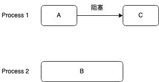

## 同步和互斥的区别

### 同步
某些进程为完成同一任务需要分工协作，由于合作的每一个进程都是独立地以不可预知的速度推进，这就需要相互协作的进程在某些协调点上协 调各自的工作。当合作进程中的一个到达协调点后，在尚未得到其伙伴进程发来的消息或信号之前应阻塞自己，直到其他合作进程发来协调信号或消息后方被唤醒并继续执行。这种协作进程之间相互等待对方消息或信号的协调关系称为进程同步。

 例子如下：

 

 `Process 1` 和 `Process 2` 协作完成任务，该任务分为A、B和C三个部分，其中A和B可以相互独立执行，C依赖B的执行结果；该任务的执行次序如下：

 1. `Process 1` `Process 2` 并发执行子任务 A、B；
 2. `Process 1` 率先执行完子任务A，由于子任务C，依赖子任务B，所以`Process 1` 阻塞；
 3. `Process 2` 完成子任务B，唤醒`Process 1` 继续执行子任务C；

### 互斥
有一些共享资源在使用时具有排他性，例如打印机，同一时间内只能被一个进程获得，在该进程使用共享资源时，其他进程只能阻塞，等待该进程释放共享资源，然后从等待进程中唤醒获取该共享资源；

## 同步机制
互斥实质上可以看作是同步的一个变种，因此同步机制既可以解决同步问题，也可以解决互斥问题；

### semaphore(信号量)
```
struct semaphore {
    // 一般初始化为一个正整数，表示可以被 count 个进程获得；
    // 当初始化为 1 时，认为它是一个互斥的信号量，又称二进制信号量；
    // 当初始化值大于 1 时，认为它是一个计数信号量；
    int count;
    // 当 count 计数等于0时，尝试获取资源的进程都会被添加到此队列中，队列中的进程都处于阻塞状态，等待一个进程释放资源后，从队列头部唤醒进程获取共享资源；
    queueType queue;
}

// 初始化计数
void init(int i) {
    count = i;
}

// 原语，尝试获取资源
void P() {
    count--;
    if (count < 0) {
        // 阻塞此进程，并且将此进程放入等待队列
        process.wait()
        queue.push(process)
    }
}

// 原语，释放资源
void V() {
    count++
    if (count <= 0) {
        // 从等待队列中取出进程，具体取出的是哪一个进程，由操作系统进行调度
        // 唤醒该进程，进程被添加到就绪队列，等待 CPU 执行；
        process = queue.pop()
        process.wakeup()
    }
}
```

### Mutex(互斥体)
`mutex` 可以等同于 二进制的信号量；
### Monitor(管程)
信号量虽然很管用，但是在某些场景下仍然乏力；
例如解决生产者-消费者问题上，信号量机制就较为繁琐；
生产者-消费者问题有三个互斥条件：
1. 同一时间只有一端能够获得缓冲区资源；
2. 当缓冲区满时，生产者需要等待缓冲区不满；
3. 当缓冲区空时，消费者需要等待缓冲区不空；

如果使用信号量就需要在代码中零散地进行三个信号量的 P/V 操作，不利于代码的维护；
`管程` 实质是对信号量的封装；
```
struct monitor {
    // 管程锁
    semaphore mutex;
    // 条件变量1
    semaphore condition1;
    // 条件变量2
    semaphore condition2;
}
```


使用管程解决生产者消费者问题：
```java
public class BlockedQueue<T> {
    final Lock lock = new ReentrantLock();
    // 条件变量：队列不满
    final Condition notFull = lock.newCondition();
    // 条件变量：队列不空
    final Condition notEmpty = lock.newCondition();

    // 入队
    void enq(T x) {
        lock.lock();
        try {
            while (队列已满) {
                // 等待队列不满，虽然这里使用的是可重入锁，但是也可以使用不可重入锁，在条件变量执行 wait 方法时，需要释放锁；
                notFull.await();
            }
            // add x to queue
            // 入队后,通知可出队
            notEmpty.signal();
        } finally {
            lock.unlock();
        }
    }

    // 出队
    void deq() {
        lock.lock();
        try {
            while (队列已空) {
                // 等待队列不空
                notEmpty.await();
            }
            // remove the first element from queue
            // 出队后，通知可入队
            notFull.signal();
        } finally {
            lock.unlock();
        }
    }
}

```
通过封装生产者和消费者就不需要关心锁的获得和释放，大大简化了代码编写；