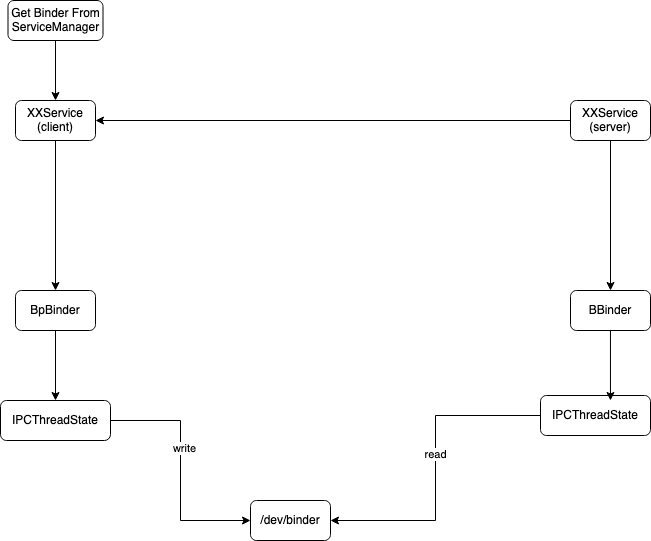

## 概述
在 `Android` 系统中不可避免的需要使用 `IPC`，一般思路肯定是先复用现有的`IPC`机制，但是实际上`Android` 自己造了一套`IPC`机制--`Binder`；肯定是因为现有的`IPC`机制无法满足我们的需求；我们究竟有什么需求呢？

1. 通信效率要高；现有一些的`IPC`机制，会发生两次复制，效率不够高；
2. 对于 Java 开发者要友好；内存映射能够满足第1个条件，但是要编写 cpp 代码；

有了需求，就要开始设计代码结构了；
1. 传输需要介质，这里选用了字符设备作为中介，配合驱动程序完成对信息的流转；
2. 信息需要载体，创造了`Parcel`来承载信息；
3. 对`framework`的代码进行封装，上层只需要编写 `Java` 代码；



## Parcel
`Parcel` 作为跨进程通信的信息载体，在`Java`应用层实际上只是一层壳，实际上都是通过`JNI`调用`Cpp`方法实现的；
```java
public final class Parcel {
    // 平台对象的指针
    private long mNativePtr; // used by native code
    // 静态方法，从Parcel缓存池中获取Parcel对象，实现Parcel的复用
    public static Parcel obtain()

    // 获取当前已存数据的大小，实际上转发给 native 方法执行，下面的方法也是类似，不再写明方法体内容，只写方法功能
    public final int dataSize() {
        return nativeDataSize(mNativePtr);
    }
    // 获取还能被读取的数据的大小
    public final int dataAvail()
    // 获取当前数据指针的位置，Parcel 所存储的内容是一段连续的内存，读一段就移动指针；
    public final int dataPosition()
    // 获取Parcel分配的内存，大小大于等于dataSize
    public final int dataCapacity()
    // 写入基础数据类型
    public final void writeInt(int val)
    public final void writeLong(long val)
    public final void writeFloat(float val)
    public final void writeDouble(double val)
    public final void writeString(String val)
    public final void writeCharSequence(CharSequence val)
    // 写入 binder 对象
    public final void writeStrongBinder(IBinder val)
    // 写入 IInterface 对象
    public final void writeStrongInterface(IInterface val)
    // 写入文件描述符
    public final void writeFileDescriptor(FileDescriptor val)
```

```cpp

```
