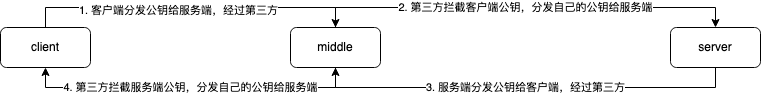
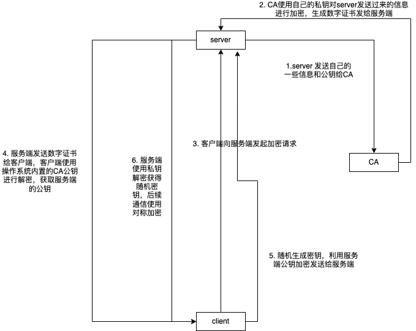

## 缘由
很早我就开始使用 certbot 来申请数字证书，后面为了方便又使用了 caddy ；虽然使用了数字证书，但是它具体在网络通信过程中起到了什么样的作用，有了它为什么就能使得网络通信安全，并没有细致了解；因此我想要了解以下几个问题：

1. 数字证书是什么？里面包含了什么东西？
2. 在网络通信中它如何发挥作用？

## 远古时期
最早的互联网是美国国防部所建立的 ARPNET ，此网络是军方实验使用，网络内部的设备都是互信的，因此消息都是明文传输；

## 中古时期
1990 年 ARPNET 正式宣布关闭，因为它的实验任务已经完成；但是在此之前互联网已经获得长足发展，网络规模和复杂度都极大，明文传输已不再满足此时的网络环境，在此时的网络环境下，通信的双方是无法互信的，因为以下两个原因：

1. 明文传输的报文在多级网络层次中会被截获，导致信息泄露；
2. 明文传输的报文会被中间人修改重发，导致收信人无法收到正确的信息；

为了解决上述问题，对称加密被引入了传输过程中，通信双方约定密钥，一方加密发送的消息，另一方利用密钥解密；

## 近古时期
对称加密算法看似解决上述的网络安全问题，但是实际上引入了新的问题 --- 密钥的保存问题；

作为提供服务的一方，需要把密钥分发给数量极大的客户端，唯一的方式就是通过网络传输，这就又回到问题的起点 --- 明文传输密钥的安全问题；

非对称加密算法作为新的解决方案登上舞台，非对称加密的内容如下：

1. 乙方生成两把密钥（公钥和私钥）。公钥是公开的，任何人都可以获得，私钥则是保密的。
2. 甲方获取乙方的公钥，然后用它对信息加密。
3. 乙方得到加密后的信息，用私钥解密。

因此服务端可以随意分发公钥，因为能解密的只有私钥，服务端拥有完全的主动权。

如果你足够敏锐，就会发现非对称加密的数据是单向的，只能从客户端发往服务端；也许你会觉得这还不简单，客户端向服务端分发它自己的公钥不就好了？

然而事实并非如此，正如我上面提到的网络中的两台设备并不能互信，只能一台设备单方面地信任另一台设备；

此时第三方同时拥有服务端和客户端的公钥，服务端和客户端的内容一旦被拦截，第三方可以随意篡改；

问题至此，似乎陷入了无解的境地。正如淘宝初办时，商户和顾客之间的信任危机一样，顾客担心自己付了钱商户不发货，要求商户先发货，但是商户担心发了货收不到钱，要求顾客先付钱；马云后面是引入了第三方担保机构 --- 支付宝解决了这一问题；

在网络安全中承担担保职责的机构称为 CA 机构 ，具体流程如下：

上述流程有以下几个安全措施：

1. 操作系统内置了 CA 的公钥，避免的网络分发公钥导致泄漏的风险；
2. 客户端随机生成密钥，并且使用服务端公钥加密，避免泄露风险；
3. 除开一开始的认证阶段后续的传输都是使用的对称加密，但是密钥只有双方拥有，所以兼顾了性能和安全；

## 未来
就现在而言，上述方式网络通信是安全的，但是随着时间的推移，事情可能会发生变化：

1. 网络规模和网络设备的发展，例如量子计算机的诞生；
2. 非对称加密算法从数学上被攻破；
3. 国际形势的恶化，CA 机构提供私钥给第三方；
4. 盗版系统的泛滥，内置不可信的 CA 公钥；

## 参考文献

http://www.ruanyifeng.com/blog/2011/08/what_is_a_digital_signature.html

https://en.wikipedia.org/wiki/Certificate_authority